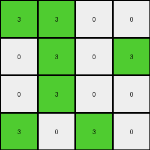

# ce4f8723 • 015 • refine_dreamer

---

Previous Code:
```python
"""
1.  **Extract Subgrid:** Extract the top-left 4x4 subgrid from the input grid.
2.  **Recolor:** Within the extracted subgrid, replace all occurrences of the value '1' (blue) with the value '3' (green). The value '0' (white) should remain unchanged.
3.  **Output:** The resulting 4x4 subgrid after the recoloring is the output.
"""

import numpy as np

def transform(input_grid):
    """Transforms an input grid to an output grid based on size reduction and color mapping."""
    
    # 1. Extract Subgrid: Top-left 4x4
    subgrid = input_grid[:4, :4]
    
    # 2. Recolor: 1 (blue) -> 3 (green), 0 (white) stays the same.
    output_grid = np.copy(subgrid)  # Start with a copy to avoid modifying the original subgrid directly.
    output_grid[output_grid == 1] = 3
    
    # 3. Output: The recolored 4x4 subgrid.
    return output_grid
```

Train Set Results:

## Example 1:

Input:
```
1 1 0 0
0 1 0 1
0 1 0 0
1 0 1 0
4 4 4 4
2 2 2 2
0 0 2 2
2 2 0 0
0 0 2 2
```
Expected Output:
```
3 3 3 3
0 3 3 3
3 3 0 0
3 0 3 3
```
Transformed Output:
```
3 3 0 0
0 3 0 3
0 3 0 0
3 0 3 0
```

match: False
pixels_off: 5
size_correct: True
color_palette_correct: True
correct_pixel_counts: False

## Example 2:

Input:
```
1 1 1 0
0 1 0 1
0 0 1 1
1 1 0 1
4 4 4 4
0 0 0 2
0 0 0 2
2 2 2 2
2 2 0 2
```
Expected Output:
```
3 3 3 3
0 3 0 3
3 3 3 3
3 3 0 3
```
Transformed Output:
```
3 3 3 0
0 3 0 3
0 0 3 3
3 3 0 3
```

match: False
pixels_off: 3
size_correct: True
color_palette_correct: True
correct_pixel_counts: False

## Example 3:

Input:
```
1 1 0 0
1 0 1 0
1 1 0 1
1 1 1 1
4 4 4 4
2 2 0 2
0 0 2 0
0 2 0 0
2 0 2 0
```
Expected Output:
```
3 3 0 3
3 0 3 0
3 3 0 3
3 3 3 3
```
Transformed Output:
```
3 3 0 0
3 0 3 0
3 3 0 3
3 3 3 3
```

match: False
pixels_off: 1
size_correct: True
color_palette_correct: True
correct_pixel_counts: False

## Example 4:

Input:
```
1 0 1 0
1 1 0 1
1 0 1 1
0 1 0 1
4 4 4 4
2 2 0 0
0 0 2 0
2 2 0 0
0 0 2 0
```
Expected Output:
```
3 3 3 0
3 3 3 3
3 3 3 3
0 3 3 3
```
Transformed Output:
```
3 0 3 0
3 3 0 3
3 0 3 3
0 3 0 3
```

match: False
pixels_off: 4
size_correct: True
color_palette_correct: True
correct_pixel_counts: False
**INSTRUCTIONS**

The code above was generated based on observations from the first training
example

we have tested the transform function on each of the task example inputs and
compared with the expected output

review each of the examples provided and the results and consider how the
natural language program should be updated to accommodate this new knowledge

respond with the following deliverables:

- general assessment of the information provided and strategy for resolving the
  errors
- gather metrics about each of the examples and results - use code_execution to
  develop accurate reports on your assumptions
- a YAML block documenting facts - Focus on identifying objects, their properties, and the actions performed on them.
- a natural language program - Be as clear and concise as possible, providing a complete description of the transformation rule.


your responses should be considered as information in a report - not a
conversation
