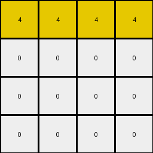
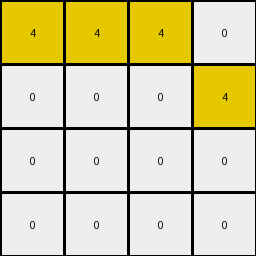

# cf98881b • 003 • refine_dreamer

---

Previous Code:
```python
"""
1.  **Identify Target Columns:** Select columns from the input grid that contain *either* the digit '9' *or* the digit '4', *or* the digit '1'. Do *not* select all columns, only the select columns identified by the rule.

2.  **Extract Sub-grid:** From the selected columns, create a new grid, discarding all others.

3. **Reduce Further:** Consider only the first instance of a contiguous vertical sequence of a single color. Discard any subsequent, matching color that is contiguous vertically.

4. **Result:** the output grid contains only 4x4
"""

import numpy as np

def get_target_columns(input_grid):
    """
    Identifies columns containing 9, 4, or 1.
    """
    target_columns = []
    for j in range(input_grid.shape[1]):
        if 9 in input_grid[:, j] or 4 in input_grid[:, j] or 1 in input_grid[:,j]:
            target_columns.append(j)
    return target_columns

def extract_subgrid(input_grid, target_columns):
    """
    Extracts a subgrid based on the target columns.
    """
    subgrid = input_grid[:, target_columns]
    return subgrid

def reduce_vertically(input_grid):
    """
    Keeps only the first instance of a contiguous vertical sequence of a single color.
    """
    output_grid = np.zeros_like(input_grid)
    rows, cols = input_grid.shape
    
    for j in range(cols):
        first_instance_found = {} # dictionary to store is a color in a column had its "first instance"
        
        for i in range(rows):            
            current_color = input_grid[i,j]
            
            if current_color not in first_instance_found:
                output_grid[i, j] = current_color
                first_instance_found[current_color] = True
            else:
                output_grid[i, j] = 0 # set the other ones to white
        
    return output_grid

def transform(input_grid):
    # initialize output_grid
    input_grid = np.array(input_grid)

    # get target columns
    target_cols = get_target_columns(input_grid)
    
    # extract the subgrid using only target columns
    subgrid = extract_subgrid(input_grid, target_cols)

    # perform vertical reduction to take first instances of each color contiguously
    reduced_grid = reduce_vertically(subgrid)

    # select only 4 columns at most
    output_grid = reduced_grid[:, :4]

    
    return output_grid.tolist()
```

Train Set Results:

## Example 1:

Input:
```
0 4 0 4 2 9 9 0 0 2 0 0 0 0
0 4 0 0 2 0 0 9 9 2 0 1 0 0
4 0 0 0 2 0 0 0 0 2 1 1 1 0
4 4 4 4 2 9 0 9 0 2 1 1 0 1
```
Expected Output:
```
9 4 0 4
0 4 9 9
4 1 1 0
4 4 4 4
```
Transformed Output:
```
0 4 0 4
0 0 0 0
4 0 0 0
0 0 4 0
```

match: False
pixels_off: 9
size_correct: True
color_palette_correct: True
correct_pixel_counts: False

## Example 2:

Input:
```
4 4 4 4 2 9 0 9 0 2 0 0 0 1
4 4 0 0 2 9 9 0 0 2 1 0 0 0
4 0 4 4 2 0 0 0 9 2 0 1 0 1
0 0 0 0 2 0 0 9 0 2 1 0 1 0
```
Expected Output:
```
4 4 4 4
4 4 0 0
4 1 4 4
1 0 9 0
```
Transformed Output:
```
4 4 4 4
0 0 0 0
0 0 0 0
0 0 0 0
```

match: False
pixels_off: 8
size_correct: True
color_palette_correct: True
correct_pixel_counts: False

## Example 3:

Input:
```
4 4 4 0 2 9 9 0 9 2 0 1 0 1
0 4 0 4 2 0 0 9 0 2 0 1 0 0
0 4 0 4 2 0 0 9 9 2 1 0 0 1
4 0 4 4 2 9 9 9 0 2 0 0 0 1
```
Expected Output:
```
4 4 4 9
0 4 9 4
1 4 9 4
4 9 4 4
```
Transformed Output:
```
4 4 4 0
0 0 0 4
0 0 0 0
0 0 0 0
```

match: False
pixels_off: 11
size_correct: True
color_palette_correct: True
correct_pixel_counts: False

## Example 4:

Input:
```
0 0 0 4 2 0 0 0 9 2 0 0 0 0
4 4 0 4 2 9 0 9 0 2 0 0 0 0
4 0 4 4 2 0 9 9 0 2 1 1 0 1
0 4 4 4 2 0 9 0 0 2 1 1 1 1
```
Expected Output:
```
0 0 0 4
4 4 9 4
4 9 4 4
1 4 4 4
```
Transformed Output:
```
0 0 0 4
4 4 0 0
0 0 4 0
0 0 0 0
```

match: False
pixels_off: 9
size_correct: True
color_palette_correct: True
correct_pixel_counts: False

## Example 5:

Input:
```
4 0 4 0 2 0 0 0 0 2 0 0 0 1
4 4 4 4 2 0 0 0 9 2 1 1 0 0
0 4 4 4 2 0 9 9 0 2 1 1 0 1
0 4 4 0 2 0 0 9 0 2 0 1 0 1
```
Expected Output:
```
4 0 4 1
4 4 4 4
1 4 4 4
0 4 4 1
```
Transformed Output:
```
4 0 4 0
0 4 0 4
0 0 0 0
0 0 0 0
```

match: False
pixels_off: 10
size_correct: True
color_palette_correct: True
correct_pixel_counts: False
**INSTRUCTIONS**

The code above was generated based on observations from the first training
example

we have tested the transform function on each of the task example inputs and
compared with the expected output

review each of the examples provided and the results and consider how the
natural language program should be updated to accommodate this new knowledge

respond with the following deliverables:

- general assessment of the information provided and strategy for resolving the
  errors
- gather metrics about each of the examples and results - use code_execution to
  develop accurate reports on your assumptions
- a YAML block documenting facts - Focus on identifying objects, their properties, and the actions performed on them.
- a natural language program - Be as clear and concise as possible, providing a complete description of the transformation rule.


your responses should be considered as information in a report - not a
conversation
