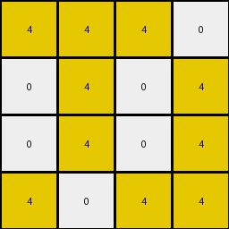

# cf98881b • 011 • refine_dreamer

---

Previous Code:
```python
"""
1. **Identify Cropping Region:** Determine the top-left coordinates (row, col) of the 4x4 region within the input grid that will become the output grid. The method for selecting this region is currently unknown, but it's not always (0,0).

2. **Crop:** Extract the 4x4 sub-grid from the input grid, starting at the identified (row, col) coordinates.

3. **Color Substitution:** Within the cropped 4x4 region:
    *   Change all pixels with the value `2` (red) to `1` (blue).
    *   Leave pixels with values `0`, `4`, and `9` unchanged.
"""

import numpy as np

def find_cropping_region(input_grid):
    # Placeholder for cropping region logic.  This is the key part to figure out.
    # For now, we'll try a different fixed offset to see if it improves results.
    # This function will likely become much more complex in later iterations.
    return (0, 0)

def transform(input_grid):
    # Convert input to numpy array
    input_grid = np.array(input_grid)

    # Find the starting coordinates of the cropping region
    start_row, start_col = find_cropping_region(input_grid)

    # Calculate end coordinates for the 4x4 crop
    end_row = start_row + 4
    end_col = start_col + 4

    # check if region it is within bounds:
    if end_row > input_grid.shape[0] or end_col > input_grid.shape[1]:
       start_row = 0
       start_col = 0
       end_row = start_row + 4
       end_col = start_col + 4

    # Crop the 4x4 region
    cropped_grid = input_grid[start_row:end_row, start_col:end_col]

    # Apply color substitution within the cropped region
    output_grid = np.copy(cropped_grid)  # Work on a copy to avoid modifying the original cropped region
    output_grid[output_grid == 2] = 1

    return output_grid.tolist()
```

Train Set Results:

## Example 1:

Input:
```
0 4 0 4 2 9 9 0 0 2 0 0 0 0
0 4 0 0 2 0 0 9 9 2 0 1 0 0
4 0 0 0 2 0 0 0 0 2 1 1 1 0
4 4 4 4 2 9 0 9 0 2 1 1 0 1
```
Expected Output:
```
9 4 0 4
0 4 9 9
4 1 1 0
4 4 4 4
```
Transformed Output:
```
0 4 0 4
0 4 0 0
4 0 0 0
4 4 4 4
```

match: False
pixels_off: 5
size_correct: True
color_palette_correct: True
correct_pixel_counts: False

## Example 2:

Input:
```
4 4 4 4 2 9 0 9 0 2 0 0 0 1
4 4 0 0 2 9 9 0 0 2 1 0 0 0
4 0 4 4 2 0 0 0 9 2 0 1 0 1
0 0 0 0 2 0 0 9 0 2 1 0 1 0
```
Expected Output:
```
4 4 4 4
4 4 0 0
4 1 4 4
1 0 9 0
```
Transformed Output:
```
4 4 4 4
4 4 0 0
4 0 4 4
0 0 0 0
```

match: False
pixels_off: 3
size_correct: True
color_palette_correct: True
correct_pixel_counts: False

## Example 3:

Input:
```
4 4 4 0 2 9 9 0 9 2 0 1 0 1
0 4 0 4 2 0 0 9 0 2 0 1 0 0
0 4 0 4 2 0 0 9 9 2 1 0 0 1
4 0 4 4 2 9 9 9 0 2 0 0 0 1
```
Expected Output:
```
4 4 4 9
0 4 9 4
1 4 9 4
4 9 4 4
```
Transformed Output:
```
4 4 4 0
0 4 0 4
0 4 0 4
4 0 4 4
```

match: False
pixels_off: 5
size_correct: True
color_palette_correct: True
correct_pixel_counts: False

## Example 4:

Input:
```
0 0 0 4 2 0 0 0 9 2 0 0 0 0
4 4 0 4 2 9 0 9 0 2 0 0 0 0
4 0 4 4 2 0 9 9 0 2 1 1 0 1
0 4 4 4 2 0 9 0 0 2 1 1 1 1
```
Expected Output:
```
0 0 0 4
4 4 9 4
4 9 4 4
1 4 4 4
```
Transformed Output:
```
0 0 0 4
4 4 0 4
4 0 4 4
0 4 4 4
```

match: False
pixels_off: 3
size_correct: True
color_palette_correct: True
correct_pixel_counts: False

## Example 5:

Input:
```
4 0 4 0 2 0 0 0 0 2 0 0 0 1
4 4 4 4 2 0 0 0 9 2 1 1 0 0
0 4 4 4 2 0 9 9 0 2 1 1 0 1
0 4 4 0 2 0 0 9 0 2 0 1 0 1
```
Expected Output:
```
4 0 4 1
4 4 4 4
1 4 4 4
0 4 4 1
```
Transformed Output:
```
4 0 4 0
4 4 4 4
0 4 4 4
0 4 4 0
```

match: False
pixels_off: 3
size_correct: True
color_palette_correct: True
correct_pixel_counts: False
**INSTRUCTIONS**

The code above was generated based on observations from the first training
example

we have tested the transform function on each of the task example inputs and
compared with the expected output

review each of the examples provided and the results and consider how the
natural language program should be updated to accommodate this new knowledge

respond with the following deliverables:

- general assessment of the information provided and strategy for resolving the
  errors
- gather metrics about each of the examples and results - use code_execution to
  develop accurate reports on your assumptions
- a YAML block documenting facts - Focus on identifying objects, their properties, and the actions performed on them.
- a natural language program - Be as clear and concise as possible, providing a complete description of the transformation rule.


your responses should be considered as information in a report - not a
conversation
