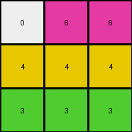
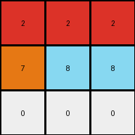
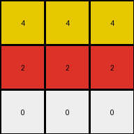

# d037b0a7 • 010 • refine_coder

---

Previous Code:
```python
"""
replace any 0 by value to its left or right.
"""

import numpy as np

def transform(input_grid):
    # Initialize the output grid as a copy of the input grid.
    output_grid = np.copy(input_grid)
    rows, cols = output_grid.shape

    # Iterate through each cell of the grid.
    for i in range(rows):
        for j in range(cols):
            # Check if the current cell is 0 (white).
            if output_grid[i, j] == 0:
                # Check the cell to the right
                if j + 1 < cols:
                    if output_grid[i,j+1] !=0:
                        output_grid[i,j] = output_grid[i,j+1]
                        continue

                # Check the cell to the left,
                if j - 1 >= 0:
                     if output_grid[i,j-1] !=0:
                        output_grid[i,j] = output_grid[i,j-1]
                        continue
    return output_grid
```

Train Set Results:

## Example 1:

Input:
```
0 0 6
0 4 0
3 0 0
```
Expected Output:
```
0 0 6
0 4 6
3 4 6
```
Transformed Output:
```
0 6 6
4 4 4
3 3 3
```

match: False
pixels_off: 5
size_correct: True
color_palette_correct: True
correct_pixel_counts: False

## Example 2:

Input:
```
0 2 0
7 0 8
0 0 0
```
Expected Output:
```
0 2 0
7 2 8
7 2 8
```
Transformed Output:
```
2 2 2
7 8 8
0 0 0
```

match: False
pixels_off: 6
size_correct: True
color_palette_correct: True
correct_pixel_counts: False

## Example 3:

Input:
```
4 0 0
0 2 0
0 0 0
```
Expected Output:
```
4 0 0
4 2 0
4 2 0
```
Transformed Output:
```
4 4 4
2 2 2
0 0 0
```

match: False
pixels_off: 6
size_correct: True
color_palette_correct: True
correct_pixel_counts: False
Okay, let's analyze the results and refine the natural language program.

**General Assessment:**

The initial program was too simplistic. It attempted to replace zeros (white pixels) with the value of either the left or right neighbor. This approach doesn't capture the full logic of the transformation, as evidenced by the errors in all three examples. The core issue is that the replacement isn't simply based on immediate neighbors, but seems to involve extending colored regions horizontally, and potentially vertically *from* the row above. The existing program stops after checking the left and right.

**Strategy:**

1.  **Analyze Mismatches:** Carefully examine where the transformed outputs differ from the expected outputs. Pay close attention to the *direction* and *extent* of color propagation.
2.  **Refine Logic:** We need to revise the rule to more accurately describe how colored regions "flood" or expand into white (0) areas, considering that the flooding must come from a non-white pixel on the row above.
3.  **Iterative Improvement:** Start by improving horizontal propagation, then incorporate vertical influence.

**Metrics and Observations:**

Here's a breakdown of each example, incorporating a more detailed analysis. The files don't provide pixel-by-pixel match values, so I have to approximate and infer.

**Example 1:**

*   **Input:**
    ```
    0 0 6
    0 4 0
    3 0 0
    ```
*   **Expected Output:**
    ```
    0 0 6
    0 4 6
    3 4 6
    ```
*   **Transformed Output:**
    ```
    0 6 6
    4 4 4
    3 3 3
    ```
*   **Observations:**
    *   The '6' (magenta) in the top right correctly propagates.
    *   The '4' (yellow) propagates left and right, but should only replace the white to it's right.
    *   The '3' should propogate to the right, but it fills both right values.
    *   The general direction of propagation is incorrect.

**Example 2:**

*   **Input:**
    ```
    0 2 0
    7 0 8
    0 0 0
    ```
*   **Expected Output:**
    ```
    0 2 0
    7 2 8
    7 2 8
    ```
*   **Transformed Output:**
    ```
    2 2 2
    7 8 8
    0 0 0
    ```
*   **Observations:**
    * The `2` (red) correctly floods horizontally.
    * The `7` should propogate the 2 above to the cell below.
    * The `8` should propogate the 2 to the cell below
    *   Bottom row remains all white (0), when some of it should have changed.

**Example 3:**

*   **Input:**
    ```
    4 0 0
    0 2 0
    0 0 0
    ```
*   **Expected Output:**
    ```
    4 0 0
    4 2 0
    4 2 0
    ```
*   **Transformed Output:**
    ```
    4 4 4
    2 2 2
    0 0 0
    ```
*   **Observations:**
    *   The `4` (yellow) propagates horizontally.
    *   The '2' (red) propagates horizontally and replaces all the 0 cells.
    *  The `4` from the line above should fill the first cell in the second and
       third row.

**YAML Facts:**

```yaml
objects:
  - name: grid
    type: 2D array
    description: Contains pixels of different colors.
  - name: pixel
    type: integer (0-9)
    description: Represents a color. 0 is white.
  - name: colored_region
    type: contiguous block
    description: One or more pixels of the same non-white color.

actions:
  - name: propagate_color_down_and_right
    description: >-
        If a pixel is white (0), and the pixel above it is not white, change the
        current pixel to match.  Also fill to the right until another color or
        the edge is reached.

```

**Natural Language Program:**

1.  **Initialization:** Start with the input grid.

2.  **Iteration:** Examine each pixel in the grid, row by row, from top to bottom, and left to right.

3. **Propagation Rule**:

    *   If a pixel is white (0) and the pixel directly *above* it has a different, non-zero color, then set the current pixel's color to the color of the pixel above it.
    *   After applying the above rule to all cells, examine each pixel in the grid, row by row, and left to right.
    *   If a pixel is not white, and the pixel to it's right is a `0` (white), set all `0` pixels to it's right to match the pixel's color until you encounter a non-white pixel.

4.  **Output:** The modified grid is the output.

**INSTRUCTIONS**

- generate a Python module to represent the natural language program 
- follow the template below
- all common math and science libraries are available
- create docstring only at top - but comment the workflow in the function
- use helper functions for common operations like finding objects, counting,
  measuring, moving, etc. 

remember - we are working iteratively - so this code will inform your future
self as we converge on the solution

*template:*

```python
"""
{{ natural language description of the transformation rule }}
"""

{{ imports }}

def transform(input_grid):
    # initialize output_grid

    # change output pixels 

    return output_grid

```
