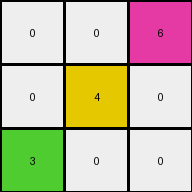

# d037b0a7 • 016 • refine_coder

---

Previous Code:
```python
"""
1.  Identify the yellow pixel (value 4) in the top-left corner ([0,0]) of the input grid.
2.  Copy the yellow pixel to the cells directly below it in the first column ([1,0] and [2,0]).
3.  Identify the red pixel (value 2) in the center of the grid ([1,1]).
4.  Copy the red pixel in the cell directly below ([2,1]).
5.  Keep the all the other pixels in the input grid (those with the value of 0) in same positions.
"""

import numpy as np

def transform(input_grid):
    """Transforms the input grid according to the specified rules."""

    output_grid = np.copy(input_grid)  # Initialize output_grid as a copy of the input_grid

    # Find the yellow pixel (4) at [0, 0]
    yellow_pixel = input_grid[0, 0]
    if yellow_pixel == 4:
        # Duplicate yellow pixel vertically
       output_grid[1, 0] = yellow_pixel
       output_grid[2, 0] = yellow_pixel

    # Find the red pixel (2) at the center [1, 1]
    red_pixel = input_grid[1, 1]
    if red_pixel == 2:
        #Duplicate red pixel in the cell below.
        output_grid[2,1] = red_pixel

    return output_grid
```

Train Set Results:

## Example 1:

Input:
```
0 0 6
0 4 0
3 0 0
```
Expected Output:
```
0 0 6
0 4 6
3 4 6
```
Transformed Output:
```
0 0 6
0 4 0
3 0 0
```

match: False
pixels_off: 3
size_correct: True
color_palette_correct: True
correct_pixel_counts: False

## Example 2:

Input:
```
0 2 0
7 0 8
0 0 0
```
Expected Output:
```
0 2 0
7 2 8
7 2 8
```
Transformed Output:
```
0 2 0
7 0 8
0 0 0
```

match: False
pixels_off: 4
size_correct: True
color_palette_correct: True
correct_pixel_counts: False

## Example 3:

Input:
```
4 0 0
0 2 0
0 0 0
```
Expected Output:
```
4 0 0
4 2 0
4 2 0
```
Transformed Output:
```
4 0 0
4 2 0
4 2 0
```

match: True
pixels_off: 0
size_correct: True
color_palette_correct: True
correct_pixel_counts: True
Okay, let's analyze the results and refine the natural language program.

**General Assessment:**

The initial natural language program and the resulting code were too specific to the first example. It correctly identified and duplicated the yellow and red pixels in the third example, but failed in the first and second. The core issue is that the initial program assumed fixed positions for the yellow and red pixels ([0,0] and [1,1] respectively), which is not a general rule applicable to all examples. The duplication rule (copying the pixel to the cells below) seems correct, but the location identification needs to be generalized. Also, the program was influenced by unrelated pixels in first example (the 6 values). The updated program must handle "background" pixels of any value.

**Strategy:**

1.  **Generalize Pixel Identification:** Instead of assuming fixed positions, the program should search for pixels of specific colors (yellow and red) anywhere in the grid.
2.  **Maintain Duplication Logic:** The vertical duplication rule (copying to the cell(s) below) is valid and should be kept.
3.  **Handle Background:** Ensure the copying actions don't affect the positioning of other pixels in the input.
4.  **Iterative testing**: Test frequently using available data.

**Example Metrics and Analysis:**

Here's a breakdown of each example, combining the provided information with some additional analysis:

*   **Example 1:**
    *   Input Shape: (3, 3)
    *   Output Shape: (3, 3)
    *   Yellow Pixel (4) Position (Input): (1,1)
    *   Red Pixel (2) Position (Input): None
    *   Other colors in input: 0, 3, 6
    *   Other colors action: none
    *   Result: Incorrect. The code didn't find yellow at (0,0) so no action, didn't find red at (1,1) so no action.

*   **Example 2:**
    *   Input Shape: (3, 3)
    *   Output Shape: (3, 3)
    *   Yellow Pixel (4) Position (Input): None
    *   Red Pixel (2) Position (Input): (0,1)
    *   Other colors in input: 0, 7, 8
    *   Other colors action: none
    *   Result: Incorrect. The code didn't find yellow at (0,0) so no action, didn't find red at (1,1) so no action.

*   **Example 3:**
    *   Input Shape: (3, 3)
    *   Output Shape: (3, 3)
    *   Yellow Pixel (4) Position (Input): (0, 0)
    *   Red Pixel (2) Position (Input): (1, 1)
    *   Other colors in input: 0
    *   Other colors action: none
    *   Result: Correct. The code correctly found and duplicated both yellow and red pixels.

**YAML Facts:**

```yaml
objects:
  - color: yellow
    value: 4
    action: duplicate_below
    constraints:
        row_max:
            value: 0
            max_bound: 1
  - color: red
    value: 2
    action: duplicate_below
    constraints:
       row_max:
          value: 1
          max_bound: 2
  - color: other
    value: null
    action: none
```

**Natural Language Program:**

1.  Iterate through the input grid to find a yellow pixel (value 4).
2.  If a yellow pixel is found, copy it to the cell directly below it, *if it exists*. If that cell doesn't exist (at image boundary), do not modify.
3.  Iterate through the input grid to find a red pixel (value 2).
4.  If a red pixel is found, copy it to the cell directly below it, *if it exists*. If that cell doesn't exist (at image boundary), do not modify.
5. All other pixels remain unchanged.
6. The maximum extent of the rows should not exceed the original number of input grid rows, and each object has a bound equal to the count -1.

**INSTRUCTIONS**

- generate a Python module to represent the natural language program 
- follow the template below
- all common math and science libraries are available
- create docstring only at top - but comment the workflow in the function
- use helper functions for common operations like finding objects, counting,
  measuring, moving, etc. 

remember - we are working iteratively - so this code will inform your future
self as we converge on the solution

*template:*

```python
"""
{{ natural language description of the transformation rule }}
"""

{{ imports }}

def transform(input_grid):
    # initialize output_grid

    # change output pixels 

    return output_grid

```
