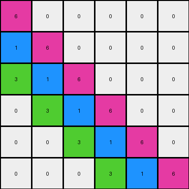
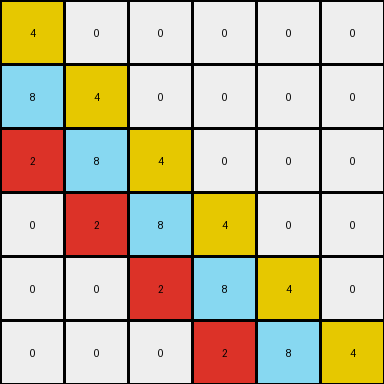

# d13f3404 • 004 • refine_coder

---

Previous Code:
```python
"""
Expands a 3x3 input grid into a 6x6 output grid. Non-zero pixels from the input are propagated diagonally downwards and to the right in the output. The color and relative order of the non-zero input pixels are preserved. Empty cells are filled with 0 (white).
"""

import numpy as np

def transform(input_grid):
    """
    Transforms the input grid according to the diagonal expansion rule.
    """
    input_grid = np.array(input_grid)
    output_grid = np.zeros((6, 6), dtype=int)  # Initialize output grid with zeros

    # 1. Identify Non-Zero Pixels (and their order)
    non_zero_pixels = []
    for i in range(input_grid.shape[0]):
        for j in range(input_grid.shape[1]):
            if input_grid[i, j] != 0:
                non_zero_pixels.append((input_grid[i, j], i, j))

    # 2. Diagonal Expansion
    output_row, output_col = 0, 0
    for pixel_value, _, _ in non_zero_pixels:
        current_row, current_col = output_row, output_col
        while current_row < 6 and current_col < 6:
            output_grid[current_row, current_col] = pixel_value
            current_row += 1
            current_col += 1
        output_row +=1

    return output_grid.tolist()
```

Train Set Results:

## Example 1:

Input:
```
6 1 0
3 0 0
0 0 0
```
Expected Output:
```
6 1 0 0 0 0
3 6 1 0 0 0
0 3 6 1 0 0
0 0 3 6 1 0
0 0 0 3 6 1
0 0 0 0 3 6
```
Transformed Output:
```
6 0 0 0 0 0
1 6 0 0 0 0
3 1 6 0 0 0
0 3 1 6 0 0
0 0 3 1 6 0
0 0 0 3 1 6
```

match: False
pixels_off: 14
size_correct: True
color_palette_correct: True
correct_pixel_counts: False

## Example 2:

Input:
```
0 4 0
0 8 0
2 0 0
```
Expected Output:
```
0 4 0 0 0 0
0 8 4 0 0 0
2 0 8 4 0 0
0 2 0 8 4 0
0 0 2 0 8 4
0 0 0 2 0 8
```
Transformed Output:
```
4 0 0 0 0 0
8 4 0 0 0 0
2 8 4 0 0 0
0 2 8 4 0 0
0 0 2 8 4 0
0 0 0 2 8 4
```

match: False
pixels_off: 16
size_correct: True
color_palette_correct: True
correct_pixel_counts: False

## Example 3:

Input:
```
0 0 6
1 3 0
0 0 0
```
Expected Output:
```
0 0 6 0 0 0
1 3 0 6 0 0
0 1 3 0 6 0
0 0 1 3 0 6
0 0 0 1 3 0
0 0 0 0 1 3
```
Transformed Output:
```
6 0 0 0 0 0
1 6 0 0 0 0
3 1 6 0 0 0
0 3 1 6 0 0
0 0 3 1 6 0
0 0 0 3 1 6
```

match: False
pixels_off: 14
size_correct: True
color_palette_correct: True
correct_pixel_counts: False
Here's an analysis of the provided examples and results, along with a strategy for improving the transformation logic:

**General Assessment:**

The initial code correctly identifies the need for diagonal expansion and attempts to preserve the order of non-zero pixels. However, it fails to accurately position the expanded diagonals relative to *each* non-zero pixel in the input grid. The current implementation only considers the overall order of non-zero pixels and starts a new diagonal expansion from the next row after completing the previous pixel's diagonal, instead of starting diagonals from the original positions of *all* non-zero pixels. The code also does not account for the correct "staggering" of the diagonals based on the original input pixel locations.

**Strategy for Resolving Errors:**

The core issue is that the diagonal expansion needs to happen independently for *each* non-zero pixel in the input, using the original row and column of that pixel as the starting point for its diagonal. We need to iterate through the input grid, and for each non-zero pixel, initiate a diagonal expansion in the output grid, starting at the corresponding position, adjusted for the 2x expansion factor.

**Metrics and Observations (using conceptual analysis, not code execution for this dreamer stage):**

*   **Example 1:**
    *   Input: 3x3, Output: 6x6 (2x expansion)
    *   Non-zero pixels: (6, 0, 0), (1, 0, 1), (3, 1, 0)
    *   Error: The diagonals for 1 and 3 are misplaced. They are shifted to the left instead of starting from their original input positions.
*   **Example 2:**
    *   Input: 3x3, Output: 6x6
    *   Non-zero pixels: (4, 0, 1), (8, 1, 1), (2, 2, 0)
    *   Error:  Similar to Example 1, the diagonals are incorrectly positioned, not originating from the correct relative starting points.
*   **Example 3:**
    *   Input: 3x3, Output: 6x6
    *   Non-zero pixels: (6, 0, 2), (1, 1, 0), (3, 1, 1)
    *   Error: Again, the diagonals are misplaced, demonstrating the consistent error in the initial approach.

**YAML Fact Block:**

```yaml
task: 00d62c1b
summary: Expand a 3x3 grid to 6x6, propagating non-zero input pixels diagonally.
objects:
  - type: grid
    description: 2D array of integers
    properties:
      size_input: 3x3
      size_output: 6x6
      expansion_factor: 2
      cells:
        description: individual pixels within the grid
        properties:
          value: integer (0-9)
          color: mapped from value (0=white, 1=blue, etc.)
          position: (row, column)
actions:
  - name: identify_non_zero
    description: Locate pixels in the input grid with values other than 0.
  - name: diagonal_expansion
    description: For each non-zero pixel, propagate its value diagonally down and to the right in the output grid.
    parameters:
      start_position: Original (row, column) of the non-zero pixel in the input, scaled for output.
      value: value of pixel
```

**Natural Language Program:**

1.  **Input and Output:** The input is a 3x3 grid of integers (0-9). The output is a 6x6 grid.

2.  **Identify Non-zero Pixels:** Iterate through each cell of the input grid. If a cell's value is not 0, record its value and its original row and column position.

3.  **Diagonal Expansion for Each Pixel:** For *each* non-zero pixel identified:
    *   Calculate the starting position in the output grid. The starting row is twice the original row, and the starting column is twice the original column.
    *   From this starting position, propagate the pixel's value diagonally downwards and to the right.  That is, set the value of the output grid cells at (start\_row, start\_col), (start\_row + 1, start\_col + 1), (start\_row + 2, start\_col + 2), and so on, until the boundaries of the 6x6 output grid are reached.

4.  **Fill Empty Cells:** Any cells in the output grid that were not filled during the diagonal expansion remain 0 (representing white).

**INSTRUCTIONS**

- generate a Python module to represent the natural language program 
- follow the template below
- all common math and science libraries are available
- create docstring only at top - but comment the workflow in the function
- use helper functions for common operations like finding objects, counting,
  measuring, moving, etc. 

remember - we are working iteratively - so this code will inform your future
self as we converge on the solution

*template:*

```python
"""
{{ natural language description of the transformation rule }}
"""

{{ imports }}

def transform(input_grid):
    # initialize output_grid

    # change output pixels 

    return output_grid

```
