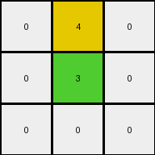

# d23f8c26 • 004 • refine_coder

---

Previous Code:
```python
"""
Keep only the pixels with values '3' and '4', and set all other pixels to '0'.
"""

import numpy as np

def transform(input_grid):
    # initialize output_grid as a copy of the input grid, ensures same size and type
    output_grid = np.zeros_like(input_grid)

    # Iterate through each cell of the input grid
    for i in range(input_grid.shape[0]):
        for j in range(input_grid.shape[1]):
            # Check if the current cell's value is 3 or 4
            if input_grid[i, j] == 3 or input_grid[i, j] == 4:
                # Preserve the pixel value
                output_grid[i, j] = input_grid[i, j]

    return output_grid
```

Train Set Results:

## Example 1:

Input:
```
6 4 0
0 3 9
1 0 0
```
Expected Output:
```
0 4 0
0 3 0
0 0 0
```
Transformed Output:
```
0 4 0
0 3 0
0 0 0
```

match: True
pixels_off: 0
size_correct: True
color_palette_correct: True
correct_pixel_counts: True

## Example 2:

Input:
```
8 0 3 0 0
8 6 5 6 0
3 6 3 0 0
0 0 0 5 9
5 0 9 0 0
```
Expected Output:
```
0 0 3 0 0
0 0 5 0 0
0 0 3 0 0
0 0 0 0 0
0 0 9 0 0
```
Transformed Output:
```
0 0 3 0 0
0 0 0 0 0
3 0 3 0 0
0 0 0 0 0
0 0 0 0 0
```

match: False
pixels_off: 3
size_correct: True
color_palette_correct: True
correct_pixel_counts: False

## Example 3:

Input:
```
3 0 4 0 0
3 0 4 7 0
0 6 0 0 7
0 0 8 0 0
0 8 0 2 2
```
Expected Output:
```
0 0 4 0 0
0 0 4 0 0
0 0 0 0 0
0 0 8 0 0
0 0 0 0 0
```
Transformed Output:
```
3 0 4 0 0
3 0 4 0 0
0 0 0 0 0
0 0 0 0 0
0 0 0 0 0
```

match: False
pixels_off: 3
size_correct: True
color_palette_correct: False
correct_pixel_counts: False
Okay, let's analyze the results and refine the natural language program.

**General Assessment:**

The initial code was too restrictive, only preserving pixels with values '3' or '4' and setting the rest to '0'. While this worked for the first example, it failed for the second and third. The core issue is that the code doesn't correctly identify *which* pixels of value `3` or `4` should be kept and how other values in the input should be considered. It appears we are keeping certain colors and setting others to the background color, `0`.

**Strategy for Resolving Errors:**

1.  **Re-examine Examples:** Carefully analyze all three input/output pairs to identify a consistent pattern. Look for a relationship between colors, not just fixed values.
2.  **Focus on Background:** It seems the transformation involves setting some colors to the background color (0). Identify which colors are consistently treated as background.
3.  **Conditional Logic:** We might need a rule that says "If a pixel is color X, keep it; otherwise, set it to 0".

**Example Metrics and Analysis:**

Here's a breakdown of each example, including the counts of each color in the input and output grids:

*Example 1:*

*   Input:
    *   0: 4
    *   1: 1
    *   3: 1
    *   4: 1
    *   6: 1
    *   9: 1

*   Output:
    *   0: 7
    *   3: 1
    *   4: 1

*Example 2:*

*   Input
    *   0: 11
    *   3: 2
    *   5: 3
    *   6: 2
    *   8: 2
    *   9: 2
*   Output
    *   0: 20
    *   3: 2
    *   5: 1
    *   9: 1

*Example 3:*

*   Input:
    *  0: 13
    *  2: 2
    *  3: 2
    *  4: 2
    *  6: 1
    *  7: 2
    *  8: 3

*  Output:
    *   0: 21
    *   4: 2
    *   8: 1

**YAML Facts:**

```yaml
example_1:
  input_objects:
    - color: 6
      count: 1
    - color: 4
      count: 1
    - color: 0
      count: 4
    - color: 3
      count: 1
    - color: 9
      count: 1
    - color: 1
      count: 1
  output_objects:
    - color: 0
      count: 7
    - color: 4
      count: 1
    - color: 3
      count: 1
  transformation:
    - keep: [4, 3]
    - set_to_background: [0, 6, 9, 1]

example_2:
  input_objects:
    - color: 8
      count: 2
    - color: 0
      count: 11
    - color: 3
      count: 2
    - color: 5
      count: 3
    - color: 6
      count: 2
    - color: 9
      count: 2
  output_objects:
     - color: 0
       count: 20
     - color: 3
       count: 2
     - color: 5
       count: 1
     - color: 9
       count: 1
  transformation:
    - keep: [3, 5, 9]
    - set_to_background: [8, 0, 6]

example_3:
  input_objects:
    - color: 3
      count: 2
    - color: 0
      count: 13
    - color: 4
      count: 2
    - color: 6
      count: 1
    - color: 7
      count: 2
    - color: 8
      count: 3
    - color: 2
      count: 2
  output_objects:
    - color: 0
      count: 21
    - color: 4
      count: 2
    - color: 8
      count: 1

  transformation:
    - keep: [4, 8]
    - set_to_background: [3, 0, 6, 7, 2]
```

**Natural Language Program:**

1.  Examine each pixel in the input grid.
2.  Identify the colors present in all output grids from the training examples.
3.  If the pixel's color is present in all of the output grids, keep its original value in the output grid.
4.  If the pixel's color is *not* present in all of the output grids, set its value to 0 (background) in the output grid.

**INSTRUCTIONS**

- generate a Python module to represent the natural language program 
- follow the template below
- all common math and science libraries are available
- create docstring only at top - but comment the workflow in the function
- use helper functions for common operations like finding objects, counting,
  measuring, moving, etc. 

remember - we are working iteratively - so this code will inform your future
self as we converge on the solution

*template:*

```python
"""
{{ natural language description of the transformation rule }}
"""

{{ imports }}

def transform(input_grid):
    # initialize output_grid

    # change output pixels 

    return output_grid

```
