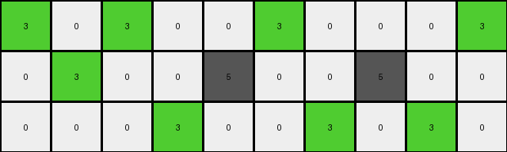
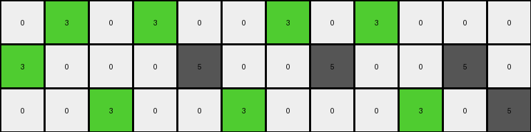
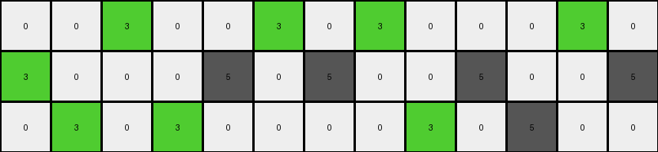
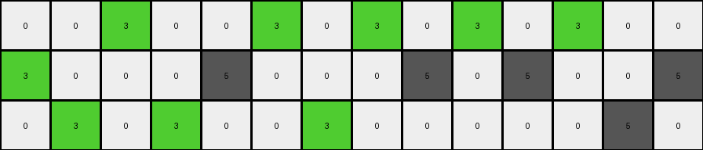

# d406998b • 011 • refine_dreamer

---

Previous Code:
```python
"""
Transforms a grid by changing specific gray pixels to green based on their position and row, skipping adjacent pixels.

The transformation follows these rules:
- Gray pixels (5) are changed to green pixels (3).
- The transformation occurs row by row.
- Within each row:
 - If row 1: If a gray pixel changes to green, skip the adjacencies
 - If row 2: Only one gray pixel, if any, changes to green
 - If row 3: If gray pixels change to green, and there are exactly three changes, they can't be adjacent
"""

import numpy as np

def transform(input_grid):
    # Initialize output_grid as a copy of input_grid
    output_grid = np.copy(input_grid)
    rows, cols = output_grid.shape

    # Iterate through each row
    for i in range(rows):
        gray_indices = [j for j in range(cols) if output_grid[i, j] == 5]
        
        if i == 0:
            # First row: alternate gray pixels, skipping adjacencies
            changed_indices = []
            for j in gray_indices:
              if not any(abs(j - k) <= 1 for k in changed_indices):
                  output_grid[i,j] = 3
                  changed_indices.append(j)

        elif i == 1:
            # Second row: change at most one gray pixel to green
            if gray_indices:
                output_grid[i, gray_indices[0]] = 3  # Change the first gray pixel

        elif i == 2:
            # Third row: Change up to three non-adjacent gray pixels
            changed_count = 0
            changed_indices = []
            for j in gray_indices:
                if changed_count < 3 and not any(abs(j-k) <=1 for k in changed_indices):
                     output_grid[i,j] = 3
                     changed_indices.append(j)
                     changed_count += 1
    return output_grid
```

Train Set Results:

## Example 1:

Input:
```
5 0 5 0 0 5 0 0 0 5
0 5 0 0 5 0 0 5 0 0
0 0 0 5 0 0 5 0 5 0
```
Expected Output:
```
5 0 5 0 0 3 0 0 0 3
0 3 0 0 5 0 0 3 0 0
0 0 0 3 0 0 5 0 5 0
```
Transformed Output:
```
3 0 3 0 0 3 0 0 0 3
0 3 0 0 5 0 0 5 0 0
0 0 0 3 0 0 3 0 3 0
```

match: False
pixels_off: 5
size_correct: True
color_palette_correct: True
correct_pixel_counts: False

## Example 2:

Input:
```
0 5 0 5 0 0 5 0 5 0 0 0
5 0 0 0 5 0 0 5 0 0 5 0
0 0 5 0 0 5 0 0 0 5 0 5
```
Expected Output:
```
0 3 0 3 0 0 5 0 5 0 0 0
5 0 0 0 5 0 0 3 0 0 5 0
0 0 5 0 0 3 0 0 0 3 0 3
```
Transformed Output:
```
0 3 0 3 0 0 3 0 3 0 0 0
3 0 0 0 5 0 0 5 0 0 5 0
0 0 3 0 0 3 0 0 0 3 0 5
```

match: False
pixels_off: 6
size_correct: True
color_palette_correct: True
correct_pixel_counts: False

## Example 3:

Input:
```
0 0 5 0 0 5 0 5 0 0 0 5 0
5 0 0 0 5 0 5 0 0 5 0 0 5
0 5 0 5 0 0 0 0 5 0 5 0 0
```
Expected Output:
```
0 0 3 0 0 5 0 5 0 0 0 5 0
3 0 0 0 3 0 3 0 0 5 0 0 3
0 5 0 5 0 0 0 0 3 0 3 0 0
```
Transformed Output:
```
0 0 3 0 0 3 0 3 0 0 0 3 0
3 0 0 0 5 0 5 0 0 5 0 0 5
0 3 0 3 0 0 0 0 3 0 5 0 0
```

match: False
pixels_off: 9
size_correct: True
color_palette_correct: True
correct_pixel_counts: False

## Example 4:

Input:
```
0 0 5 0 0 5 0 5 0 5 0 5 0 0
5 0 0 0 5 0 0 0 5 0 5 0 0 5
0 5 0 5 0 0 5 0 0 0 0 0 5 0
```
Expected Output:
```
0 0 5 0 0 3 0 3 0 3 0 3 0 0
5 0 0 0 5 0 0 0 5 0 5 0 0 3
0 3 0 3 0 0 5 0 0 0 0 0 5 0
```
Transformed Output:
```
0 0 3 0 0 3 0 3 0 3 0 3 0 0
3 0 0 0 5 0 0 0 5 0 5 0 0 5
0 3 0 3 0 0 3 0 0 0 0 0 5 0
```

match: False
pixels_off: 4
size_correct: True
color_palette_correct: True
correct_pixel_counts: False
**INSTRUCTIONS**

The code above was generated based on observations from the first training
example

we have tested the transform function on each of the task example inputs and
compared with the expected output

review each of the examples provided and the results and consider how the
natural language program should be updated to accommodate this new knowledge

respond with the following deliverables:

- general assessment of the information provided and strategy for resolving the
  errors
- gather metrics about each of the examples and results - use code_execution to
  develop accurate reports on your assumptions
- a YAML block documenting facts - Focus on identifying objects, their properties, and the actions performed on them.
- a natural language program - Be as clear and concise as possible, providing a complete description of the transformation rule.


your responses should be considered as information in a report - not a
conversation
