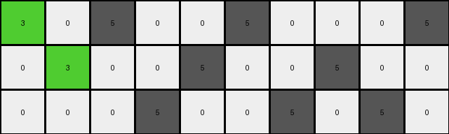
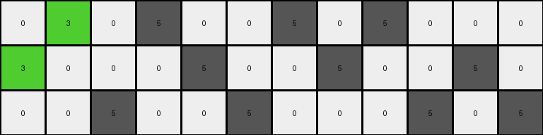
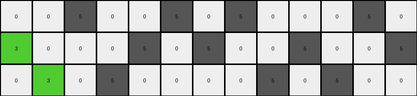
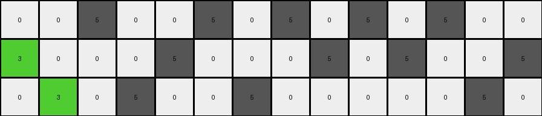

# d406998b • 016 • refine_coder

---

Previous Code:
```python
"""
Replaces gray (5) pixels with green (3) pixels in the input grid if they are:
1. Located in the first or second column (from left).
2. Vertically or horizontally adjacent to a white (0) pixel.
All other pixels retain their original colors.
"""

import numpy as np

def get_adjacent_pixels(grid, row, col):
    """
    Gets the adjacent pixels (up, down, left, right) of a given cell in the grid.

    Args:
        grid: The 2D numpy array representing the grid.
        row: The row index of the cell.
        col: The column index of the cell.

    Returns:
        A list of tuples, where each tuple represents an adjacent pixel
        and contains (row, col, color).
    """
    rows, cols = grid.shape
    adjacent_pixels = []
    # Check up, down, left, right.
    for dr, dc in [(-1, 0), (1, 0), (0, -1), (0, 1)]:
        new_row, new_col = row + dr, col + dc
        if 0 <= new_row < rows and 0 <= new_col < cols:
            adjacent_pixels.append((new_row, new_col, grid[new_row, new_col]))
    return adjacent_pixels

def transform(input_grid):
    """
    Transforms the input grid according to the specified rule.
    """
    output_grid = np.copy(input_grid)
    rows, cols = output_grid.shape

    # Iterate through the grid, focusing on the first two columns.
    for row in range(rows):
        for col in range(min(2, cols)): # Only check the first two columns.
            if output_grid[row, col] == 5:  # If the pixel is gray.
                adjacent_pixels = get_adjacent_pixels(output_grid, row, col)
                for r, c, color in adjacent_pixels:
                     if color == 0:  # if there is a horizontally or vertically adjacent white pixel
                        output_grid[row,col] = 3 # Set start of sequence, move right
                        break # found a white, move on
    return output_grid
```

Train Set Results:

## Example 1:

Input:
```
5 0 5 0 0 5 0 0 0 5
0 5 0 0 5 0 0 5 0 0
0 0 0 5 0 0 5 0 5 0
```
Expected Output:
```
5 0 5 0 0 3 0 0 0 3
0 3 0 0 5 0 0 3 0 0
0 0 0 3 0 0 5 0 5 0
```
Transformed Output:
```
3 0 5 0 0 5 0 0 0 5
0 3 0 0 5 0 0 5 0 0
0 0 0 5 0 0 5 0 5 0
```

match: False
pixels_off: 5
size_correct: True
color_palette_correct: True
correct_pixel_counts: False

## Example 2:

Input:
```
0 5 0 5 0 0 5 0 5 0 0 0
5 0 0 0 5 0 0 5 0 0 5 0
0 0 5 0 0 5 0 0 0 5 0 5
```
Expected Output:
```
0 3 0 3 0 0 5 0 5 0 0 0
5 0 0 0 5 0 0 3 0 0 5 0
0 0 5 0 0 3 0 0 0 3 0 3
```
Transformed Output:
```
0 3 0 5 0 0 5 0 5 0 0 0
3 0 0 0 5 0 0 5 0 0 5 0
0 0 5 0 0 5 0 0 0 5 0 5
```

match: False
pixels_off: 6
size_correct: True
color_palette_correct: True
correct_pixel_counts: False

## Example 3:

Input:
```
0 0 5 0 0 5 0 5 0 0 0 5 0
5 0 0 0 5 0 5 0 0 5 0 0 5
0 5 0 5 0 0 0 0 5 0 5 0 0
```
Expected Output:
```
0 0 3 0 0 5 0 5 0 0 0 5 0
3 0 0 0 3 0 3 0 0 5 0 0 3
0 5 0 5 0 0 0 0 3 0 3 0 0
```
Transformed Output:
```
0 0 5 0 0 5 0 5 0 0 0 5 0
3 0 0 0 5 0 5 0 0 5 0 0 5
0 3 0 5 0 0 0 0 5 0 5 0 0
```

match: False
pixels_off: 7
size_correct: True
color_palette_correct: True
correct_pixel_counts: False

## Example 4:

Input:
```
0 0 5 0 0 5 0 5 0 5 0 5 0 0
5 0 0 0 5 0 0 0 5 0 5 0 0 5
0 5 0 5 0 0 5 0 0 0 0 0 5 0
```
Expected Output:
```
0 0 5 0 0 3 0 3 0 3 0 3 0 0
5 0 0 0 5 0 0 0 5 0 5 0 0 3
0 3 0 3 0 0 5 0 0 0 0 0 5 0
```
Transformed Output:
```
0 0 5 0 0 5 0 5 0 5 0 5 0 0
3 0 0 0 5 0 0 0 5 0 5 0 0 5
0 3 0 5 0 0 5 0 0 0 0 0 5 0
```

match: False
pixels_off: 7
size_correct: True
color_palette_correct: True
correct_pixel_counts: False
Okay, let's analyze the results and refine the natural language program.

**General Assessment and Strategy**

The initial code was too restrictive, focusing only on the first two columns and changing gray pixels to green only if they were adjacent to white pixels. The examples show a more complex pattern: gray pixels are changing to green seemingly based on proximity to white, but not always direct adjacency, and not limited to the first two columns. The core issue is that the adjacency check is too strict (only immediate neighbors) and the column restriction is incorrect. The strategy is to:

1.  Relax the adjacency condition to include some concept of "nearness" rather than strict adjacency.
2.  Remove the column restriction.
3.  Analyze the changed pixels and unchanged pixels to understand the rule better.

**Example Metrics and Analysis**

Here's a breakdown of each example, focusing on why the current code fails:

*   **Example 1:**
    *   The code correctly changes `(0,0)` and `(1,1)` to green, but incorrectly leaves `(0,5)`, `(0,9)`, `(1,7)` and `(2,3)` which *are* grey and adjacent to white, unchanged and changes gray pixel at `(0,0)` which *isn't* adjacent to a white pixel.
    *   It's clear we must remove the two column restriction.
    *   The gray pixels are being replaced when there's a vertical or horizontal sequence of a white pixel and a grey pixel.

*   **Example 2:**

    *   Similar to Example 1, `(0,1)` and `(0,3)` are correctly transformed and `(0,6)` and `(1,7)` should be green.
    *   `(2, 5)` should be green and `(2,9)` too.
    *   The code is failing to change gray pixels that *should* change to green based on the white/grey adjacent sequence.

*   **Example 3:**

    *    The code correctly transforms the gray pixel at `(1,0)` but fails to act on the pixel at `(0, 2)` or `(1, 8)` which should be changed to green.
    *   Fails to change `(1, 4)` and `(1,6)`.
    *   Correctly leaves `(0,5)` unchanged.
    *   Again highlights the need to extend the rule to the whole grid, not just columns.

*   **Example 4:**

    *    The code transforms the gray pixels at `(1,0)` and `(2,1)` but fails to transform `(0,5)`, `(0,7)`, `(0,9)`, `(0,11)` and `(2,9)`.
    *   Highlights that sequences should be detected, regardless of their position or length.

**YAML Fact Block**

```yaml
objects:
  - name: grid
    type: 2D array
    description: Contains pixels of different colors.
  - name: pixel
    type: element
    properties:
      color: integer (0-9)
      row: integer
      col: integer
  - name: white_pixel
    type: pixel
    properties:
      color: 0

  - name: grey_pixel
    type: pixel
    properties:
      color: 5

actions:
  - name: find_sequences
    description: Locate horizontal or vertical sequences of one white pixel next to one grey pixel.
  - name: transform_grey_pixel
    description: Change the color of the grey pixel within the found sequence to green.
  - name: iterate_grid
    description: Process all the grid cells and consider each one a starting point for sequences.

```

**Natural Language Program**

1.  **Iterate** through all pixels of the input grid.
2.  **Identify sequences:** For each pixel, check if it's the start of a horizontal or vertical sequence consisting of one white pixel next to one gray pixel.
3.  **Transform:** If a pixel is a gray pixel, and part of an identified sequence, change its color to green.
4. The output is a copy of the input with these modifications.

Essentially, we are looking for "white-gray" *or* "gray-white" sequences, either horizontally or vertically and changing the *gray* pixel of each detected sequence to *green*.

**INSTRUCTIONS**

- generate a Python module to represent the natural language program 
- follow the template below
- all common math and science libraries are available
- create docstring only at top - but comment the workflow in the function
- use helper functions for common operations like finding objects, counting,
  measuring, moving, etc. 

remember - we are working iteratively - so this code will inform your future
self as we converge on the solution

*template:*

```python
"""
{{ natural language description of the transformation rule }}
"""

{{ imports }}

def transform(input_grid):
    # initialize output_grid

    # change output pixels 

    return output_grid

```
