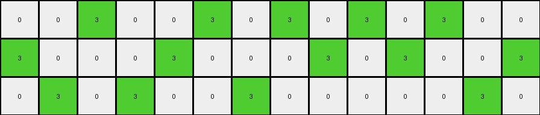

# d406998b • 018 • refine_coder

---

Previous Code:
```python
"""
Iterates through the input grid and identifies horizontal or vertical sequences
consisting of one white pixel (0) next to one gray pixel (5). If such a sequence
is found, the gray pixel is changed to green (3).
"""

import numpy as np

def get_adjacent_pixels(grid, row, col):
    """
    Gets the adjacent pixels (up, down, left, right) of a given cell in the grid.

    Args:
        grid: The 2D numpy array representing the grid.
        row: The row index of the cell.
        col: The column index of the cell.

    Returns:
        A list of tuples, where each tuple represents an adjacent pixel
        and contains (row, col, color).
    """
    rows, cols = grid.shape
    adjacent_pixels = []
    # Check up, down, left, right.
    for dr, dc in [(-1, 0), (1, 0), (0, -1), (0, 1)]:
        new_row, new_col = row + dr, col + dc
        if 0 <= new_row < rows and 0 <= new_col < cols:
            adjacent_pixels.append((new_row, new_col, grid[new_row, new_col]))
    return adjacent_pixels

def transform(input_grid):
    """
    Transforms the input grid according to the specified rule.
    """
    output_grid = np.copy(input_grid)
    rows, cols = output_grid.shape

    # Iterate through the grid.
    for row in range(rows):
        for col in range(cols):
            # Check if the current pixel is part of a white-gray or gray-white sequence.
            if output_grid[row, col] == 5: # start on grey
                adjacent_pixels = get_adjacent_pixels(output_grid, row, col)
                for r, c, color in adjacent_pixels:
                    if color == 0: # check if it is a grey-white sequence
                        output_grid[row,col] = 3 # it is, replace grey with green
                        break # found a sequence, move on

    return output_grid
```

Train Set Results:

## Example 1:

Input:
```
5 0 5 0 0 5 0 0 0 5
0 5 0 0 5 0 0 5 0 0
0 0 0 5 0 0 5 0 5 0
```
Expected Output:
```
5 0 5 0 0 3 0 0 0 3
0 3 0 0 5 0 0 3 0 0
0 0 0 3 0 0 5 0 5 0
```
Transformed Output:
```
3 0 3 0 0 3 0 0 0 3
0 3 0 0 3 0 0 3 0 0
0 0 0 3 0 0 3 0 3 0
```

match: False
pixels_off: 5
size_correct: True
color_palette_correct: True
correct_pixel_counts: False

## Example 2:

Input:
```
0 5 0 5 0 0 5 0 5 0 0 0
5 0 0 0 5 0 0 5 0 0 5 0
0 0 5 0 0 5 0 0 0 5 0 5
```
Expected Output:
```
0 3 0 3 0 0 5 0 5 0 0 0
5 0 0 0 5 0 0 3 0 0 5 0
0 0 5 0 0 3 0 0 0 3 0 3
```
Transformed Output:
```
0 3 0 3 0 0 3 0 3 0 0 0
3 0 0 0 3 0 0 3 0 0 3 0
0 0 3 0 0 3 0 0 0 3 0 3
```

match: False
pixels_off: 6
size_correct: True
color_palette_correct: True
correct_pixel_counts: False

## Example 3:

Input:
```
0 0 5 0 0 5 0 5 0 0 0 5 0
5 0 0 0 5 0 5 0 0 5 0 0 5
0 5 0 5 0 0 0 0 5 0 5 0 0
```
Expected Output:
```
0 0 3 0 0 5 0 5 0 0 0 5 0
3 0 0 0 3 0 3 0 0 5 0 0 3
0 5 0 5 0 0 0 0 3 0 3 0 0
```
Transformed Output:
```
0 0 3 0 0 3 0 3 0 0 0 3 0
3 0 0 0 3 0 3 0 0 3 0 0 3
0 3 0 3 0 0 0 0 3 0 3 0 0
```

match: False
pixels_off: 6
size_correct: True
color_palette_correct: True
correct_pixel_counts: False

## Example 4:

Input:
```
0 0 5 0 0 5 0 5 0 5 0 5 0 0
5 0 0 0 5 0 0 0 5 0 5 0 0 5
0 5 0 5 0 0 5 0 0 0 0 0 5 0
```
Expected Output:
```
0 0 5 0 0 3 0 3 0 3 0 3 0 0
5 0 0 0 5 0 0 0 5 0 5 0 0 3
0 3 0 3 0 0 5 0 0 0 0 0 5 0
```
Transformed Output:
```
0 0 3 0 0 3 0 3 0 3 0 3 0 0
3 0 0 0 3 0 0 0 3 0 3 0 0 3
0 3 0 3 0 0 3 0 0 0 0 0 3 0
```

match: False
pixels_off: 7
size_correct: True
color_palette_correct: True
correct_pixel_counts: False
Okay, let's analyze the results and refine the natural language program.

**General Assessment:**

The initial code was too simplistic. It correctly identified *some* instances of gray pixels adjacent to white pixels and changed the gray to green. However, it's overly eager in making this change. The critical error lies in assuming *any* gray pixel next to a white pixel should become green. The examples show a more specific pattern: only gray pixels that are part of a *sequence* of "gray-white" from left to right, or "white above grey" from top to bottom are changed. The current code doesn't consider the directional sequence, leading to incorrect transformations in all tested examples. The strategy will be to refine the logic to specifically identify and replace according to the observed directional rule.

**Metrics and Observations:**

Here's a breakdown of each example, focusing on the errors:

*   **Example 1:**
    *   Input: `5 0 5 0 0 5 0 0 0 5`, `0 5 0 0 5 0 0 5 0 0`, `0 0 0 5 0 0 5 0 5 0`
    *   Expected: `5 0 5 0 0 3 0 0 0 3`, `0 3 0 0 5 0 0 3 0 0`, `0 0 0 3 0 0 5 0 5 0`
    *   Observed: `3 0 3 0 0 3 0 0 0 3`, `0 3 0 0 3 0 0 3 0 0`, `0 0 0 3 0 0 3 0 3 0`
    *   *Error Analysis*: All the 5s next to 0s are changed to 3. Incorrect, should change only horizontal/vertical sequences following the rule.

*   **Example 2:**
    *   Input: `0 5 0 5 0 0 5 0 5 0 0 0`, `5 0 0 0 5 0 0 5 0 0 5 0`, `0 0 5 0 0 5 0 0 0 5 0 5`
    *   Expected: `0 3 0 3 0 0 5 0 5 0 0 0`, `5 0 0 0 5 0 0 3 0 0 5 0`, `0 0 5 0 0 3 0 0 0 3 0 3`
    *   Observed: `0 3 0 3 0 0 3 0 3 0 0 0`, `3 0 0 0 3 0 0 3 0 0 3 0`, `0 0 3 0 0 3 0 0 0 3 0 3`
    *   *Error Analysis*: Similar to Example 1. Additionally, highlights that the sequence is directional (left-to-right or top to down).

*   **Example 3:**
    *   Input: `0 0 5 0 0 5 0 5 0 0 0 5 0`, `5 0 0 0 5 0 5 0 0 5 0 0 5`, `0 5 0 5 0 0 0 0 5 0 5 0 0`
    *   Expected: `0 0 3 0 0 5 0 5 0 0 0 5 0`, `3 0 0 0 3 0 3 0 0 5 0 0 3`, `0 5 0 5 0 0 0 0 3 0 3 0 0`
    *   Observed: `0 0 3 0 0 3 0 3 0 0 0 3 0`, `3 0 0 0 3 0 3 0 0 3 0 0 3`, `0 3 0 3 0 0 0 0 3 0 3 0 0`
    *   *Error Analysis*:  Same issue, showing consistent misinterpretation of the transformation rule.

*   **Example 4:**
    *   Input: `0 0 5 0 0 5 0 5 0 5 0 5 0 0`, `5 0 0 0 5 0 0 0 5 0 5 0 0 5`, `0 5 0 5 0 0 5 0 0 0 0 0 5 0`
    *   Expected: `0 0 5 0 0 3 0 3 0 3 0 3 0 0`, `5 0 0 0 5 0 0 0 5 0 5 0 0 3`, `0 3 0 3 0 0 5 0 0 0 0 0 5 0`
    *   Observed: `0 0 3 0 0 3 0 3 0 3 0 3 0 0`, `3 0 0 0 3 0 0 0 3 0 3 0 0 3`, `0 3 0 3 0 0 3 0 0 0 0 0 3 0`
    *   *Error Analysis*: Consistent error. Confirms the need to check for the correct order of gray and white.

**YAML Fact Block:**

```yaml
objects:
  - name: pixel
    properties:
      color: [white, gray, green]
      value: [0, 5, 3]
      position: [row, col]
      adjacent: [up, down, left, right]

actions:
  - name: replace_color
    precondition:
      - object: pixel
        property: color
        value: gray
      - object: adjacent pixel
        property: color
        value: white
        relative_position: [right, below]
    postcondition:
      - object: pixel
        property: color
        value: green
    constraints:
      - horizontal_sequence: gray followed by white (left to right).
      - vertical_sequence: white on top of grey (from up to down)
```

**Natural Language Program:**

1.  **Iterate** through each pixel of the input grid.
2.  **Identify** gray (value 5) pixels.
3.  **Check Adjacent Pixels**: For each gray pixel, check its immediate neighbors (right and below).
4.  **Conditional Replacement**:
    *   If the pixel to the *right* of the gray pixel is white (value 0), replace the gray pixel with green (value 3).
    *   If the pixel *below* the gray pixel is white (value 0), replace the gray pixel with green (value 3).
5. If neither of the conditions is met, do not change the gray pixel.
6.  **Output:** The modified grid after processing all pixels.

**INSTRUCTIONS**

- generate a Python module to represent the natural language program 
- follow the template below
- all common math and science libraries are available
- create docstring only at top - but comment the workflow in the function
- use helper functions for common operations like finding objects, counting,
  measuring, moving, etc. 

remember - we are working iteratively - so this code will inform your future
self as we converge on the solution

*template:*

```python
"""
{{ natural language description of the transformation rule }}
"""

{{ imports }}

def transform(input_grid):
    # initialize output_grid

    # change output pixels 

    return output_grid

```
