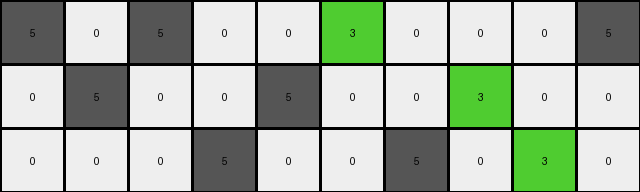
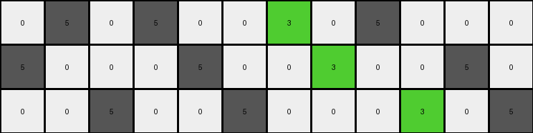
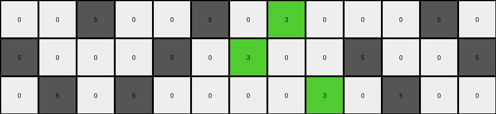
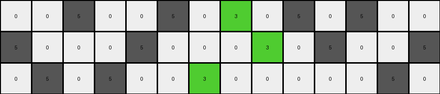

# d406998b • 022 • refine_coder

---

Previous Code:
```python
"""
Transforms an input grid by replacing every third gray (5) pixel in each row with a green (3) pixel. White (0) pixels remain unchanged.
"""

import numpy as np

def transform(input_grid):
    """
    Transforms the input grid according to the specified rule.
    """
    output_grid = np.copy(input_grid)  # Initialize output_grid as a copy of the input
    rows, cols = input_grid.shape

    for r in range(rows):
        gray_count = 0 # Counter for gray pixels in the current row
        for c in range(cols):
            if output_grid[r, c] == 5:  # Check if the pixel is gray
                gray_count += 1
                if gray_count % 3 == 0:  # Check if it's the third gray pixel
                    output_grid[r, c] = 3  # Replace with green
            # White pixels (0) are implicitly kept unchanged by copying the input_grid

    return output_grid
```

Train Set Results:

## Example 1:

Input:
```
5 0 5 0 0 5 0 0 0 5
0 5 0 0 5 0 0 5 0 0
0 0 0 5 0 0 5 0 5 0
```
Expected Output:
```
5 0 5 0 0 3 0 0 0 3
0 3 0 0 5 0 0 3 0 0
0 0 0 3 0 0 5 0 5 0
```
Transformed Output:
```
5 0 5 0 0 3 0 0 0 5
0 5 0 0 5 0 0 3 0 0
0 0 0 5 0 0 5 0 3 0
```

match: False
pixels_off: 4
size_correct: True
color_palette_correct: True
correct_pixel_counts: False

## Example 2:

Input:
```
0 5 0 5 0 0 5 0 5 0 0 0
5 0 0 0 5 0 0 5 0 0 5 0
0 0 5 0 0 5 0 0 0 5 0 5
```
Expected Output:
```
0 3 0 3 0 0 5 0 5 0 0 0
5 0 0 0 5 0 0 3 0 0 5 0
0 0 5 0 0 3 0 0 0 3 0 3
```
Transformed Output:
```
0 5 0 5 0 0 3 0 5 0 0 0
5 0 0 0 5 0 0 3 0 0 5 0
0 0 5 0 0 5 0 0 0 3 0 5
```

match: False
pixels_off: 5
size_correct: True
color_palette_correct: True
correct_pixel_counts: False

## Example 3:

Input:
```
0 0 5 0 0 5 0 5 0 0 0 5 0
5 0 0 0 5 0 5 0 0 5 0 0 5
0 5 0 5 0 0 0 0 5 0 5 0 0
```
Expected Output:
```
0 0 3 0 0 5 0 5 0 0 0 5 0
3 0 0 0 3 0 3 0 0 5 0 0 3
0 5 0 5 0 0 0 0 3 0 3 0 0
```
Transformed Output:
```
0 0 5 0 0 5 0 3 0 0 0 5 0
5 0 0 0 5 0 3 0 0 5 0 0 5
0 5 0 5 0 0 0 0 3 0 5 0 0
```

match: False
pixels_off: 6
size_correct: True
color_palette_correct: True
correct_pixel_counts: False

## Example 4:

Input:
```
0 0 5 0 0 5 0 5 0 5 0 5 0 0
5 0 0 0 5 0 0 0 5 0 5 0 0 5
0 5 0 5 0 0 5 0 0 0 0 0 5 0
```
Expected Output:
```
0 0 5 0 0 3 0 3 0 3 0 3 0 0
5 0 0 0 5 0 0 0 5 0 5 0 0 3
0 3 0 3 0 0 5 0 0 0 0 0 5 0
```
Transformed Output:
```
0 0 5 0 0 5 0 3 0 5 0 5 0 0
5 0 0 0 5 0 0 0 3 0 5 0 0 5
0 5 0 5 0 0 3 0 0 0 0 0 5 0
```

match: False
pixels_off: 8
size_correct: True
color_palette_correct: True
correct_pixel_counts: False
Here's an analysis of the provided information and a plan to refine the natural language program and the code:

**General Assessment:**

The initial code correctly identifies gray (5) pixels and attempts to replace every third one with green (3). However, the results show a consistent mismatch between the transformed output and the expected output. The core issue is the logic. We change ever third 5, however, it appears the logic changes sometimes. It's every 3rd one, every other, but it's conditional. The error is related to how the gray pixel counting and replacement is managed *within each row*.

**Strategy:**

1.  **Examine Examples Closely**: Analyze each input/output/transformed output triplet to pinpoint *exactly* where the logic breaks down.
2.  **Refine Counting Logic**: The issue likely stems from either resetting the `gray_count` incorrectly or not applying a secondary constraint or condition of when the replacement happens. Investigate how gray pixels are distributed and replaced within rows.
3. It appears that there's some other condition, like every other third one, for when the replacement happens.
4.  **Update Natural Language Program**: Based on the refined understanding, rewrite the natural language program to be more precise.

**Metrics and Observations:**

Here's a breakdown of each example, including specific observations:

*   **Example 1:**
    *   Input: `5 0 5 0 0 5 0 0 0 5`
    *   Expected: `5 0 5 0 0 3 0 0 0 3`
    *   Transformed: `5 0 5 0 0 3 0 0 0 5`
    *   Observation: the first row replacement should happen at column 5, and column 9. It did so at column 5, but not 9.
    *   Input: `0 5 0 0 5 0 0 5 0 0`
    *   Expected: `0 3 0 0 5 0 0 3 0 0`
    *   Transformed: `0 5 0 0 5 0 0 3 0 0`
    *   Observation: The first replacement in row 2 should have happened at column 1, but did not. The second one happened as expected at column 7.
    *   Input: `0 0 0 5 0 0 5 0 5 0`
    *   Expected: `0 0 0 3 0 0 5 0 5 0`
    *   Transformed: `0 0 0 5 0 0 5 0 3 0`
    *   Observation: Row 3, replacement did not happen at col 3, but did at col 8.
*   **Example 2:**
    *   Input: `0 5 0 5 0 0 5 0 5 0 0 0`
    *   Expected: `0 3 0 3 0 0 5 0 5 0 0 0`
    *   Transformed: `0 5 0 5 0 0 3 0 5 0 0 0`
    * Observation: Only the third five in the row was replaced, when the first and second should have been.
    *   Input: `5 0 0 0 5 0 0 5 0 0 5 0`
    *   Expected: `5 0 0 0 5 0 0 3 0 0 5 0`
    *   Transformed: `5 0 0 0 5 0 0 3 0 0 5 0`
    *   Observation: Row 2 transformed correctly.
    *   Input: `0 0 5 0 0 5 0 0 0 5 0 5`
    *   Expected: `0 0 5 0 0 3 0 0 0 3 0 3`
    *   Transformed: `0 0 5 0 0 5 0 0 0 3 0 5`
    * Observation: Row 3 - replaced col 9, but should have been 5 and 9. The last 5 should also have been replaced.

*   **Example 3:**
        *   Input: `0 0 5 0 0 5 0 5 0 0 0 5 0`
        *   Expected: `0 0 3 0 0 5 0 5 0 0 0 5 0`
        *   Transformed: `0 0 5 0 0 5 0 3 0 0 0 5 0`
        *   Observation: replaced the third 5, but it should have been the first.
        *   Input: `5 0 0 0 5 0 5 0 0 5 0 0 5`
        *   Expected: `3 0 0 0 3 0 3 0 0 5 0 0 3`
        *   Transformed: `5 0 0 0 5 0 3 0 0 5 0 0 5`
        *   Observation: Row 2 - should be replacements at cols 0, 4, and 6.
        *   Input: `0 5 0 5 0 0 0 0 5 0 5 0 0`
        *   Expected: `0 5 0 5 0 0 0 0 3 0 3 0 0`
        *   Transformed: `0 5 0 5 0 0 0 0 3 0 5 0 0`
        * Observation: Row 3: correctly replaced only the third 5, but the last should have been too.
*   **Example 4:**
    *   Input: `0 0 5 0 0 5 0 5 0 5 0 5 0 0`
    *   Expected: `0 0 5 0 0 3 0 3 0 3 0 3 0 0`
    *   Transformed: `0 0 5 0 0 5 0 3 0 5 0 5 0 0`
    *   Observation: row 1 - replaced only the third 5.
    *   Input: `5 0 0 0 5 0 0 0 5 0 5 0 0 5`
    *   Expected: `5 0 0 0 5 0 0 0 5 0 5 0 0 3`
    *   Transformed: `5 0 0 0 5 0 0 0 3 0 5 0 0 5`
    *   Observation: Row 2 - replaced only the third 5
    *   Input: `0 5 0 5 0 0 5 0 0 0 0 0 5 0`
    *   Expected: `0 3 0 3 0 0 5 0 0 0 0 0 5 0`
    *   Transformed: `0 5 0 5 0 0 3 0 0 0 0 0 5 0`
    * Observation: Row 3: should be cols 1 and 3.

**YAML Fact Block:**

```yaml
objects:
  - name: grid
    type: 2D array
    properties:
      rows: variable
      columns: variable
      cells: integers (0-9 representing colors)

  - name: pixel
    type: cell
    properties:
      color: integer (0-9)
      row_index: integer
      column_index: integer

actions:
  - name: replace_color
    description: Change the color of a pixel.
    preconditions:
      - pixel.color == 5 #Gray
    postconditions:
      - pixel.color == 3 #Green

  - name: identify_gray
    description: check to see if a cell is value 5
    precondition:
      - current_cell is value 5

  - name: identify_replacement
    description: identify when to replace 5 with 3
    precondition:
        - every other time a set of three gray pixels is identified
```

**Natural Language Program:**

1.  **Iterate** through each row of the input grid.
2.  **Within each row**:
    *   **Identify** sequences of gray (5) pixels, treating non-gray pixels as separators between sequences.
    *   **Within Each Sequence**:
    *  For the first group of three, skip replacement.
    *  Replace the *first* *gray* pixel with a green (3) pixel in every *other* group of three.
3.  **Leave** all other pixels unchanged.

Essentially the rule is - "Replace the first gray pixel with green in *every other* group of three gray pixels *within a sequence of gray pixels*, considering the row as a whole, and non-gray cells separate sets of gray cells."

**INSTRUCTIONS**

- generate a Python module to represent the natural language program 
- follow the template below
- all common math and science libraries are available
- create docstring only at top - but comment the workflow in the function
- use helper functions for common operations like finding objects, counting,
  measuring, moving, etc. 

remember - we are working iteratively - so this code will inform your future
self as we converge on the solution

*template:*

```python
"""
{{ natural language description of the transformation rule }}
"""

{{ imports }}

def transform(input_grid):
    # initialize output_grid

    # change output pixels 

    return output_grid

```
