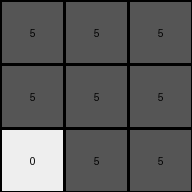

# d4469b4b • 004 • refine_coder

---

Previous Code:
```python
"""
Divide the 5x5 input grid into nine regions by conceptually superimposing a 3x3 grid.
If a region contains any red pixels, the corresponding output pixel is gray.
If a region contains only white pixels, the corresponding output pixel is white.
"""

import numpy as np

def get_region(input_grid, row_start, row_end, col_start, col_end):
    """Helper function to extract a region from the input grid."""
    return input_grid[row_start:row_end, col_start:col_end]

def transform(input_grid):
    """Transforms the input grid according to the described rule."""

    input_grid = np.array(input_grid)  # Ensure numpy array for easy slicing
    output_grid = np.zeros((3, 3), dtype=int)  # Initialize output grid with zeros (white)

    # Define the boundaries of the nine regions.
    regions = [
        (0, 2, 0, 2),  # Top-left
        (0, 2, 1, 4),  # Top-middle
        (0, 2, 3, 5),  # Top-right
        (1, 4, 0, 2),  # Middle-left
        (1, 4, 1, 4),  # Center
        (1, 4, 3, 5),  # Middle-right
        (3, 5, 0, 2),  # Bottom-left
        (3, 5, 1, 4),  # Bottom-middle
        (3, 5, 3, 5)   # Bottom-right
    ]
    
    k = 0
    for i in range(3):
        for j in range(3):
            row_start, row_end, col_start, col_end = regions[k]
            region = get_region(input_grid, row_start, row_end, col_start, col_end)
            if 2 in region:  # Check for any red pixels
                output_grid[i, j] = 5  # Set to gray
            k += 1

    return output_grid.tolist()
```

Train Set Results:

## Example 1:

Input:
```
2 0 0 0 0
0 2 0 0 2
2 0 0 2 0
0 0 0 2 2
0 0 2 2 0
```
Expected Output:
```
5 5 5
0 5 0
0 5 0
```
Transformed Output:
```
5 5 5
5 5 5
0 5 5
```

match: False
pixels_off: 3
size_correct: True
color_palette_correct: True
correct_pixel_counts: False

## Example 2:

Input:
```
0 0 0 0 0
0 0 1 1 1
0 1 0 1 1
0 1 0 1 0
0 0 0 0 1
```
Expected Output:
```
0 5 0
5 5 5
0 5 0
```
Transformed Output:
```
0 0 0
0 0 0
0 0 0
```

match: False
pixels_off: 5
size_correct: True
color_palette_correct: True
correct_pixel_counts: False

## Example 3:

Input:
```
3 0 0 0 0
0 0 0 3 3
0 3 3 0 0
0 3 0 3 0
3 0 3 3 0
```
Expected Output:
```
0 0 5
0 0 5
5 5 5
```
Transformed Output:
```
0 0 0
0 0 0
0 0 0
```

match: False
pixels_off: 5
size_correct: True
color_palette_correct: True
correct_pixel_counts: False

## Example 4:

Input:
```
1 0 1 0 0
1 0 0 1 1
1 1 0 1 0
0 1 0 1 0
1 0 0 0 1
```
Expected Output:
```
0 5 0
5 5 5
0 5 0
```
Transformed Output:
```
0 0 0
0 0 0
0 0 0
```

match: False
pixels_off: 5
size_correct: True
color_palette_correct: True
correct_pixel_counts: False

## Example 5:

Input:
```
2 0 2 0 2
2 0 0 0 2
2 2 0 0 0
2 0 0 2 2
2 2 2 0 2
```
Expected Output:
```
5 5 5
0 5 0
0 5 0
```
Transformed Output:
```
5 5 5
5 5 5
5 5 5
```

match: False
pixels_off: 4
size_correct: True
color_palette_correct: True
correct_pixel_counts: False

## Example 6:

Input:
```
0 2 0 2 0
0 2 2 2 0
0 2 2 0 2
2 2 2 0 0
0 0 2 0 2
```
Expected Output:
```
5 5 5
0 5 0
0 5 0
```
Transformed Output:
```
5 5 5
5 5 5
5 5 5
```

match: False
pixels_off: 4
size_correct: True
color_palette_correct: True
correct_pixel_counts: False

## Example 7:

Input:
```
0 3 0 3 0
3 3 0 0 0
0 3 0 0 0
0 0 3 0 0
3 3 3 0 0
```
Expected Output:
```
0 0 5
0 0 5
5 5 5
```
Transformed Output:
```
0 0 0
0 0 0
0 0 0
```

match: False
pixels_off: 5
size_correct: True
color_palette_correct: True
correct_pixel_counts: False
Here's an analysis of the provided information and a plan to refine the natural language program and the subsequent code:

**General Assessment:**

The initial natural language program and the generated code have a fundamental flaw: they incorrectly define the regions within the 5x5 input grid. The code attempts to divide the grid into a 3x3 grid, but the region boundaries are not calculated correctly to represent overlapping regions. This results in incorrect pixel checks and therefore wrong output values. Specifically, the regions aren't correctly covering the entire input. The existing program also seems to focus too heavily on the red color, while several examples indicate any non-white color should trigger the gray output.

The strategy to address this is:

1.  **Correct Region Definition:** Redefine the regions to accurately represent the nine overlapping 3x3 areas within the 5x5 input grid.  This is the main error.
2.  **Generalized Color Check:** Modify the condition to check for *any* non-white pixel (not just red) within a region.
3. Provide an updated YAML summary and a more accurate and concise natural language program

**Metrics and Observations:**

Here's a summary based on the provided examples:

| Example | Input Size | Output Size | Match | Pixels Off | Notes                                                                     |
| ------- | ---------- | ----------- | ----- | ---------- | ------------------------------------------------------------------------- |
| 1       | 5x5        | 3x3         | False | 3          | Incorrect region boundaries; Only checks for red.                       |
| 2       | 5x5        | 3x3         | False | 5          | Incorrect region boundaries; Only checks for red; should trigger on blue. |
| 3       | 5x5        | 3x3         | False | 5          | Incorrect region boundaries; Only checks for red; should trigger on green|
| 4       | 5x5        | 3x3         | False | 5          | Incorrect region boundaries; Only checks for red; should trigger on blue. |
| 5       | 5x5        | 3x3         | False | 4          | Incorrect region boundaries; Only checks for red.                          |
| 6       | 5x5        | 3x3         | False | 4          | Incorrect region boundaries; Only checks for red.                       |
| 7       | 5x5        | 3x3         | False | 5          | Incorrect region boundaries; Only checks for red; should trigger on green. |
**YAML Summary:**

```yaml
task_id: 002
objects:
  - id: input_grid
    type: grid
    dimensions: 5x5
    elements: pixels (integers 0-9 representing colors)
  - id: output_grid
    type: grid
    dimensions: 3x3
    elements: pixels (integers 0-9 representing colors)
  - id: regions
    type: list
    elements: 9 overlapping 3x3 subgrids within the input_grid
    description: Each region is defined by its row and column boundaries.

actions:
  - name: divide_into_regions
    input: input_grid
    output: regions
    description: Conceptually divides the 5x5 input grid into nine overlapping 3x3 regions.
  - name: check_region_colors
    input: region
    output: color (integer)
    description:  If any pixel within the region is non-white (not 0), the output color is gray (5). Otherwise, the output color is white (0).
  - name: construct_output
    input: regions, check_region_colors
    output: output_grid
    description: Creates the 3x3 output grid based on the color checks of each region.
```

**Natural Language Program:**

1.  **Input:** A 5x5 grid of pixels, each with a color value from 0 to 9.
2.  **Conceptual Overlay:** Superimpose a 3x3 grid over the 5x5 input grid, creating nine overlapping 3x3 regions. These regions share some pixels.
3.  **Region Analysis:** For each of the nine 3x3 regions:
    *   If *any* pixel within the region is *not* white (value is not 0), the corresponding output pixel in the 3x3 output grid is gray (value 5).
    *   If all pixels within the region are white (value 0), the corresponding output pixel in the 3x3 output grid is white (value 0).
4.  **Output:** A 3x3 grid of pixels, each with a color value determined by the region analysis.

Key improvements in the Natural Language program:

*   **Overlapping Regions:** The description clearly states the regions *overlap*, resolving the main issue in the previous program.
*  **Generalized color:** makes clear that output of 5 is triggered by any non-zero color.
*   **Conciseness:** The program is more concise and easier to understand.

**INSTRUCTIONS**

- generate a Python module to represent the natural language program 
- follow the template below
- all common math and science libraries are available
- create docstring only at top - but comment the workflow in the function
- use helper functions for common operations like finding objects, counting,
  measuring, moving, etc. 

remember - we are working iteratively - so this code will inform your future
self as we converge on the solution

*template:*

```python
"""
{{ natural language description of the transformation rule }}
"""

{{ imports }}

def transform(input_grid):
    # initialize output_grid

    # change output pixels 

    return output_grid

```
