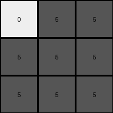

# d4469b4b • 029 • refine_dreamer

---

Previous Code:
```python
"""
The input 5x5 grid is reduced to a 3x3 output grid. 
The output grid summarizes 3x3 regions of the input grid.
If any of the input pixels in a 3x3 region centered at the corresponding output pixel's location have a value other than 0, the output pixel is grey (5). 
Otherwise, the output pixel is white (0).
"""

import numpy as np

def get_region(input_array, row, col):
    """Extracts a 3x3 region from the input array centered at (row, col)."""
    row_start = max(0, row - 1)
    row_end = min(input_array.shape[0], row + 2)
    col_start = max(0, col - 1)
    col_end = min(input_array.shape[1], col + 2)
    return input_array[row_start:row_end, col_start:col_end]

def transform(input_grid):
    """Transforms a 5x5 input grid to a 3x3 output grid based on summarization and color transformation."""

    input_array = np.array(input_grid)
    output_array = np.zeros((3, 3), dtype=int)

    # Iterate through the 3x3 output grid
    for i in range(3):
        for j in range(3):
            # Get the 3x3 region centered at the corresponding input pixel
            region = get_region(input_array, i, j)

            # Check if any pixel in the region is not 0
            if np.any(region != 0):
                output_array[i, j] = 5  # Set output to grey (5)
            else:
                output_array[i, j] = 0  # Set output to white (0)

    return output_array.tolist()
```

Train Set Results:

## Example 1:

Input:
```
2 0 0 0 0
0 2 0 0 2
2 0 0 2 0
0 0 0 2 2
0 0 2 2 0
```
Expected Output:
```
5 5 5
0 5 0
0 5 0
```
Transformed Output:
```
5 5 5
5 5 5
5 5 5
```

match: False
pixels_off: 4
size_correct: True
color_palette_correct: True
correct_pixel_counts: False

## Example 2:

Input:
```
0 0 0 0 0
0 0 1 1 1
0 1 0 1 1
0 1 0 1 0
0 0 0 0 1
```
Expected Output:
```
0 5 0
5 5 5
0 5 0
```
Transformed Output:
```
0 5 5
5 5 5
5 5 5
```

match: False
pixels_off: 3
size_correct: True
color_palette_correct: True
correct_pixel_counts: False

## Example 3:

Input:
```
3 0 0 0 0
0 0 0 3 3
0 3 3 0 0
0 3 0 3 0
3 0 3 3 0
```
Expected Output:
```
0 0 5
0 0 5
5 5 5
```
Transformed Output:
```
5 5 5
5 5 5
5 5 5
```

match: False
pixels_off: 4
size_correct: True
color_palette_correct: True
correct_pixel_counts: False

## Example 4:

Input:
```
1 0 1 0 0
1 0 0 1 1
1 1 0 1 0
0 1 0 1 0
1 0 0 0 1
```
Expected Output:
```
0 5 0
5 5 5
0 5 0
```
Transformed Output:
```
5 5 5
5 5 5
5 5 5
```

match: False
pixels_off: 4
size_correct: True
color_palette_correct: True
correct_pixel_counts: False

## Example 5:

Input:
```
2 0 2 0 2
2 0 0 0 2
2 2 0 0 0
2 0 0 2 2
2 2 2 0 2
```
Expected Output:
```
5 5 5
0 5 0
0 5 0
```
Transformed Output:
```
5 5 5
5 5 5
5 5 5
```

match: False
pixels_off: 4
size_correct: True
color_palette_correct: True
correct_pixel_counts: False

## Example 6:

Input:
```
0 2 0 2 0
0 2 2 2 0
0 2 2 0 2
2 2 2 0 0
0 0 2 0 2
```
Expected Output:
```
5 5 5
0 5 0
0 5 0
```
Transformed Output:
```
5 5 5
5 5 5
5 5 5
```

match: False
pixels_off: 4
size_correct: True
color_palette_correct: True
correct_pixel_counts: False

## Example 7:

Input:
```
0 3 0 3 0
3 3 0 0 0
0 3 0 0 0
0 0 3 0 0
3 3 3 0 0
```
Expected Output:
```
0 0 5
0 0 5
5 5 5
```
Transformed Output:
```
5 5 5
5 5 5
5 5 5
```

match: False
pixels_off: 4
size_correct: True
color_palette_correct: True
correct_pixel_counts: False
**INSTRUCTIONS**

The code above was generated based on observations from the first training
example

we have tested the transform function on each of the task example inputs and
compared with the expected output

review each of the examples provided and the results and consider how the
natural language program should be updated to accommodate this new knowledge

respond with the following deliverables:

- general assessment of the information provided and strategy for resolving the
  errors
- gather metrics about each of the examples and results - use code_execution to
  develop accurate reports on your assumptions
- a YAML block documenting facts - Focus on identifying objects, their properties, and the actions performed on them.
- a natural language program - Be as clear and concise as possible, providing a complete description of the transformation rule.


your responses should be considered as information in a report - not a
conversation
