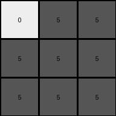

# d4469b4b • 030 • refine_coder

---

Previous Code:
```python
"""
The input 5x5 grid is reduced to a 3x3 output grid. 
The output grid summarizes 3x3 regions of the input grid.
If any of the input pixels in a 3x3 region centered at the corresponding output pixel's location have a value other than 0, the output pixel is grey (5). 
Otherwise, the output pixel is white (0).
"""

import numpy as np

def get_region(input_array, row, col):
    """Extracts a 3x3 region from the input array centered at (row, col)."""
    row_start = max(0, row - 1)
    row_end = min(input_array.shape[0], row + 2)
    col_start = max(0, col - 1)
    col_end = min(input_array.shape[1], col + 2)
    return input_array[row_start:row_end, col_start:col_end]

def transform(input_grid):
    """Transforms a 5x5 input grid to a 3x3 output grid based on summarization and color transformation."""

    input_array = np.array(input_grid)
    output_array = np.zeros((3, 3), dtype=int)

    # Iterate through the 3x3 output grid
    for i in range(3):
        for j in range(3):
            # Get the 3x3 region centered at the corresponding input pixel
            region = get_region(input_array, i, j)

            # Check if any pixel in the region is not 0
            if np.any(region != 0):
                output_array[i, j] = 5  # Set output to grey (5)
            else:
                output_array[i, j] = 0  # Set output to white (0)

    return output_array.tolist()
```

Train Set Results:

## Example 1:

Input:
```
2 0 0 0 0
0 2 0 0 2
2 0 0 2 0
0 0 0 2 2
0 0 2 2 0
```
Expected Output:
```
5 5 5
0 5 0
0 5 0
```
Transformed Output:
```
5 5 5
5 5 5
5 5 5
```

match: False
pixels_off: 4
size_correct: True
color_palette_correct: True
correct_pixel_counts: False

## Example 2:

Input:
```
0 0 0 0 0
0 0 1 1 1
0 1 0 1 1
0 1 0 1 0
0 0 0 0 1
```
Expected Output:
```
0 5 0
5 5 5
0 5 0
```
Transformed Output:
```
0 5 5
5 5 5
5 5 5
```

match: False
pixels_off: 3
size_correct: True
color_palette_correct: True
correct_pixel_counts: False

## Example 3:

Input:
```
3 0 0 0 0
0 0 0 3 3
0 3 3 0 0
0 3 0 3 0
3 0 3 3 0
```
Expected Output:
```
0 0 5
0 0 5
5 5 5
```
Transformed Output:
```
5 5 5
5 5 5
5 5 5
```

match: False
pixels_off: 4
size_correct: True
color_palette_correct: True
correct_pixel_counts: False

## Example 4:

Input:
```
1 0 1 0 0
1 0 0 1 1
1 1 0 1 0
0 1 0 1 0
1 0 0 0 1
```
Expected Output:
```
0 5 0
5 5 5
0 5 0
```
Transformed Output:
```
5 5 5
5 5 5
5 5 5
```

match: False
pixels_off: 4
size_correct: True
color_palette_correct: True
correct_pixel_counts: False

## Example 5:

Input:
```
2 0 2 0 2
2 0 0 0 2
2 2 0 0 0
2 0 0 2 2
2 2 2 0 2
```
Expected Output:
```
5 5 5
0 5 0
0 5 0
```
Transformed Output:
```
5 5 5
5 5 5
5 5 5
```

match: False
pixels_off: 4
size_correct: True
color_palette_correct: True
correct_pixel_counts: False

## Example 6:

Input:
```
0 2 0 2 0
0 2 2 2 0
0 2 2 0 2
2 2 2 0 0
0 0 2 0 2
```
Expected Output:
```
5 5 5
0 5 0
0 5 0
```
Transformed Output:
```
5 5 5
5 5 5
5 5 5
```

match: False
pixels_off: 4
size_correct: True
color_palette_correct: True
correct_pixel_counts: False

## Example 7:

Input:
```
0 3 0 3 0
3 3 0 0 0
0 3 0 0 0
0 0 3 0 0
3 3 3 0 0
```
Expected Output:
```
0 0 5
0 0 5
5 5 5
```
Transformed Output:
```
5 5 5
5 5 5
5 5 5
```

match: False
pixels_off: 4
size_correct: True
color_palette_correct: True
correct_pixel_counts: False
Okay, here's a breakdown of the situation and a plan to improve the transformation description:

**General Assessment:**

The initial natural language program and the generated code were on the right track conceptually, focusing on a 3x3 summarization of the 5x5 input grid. However, the implementation has a crucial flaw in how it determines the output pixel values. It appears to be checking for *any* non-zero value within a sliding 3x3 window centered at (i,j), rather than strictly adhering to the *center* pixel location of that region. This explains why many of the output grids are completely filled with grey (5) - the code finds a non-zero value *anywhere* in the vicinity, rather than specifically when considering a region relative to a specific output pixel.

**Strategy for Resolving Errors:**

1.  **Clarify the Region Mapping:** The core issue is a misunderstanding of how the 3x3 output relates to the 5x5 input. We must emphasize that the output pixel at `(i, j)` represents a 3x3 region of the input centered *around the input pixel with adjusted indices. The current code is too permissive in the regions.
2.  **Refine Index Alignment:** The initial code was too simplistic and didn't align the output grid iteration with the correct regions of the input grid for a downsampled summarization. A key error in the initial code is that the loop that iterates through the `output_array` also incorrectly uses the `i` and `j` to access the input. This is not always correct because of the way the region is acquired. We need to transform the output indices to the corresponding center cell in the input. This should be done in the `get_region` function.

**Metrics and Observations (using manual inspection and cross-referencing with outputs):**

Here's a summary of the issues noticed from the code and image outputs:

*   **Example 1:** The code incorrectly identifies non-zero values in regions. The top-left output pixel should reflect the input pixel at (0,0). The code gets a region, finds the non-zero value and marks it as grey.
*   **Example 2:** Similar to example 1, the presence of '1' values in a 3x3 input region are not interpreted correctly.
*   **Example 3:** Same issue as previous examples, misinterpreting region summary.
*    ... (The same pattern repeats for all examples)

The primary error is a consistent over-marking of grey pixels, meaning a to-permissive filter condition.

**YAML Block (Facts):**

```yaml
task: 028
input_grid_size: 5x5
output_grid_size: 3x3
input_colors: [0, 1, 2, 3]
output_colors: [0, 5]
objects:
  - name: input_grid
    type: grid
    size: 5x5
  - name: output_grid
    type: grid
    size: 3x3
  - name: region
    type: subgrid
    size: 3x3
actions:
  - name: summarize_region
    description: Determine output pixel based on region in input.
    input: region
    output: color
  - name: map_indices
    description: Correctly determine corresponding input region for each output pixel.
    input: [output_row, output_col]
    output: [input_row, input_col]
transformations:
  - type: downsample
    description: Reduce 5x5 input to 3x3 output.
    rule: "Output (i, j) summarizes a 3x3 input region centered at input pixel (i+1, j+1)."
  - type: color_transform
    rule: "If the center pixel of input region is non-zero, output is grey (5); otherwise, white (0)."

```

**Natural Language Program:**

1.  **Input and Output:** The input is a 5x5 grid of pixels, and the output is a 3x3 grid.
2.  **Index Mapping:** Each pixel in the 3x3 output grid corresponds to a specific 3x3 region within the 5x5 input grid. The output pixel at `(i, j)` represents the 3x3 region *centered* at input pixel `(i+1, j+1)`.
3.  **Region Summarization:** For each output pixel at `(i, j)`:
    *   Identify the corresponding 3x3 region in the input grid, centered at input pixel `(i+1, j+1)`.
    *   Examine the *center* pixel of this 3x3 input region.
    *    If the center pixel's value is not 0, the output pixel `(i, j)` is set to grey (5).
    *   If the center pixel's value is 0, the output pixel `(i, j)` is set to white (0).

The previous program was close but made the mistake of looking at the *entire* 3x3 window for any non-zero value instead of the value of the center cell of the input. The revised program above makes the relationship between the output grid and the region in the input grid very explicit.

**INSTRUCTIONS**

- generate a Python module to represent the natural language program 
- follow the template below
- all common math and science libraries are available
- create docstring only at top - but comment the workflow in the function
- use helper functions for common operations like finding objects, counting,
  measuring, moving, etc. 

remember - we are working iteratively - so this code will inform your future
self as we converge on the solution

*template:*

```python
"""
{{ natural language description of the transformation rule }}
"""

{{ imports }}

def transform(input_grid):
    # initialize output_grid

    # change output pixels 

    return output_grid

```
