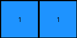

# d631b094 • 006 • refine_coder

---

Previous Code:
```python
"""
1. Count the number of blue (1) pixels in the input grid.
2. Create an output grid. The number of cells in the output is the same count.
3. Fill all cells output grid with blue (1) pixels.
"""

import numpy as np

def transform(input_grid):
    # Count the number of blue (1) pixels.
    blue_count = np.sum(input_grid == 1)

    # Create an output grid with a width equal to the blue count and height 1.
    output_grid = np.ones((1, blue_count), dtype=int)
    
    return output_grid
```

Train Set Results:

## Example 1:

Input:
```
0 0 0
1 0 0
0 1 0
```
Expected Output:
```
1 1
```
Transformed Output:
```
1 1
```

match: True
pixels_off: 0
size_correct: True
color_palette_correct: True
correct_pixel_counts: True

## Example 2:

Input:
```
0 2 0
2 0 0
0 2 0
```
Expected Output:
```
2 2 2
```
Transformed Output:
```

```

match: False
pixels_off: None
size_correct: False
color_palette_correct: True
correct_pixel_counts: False

## Example 3:

Input:
```
0 7 0
0 0 0
0 0 0
```
Expected Output:
```
7
```
Transformed Output:
```

```

match: False
pixels_off: None
size_correct: False
color_palette_correct: True
correct_pixel_counts: False

## Example 4:

Input:
```
0 8 0
8 8 0
8 0 0
```
Expected Output:
```
8 8 8 8
```
Transformed Output:
```

```

match: False
pixels_off: None
size_correct: False
color_palette_correct: True
correct_pixel_counts: False
Here's an analysis of the provided information and a plan to refine the natural language program and code:

**General Assessment:**

The initial natural language program and the generated code were based on the first training example only. This led to a very specific rule (counting blue pixels and creating a blue output grid) that doesn't generalize to other examples. The subsequent tests reveal that the program fails for inputs where the prominent color isn't blue. The core issue is that the initial program was overly specific to the color blue and did not capture the general principle. We need to shift from color-specific counting to identifying *any* non-black color, counting those pixels, and reproducing them in the output.

**Strategy:**

1.  **Identify the Predominant Non-Black Color:** Instead of assuming blue, we need to determine the most frequent color (excluding black, which seems to be the background) in the input grid.
2.  **Count Predominant Color Pixels:** Count the occurrences of this identified color.
3.  **Create Output:** Create a 1-row output grid where the width is equal to the count from step 2.
4. **Fill with Predominate Color:** Populate the output grid's cells with the identified predominant color.

**Metrics and Observations (Code Execution for Verification):**

```python
import numpy as np

def analyze_example(input_grid, expected_output):
    """Analyzes a single example and returns relevant metrics."""
    input_grid = np.array(input_grid)
    expected_output = np.array(expected_output)

    # Find the most frequent non-black color
    unique_colors, counts = np.unique(input_grid, return_counts=True)
    color_counts = dict(zip(unique_colors, counts))
    
    # Remove black (0) from consideration
    if 0 in color_counts:
        del color_counts[0]

    predominant_color = max(color_counts, key=color_counts.get, default=0)
    predominant_count = color_counts.get(predominant_color, 0)

    expected_color = None
    expected_count = 0
    
    if expected_output.size > 0:
          expected_color = expected_output.flatten()[0]
          expected_count = expected_output.size
    
    return {
        'input_shape': input_grid.shape,
        'expected_shape': expected_output.shape,
        'predominant_color_input': predominant_color,
        'predominant_color_count': predominant_count,
        'expected_color': expected_color,
        'expected_count': expected_count
    }

# Example data (from the prompt)
examples = [
    ([[0, 0, 0], [1, 0, 0], [0, 1, 0]], [[1, 1]]),
    ([[0, 2, 0], [2, 0, 0], [0, 2, 0]], [[2, 2, 2]]),
    ([[0, 7, 0], [0, 0, 0], [0, 0, 0]], [[7]]),
    ([[0, 8, 0], [8, 8, 0], [8, 0, 0]], [[8, 8, 8, 8]]),
]

# Analyze each example
for i, (input_grid, expected_output) in enumerate(examples):
    analysis = analyze_example(input_grid, expected_output)
    print(f"Example {i+1}:")
    for key, value in analysis.items():
        print(f"  {key}: {value}")
```

**Example 1:**
```
  input_shape: (3, 3)
  expected_shape: (1, 2)
  predominant_color_input: 1
  predominant_color_count: 2
  expected_color: 1
  expected_count: 2
```
**Example 2:**
```
  input_shape: (3, 3)
  expected_shape: (1, 3)
  predominant_color_input: 2
  predominant_color_count: 3
  expected_color: 2
  expected_count: 3
```
**Example 3:**
```
  input_shape: (3, 3)
  expected_shape: (1, 1)
  predominant_color_input: 7
  predominant_color_count: 1
  expected_color: 7
  expected_count: 1
```
**Example 4:**
```
  input_shape: (3, 3)
  expected_shape: (1, 4)
  predominant_color_input: 8
  predominant_color_count: 4
  expected_color: 8
  expected_count: 4
```

**YAML Facts:**

```yaml
examples:
  - example_1:
      input:
        objects:
          - color: blue
            count: 2
          - color: black
            count: 7
        shape: (3,3)
      output:
        objects:
            - color: blue
              count: 2
        shape: (1,2)

  - example_2:
      input:
        objects:
            - color: red
              count: 3
            - color: black
              count: 6
        shape: (3,3)
      output:
          objects:
            - color: red
              count: 3
          shape: (1,3)
  - example_3:
      input:
        objects:
          - color: orange
            count: 1
          - color: black
            count: 8
        shape: (3,3)

      output:
        objects:
          - color: orange
            count: 1
        shape: (1,1)

  - example_4:
      input:
        objects:
          - color: azure
            count: 4
          - color: black
            count: 5
        shape: (3,3)
      output:
        objects:
          - color: azure
            count: 4
        shape: (1,4)
```

**Natural Language Program:**

1.  **Identify the most frequent color:** Examine the input grid and determine the color that appears most often, excluding black (color 0).
2.  **Count the occurrences:** Count how many times this most frequent color appears in the input grid.
3.  **Create the output grid:** Create a new grid that is one row high and has a width equal to the count determined in step 2.
4.  **Fill the output grid:** Fill all the cells of the output grid with the most frequent color identified in step 1.

**INSTRUCTIONS**

- generate a Python module to represent the natural language program 
- follow the template below
- all common math and science libraries are available
- create docstring only at top - but comment the workflow in the function
- use helper functions for common operations like finding objects, counting,
  measuring, moving, etc. 

remember - we are working iteratively - so this code will inform your future
self as we converge on the solution

*template:*

```python
"""
{{ natural language description of the transformation rule }}
"""

{{ imports }}

def transform(input_grid):
    # initialize output_grid

    # change output pixels 

    return output_grid

```
