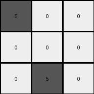
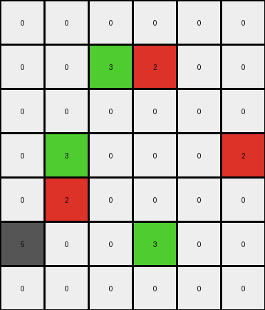
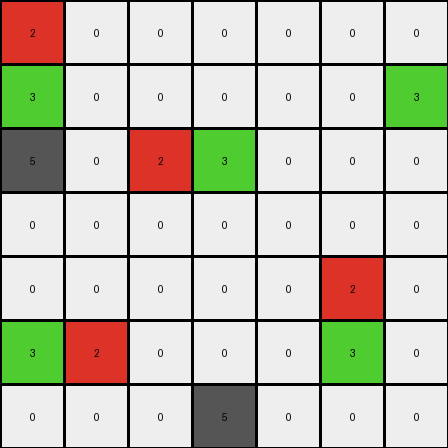

# d90796e8 • 003 • refine_dreamer

---

Previous Code:
```python
"""
1.  Identify all non-zero and non-grey (not equal to 5) cells in the top row of the input grid.
2.  Sum the values of these identified cells.
3.  Replace the value of the top-left cell (first cell) in the output grid with this sum.
4. Set values of the summed cells of the top row in the input to 0 in the output grid.
5.  Copy all other cells, which are not located in the top row or are grey, from the input grid to the output grid without changes.
"""

import numpy as np

def transform(input_grid):
    # Initialize output_grid as a copy of the input_grid
    output_grid = np.copy(input_grid)

    # Calculate the sum of non-zero and non-grey values in the top row.
    top_row_sum = 0
    for i in range(len(input_grid[0])):
      if input_grid[0, i] != 0 and input_grid[0, i] != 5:
          top_row_sum += input_grid[0, i]
          output_grid[0,i] = 0

    # Replace the top-left cell's value with the sum.
    output_grid[0, 0] = top_row_sum


    return output_grid
```

Train Set Results:

## Example 1:

Input:
```
3 2 0
0 0 0
0 5 0
```
Expected Output:
```
8 0 0
0 0 0
0 5 0
```
Transformed Output:
```
5 0 0
0 0 0
0 5 0
```

match: False
pixels_off: 1
size_correct: True
color_palette_correct: True
correct_pixel_counts: False

## Example 2:

Input:
```
5 0 0 0 0 0
0 0 3 2 0 0
0 0 0 0 0 0
0 3 0 0 0 2
0 2 0 0 0 0
5 0 0 3 0 0
0 0 0 0 0 0
```
Expected Output:
```
5 0 0 0 0 0
0 0 8 0 0 0
0 0 0 0 0 0
0 8 0 0 0 2
0 0 0 0 0 0
5 0 0 3 0 0
0 0 0 0 0 0
```
Transformed Output:
```
0 0 0 0 0 0
0 0 3 2 0 0
0 0 0 0 0 0
0 3 0 0 0 2
0 2 0 0 0 0
5 0 0 3 0 0
0 0 0 0 0 0
```

match: False
pixels_off: 5
size_correct: True
color_palette_correct: True
correct_pixel_counts: False

## Example 3:

Input:
```
0 0 0 0 0 2 0
3 0 0 0 0 0 3
5 0 2 3 0 0 0
0 0 0 0 0 0 0
0 0 0 0 0 2 0
3 2 0 0 0 3 0
0 0 0 5 0 0 0
```
Expected Output:
```
0 0 0 0 0 2 0
3 0 0 0 0 0 3
5 0 0 8 0 0 0
0 0 0 0 0 0 0
0 0 0 0 0 0 0
8 0 0 0 0 8 0
0 0 0 5 0 0 0
```
Transformed Output:
```
2 0 0 0 0 0 0
3 0 0 0 0 0 3
5 0 2 3 0 0 0
0 0 0 0 0 0 0
0 0 0 0 0 2 0
3 2 0 0 0 3 0
0 0 0 5 0 0 0
```

match: False
pixels_off: 8
size_correct: True
color_palette_correct: True
correct_pixel_counts: False
**INSTRUCTIONS**

The code above was generated based on observations from the first training
example

we have tested the transform function on each of the task example inputs and
compared with the expected output

review each of the examples provided and the results and consider how the
natural language program should be updated to accommodate this new knowledge

respond with the following deliverables:

- general assessment of the information provided and strategy for resolving the
  errors
- gather metrics about each of the examples and results - use code_execution to
  develop accurate reports on your assumptions
- a YAML block documenting facts - Focus on identifying objects, their properties, and the actions performed on them.
- a natural language program - Be as clear and concise as possible, providing a complete description of the transformation rule.


your responses should be considered as information in a report - not a
conversation
