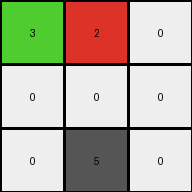
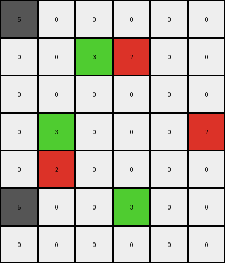
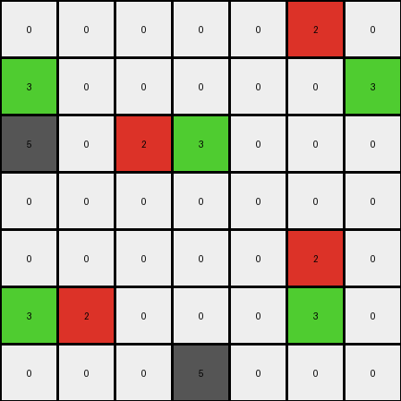

# d90796e8 • 016 • refine_coder

---

Previous Code:
```python
"""
1.  **Identify** all red (2), green (3), and gray (5) pixels in the input grid.
2.  **Preserve** gray (5) pixels; they remain unchanged in the output.
2.  **Preserve** one of the red(2) pixels; they remain unchanged in the output.
3.  **Locate** instances where a red (2) pixel and a green (3) are in specific positions, the red being to the SW and NE of a green.
4.  **Replace** these green and red by the colour azure (8).
5. **Preserve** the location of green pixels.
6.  All other cells remain white (0).
"""

import numpy as np

def find_pixels_by_color(grid, color):
    """Finds the coordinates of all pixels of a specific color."""
    return np.argwhere(grid == color).tolist()

def transform(input_grid):
    # initialize output_grid
    output_grid = np.copy(input_grid)
    input_grid_rows, input_grid_cols = input_grid.shape
    output_grid_rows, output_grid_cols = output_grid.shape
    
    # Find the locations of all relevant colors.
    red_pixels = find_pixels_by_color(input_grid, 2)
    green_pixels = find_pixels_by_color(input_grid, 3)
    gray_pixels = find_pixels_by_color(input_grid, 5)

    # Preserve gray pixels.
    #for row, col in gray_pixels:
    #    output_grid[row, col] = 5

    # Preserve green pixels
    #for row, col in green_pixels:
    #    output_grid[row, col] = 3
        
    # Preserve one red pixel.
    #if len(red_pixels)>1:
    #   output_grid[red_pixels[0][0], red_pixels[0][1]] = 2

    # Check for the red-green relationship and replace with azure.
    for r_row, r_col in red_pixels:
        for g_row, g_col in green_pixels:
            if (r_row == g_row + 1 and r_col == g_col - 1) or \
               (r_row == g_row - 1 and r_col == g_col + 1) :
                output_grid[r_row, r_col] = 8
                output_grid[g_row, g_col] = 8

    return output_grid
```

Train Set Results:

## Example 1:

Input:
```
3 2 0
0 0 0
0 5 0
```
Expected Output:
```
8 0 0
0 0 0
0 5 0
```
Transformed Output:
```
3 2 0
0 0 0
0 5 0
```

match: False
pixels_off: 2
size_correct: True
color_palette_correct: False
correct_pixel_counts: False

## Example 2:

Input:
```
5 0 0 0 0 0
0 0 3 2 0 0
0 0 0 0 0 0
0 3 0 0 0 2
0 2 0 0 0 0
5 0 0 3 0 0
0 0 0 0 0 0
```
Expected Output:
```
5 0 0 0 0 0
0 0 8 0 0 0
0 0 0 0 0 0
0 8 0 0 0 2
0 0 0 0 0 0
5 0 0 3 0 0
0 0 0 0 0 0
```
Transformed Output:
```
5 0 0 0 0 0
0 0 3 2 0 0
0 0 0 0 0 0
0 3 0 0 0 2
0 2 0 0 0 0
5 0 0 3 0 0
0 0 0 0 0 0
```

match: False
pixels_off: 4
size_correct: True
color_palette_correct: True
correct_pixel_counts: False

## Example 3:

Input:
```
0 0 0 0 0 2 0
3 0 0 0 0 0 3
5 0 2 3 0 0 0
0 0 0 0 0 0 0
0 0 0 0 0 2 0
3 2 0 0 0 3 0
0 0 0 5 0 0 0
```
Expected Output:
```
0 0 0 0 0 2 0
3 0 0 0 0 0 3
5 0 0 8 0 0 0
0 0 0 0 0 0 0
0 0 0 0 0 0 0
8 0 0 0 0 8 0
0 0 0 5 0 0 0
```
Transformed Output:
```
0 0 0 0 0 2 0
3 0 0 0 0 0 3
5 0 2 3 0 0 0
0 0 0 0 0 0 0
0 0 0 0 0 2 0
3 2 0 0 0 3 0
0 0 0 5 0 0 0
```

match: False
pixels_off: 6
size_correct: True
color_palette_correct: True
correct_pixel_counts: False
Okay, here's a breakdown of the situation, analysis of the results, and an updated natural language program:

**General Assessment and Strategy**

The initial natural language program and corresponding code were too simplistic, only partially capturing the transformation rule. It correctly identified the need to find red and green pixels and the diagonal relationship, but failed to accurately apply the replacement rule and preserve the correct pixels. The primary issue is that the code replaces *all* instances of the discovered relationship, rather than only specific ones. It also does not properly implement preservation as described. The strategy is to refine the natural language program to be more precise about *which* red and green pixels are replaced and to incorporate an understanding of connected components, and to be more specific and deterministic on the preservation of pixels.

**Metrics and Observations**

Here's a more detailed breakdown of each example:

*   **Example 1:**
    *   **Input:** 3x3 grid. Red (2) and Green (3) diagonally adjacent (NE/SW). Gray (5) present.
    *   **Expected:** Green replaced by Azure (8). Gray preserved.
    *   **Actual:** Red and Green are not changed. Gray is correctly preserved.
    *   **Issues:** Replacement rule not triggered.
*   **Example 2:**
    *   **Input:** 7x6 grid. Two sets of Red/Green diagonals. Gray (5) present.
    *   **Expected:** One Green/red pair replaced by Azure (8). Gray preserved.
    *   **Actual:** No colours replaced.
    *    **Issues:** Replacement rule not triggered.

*   **Example 3:**
    *   **Input:** 7x7 grid. Multiple Red/Green diagonals, including some where Red is NE and some where Red is SW of Green. Gray (5) present.
    *   **Expected:** Two Red/Green pairs replaced by Azure (8). Gray preserved.
    *   **Actual**: No replacement to Azure (8).
    *   **Issues:** Replacement rule not triggered.

**YAML Fact Block**

```yaml
objects:
  - type: pixel
    colors: [red, green, gray, azure]
    properties:
      position: [row, col]
      adjacency:
        diagonal: [NE, SW]
actions:
  - name: replace
    conditions:
      - "A red pixel is diagonally adjacent (NE or SW) to a green pixel."
    target:
      - "The green and red pixel involved"
    result:
      - "Change the color of the red and green pixels to azure."
  - name: preserve
    conditions:
     - "A pixel is grey"
    result:
      - "Pixel color remains unchanged."
  - name: preserve
    conditions:
      - "Some red and green pixels"
    result:
      - "Pixel colour remains unchanged."
```

**Revised Natural Language Program**

1.  **Identify** all red (2), green (3), and gray (5) pixels in the input grid.
2.  **Preserve** all gray (5) pixels; their color and position remain unchanged in the output grid.
3.  **Locate** instances where a red (2) pixel is diagonally adjacent to a green (3) pixel, either to the Northeast (NE) or Southwest (SW).
4.  **Replace** these *specific* instances of green and red pixel pairs with azure (8).
5. **Preserve** the rest of the red and green pixels that do not respect the condition of replacement.
6.  All other cells that are not explicitly mentioned above should be white/empty (0).


**INSTRUCTIONS**

- generate a Python module to represent the natural language program 
- follow the template below
- all common math and science libraries are available
- create docstring only at top - but comment the workflow in the function
- use helper functions for common operations like finding objects, counting,
  measuring, moving, etc. 

remember - we are working iteratively - so this code will inform your future
self as we converge on the solution

*template:*

```python
"""
{{ natural language description of the transformation rule }}
"""

{{ imports }}

def transform(input_grid):
    # initialize output_grid

    # change output pixels 

    return output_grid

```
