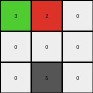
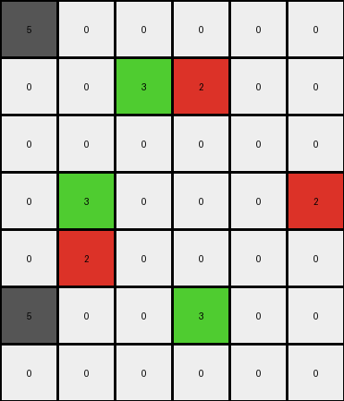

# d90796e8 • 018 • refine_coder

---

Previous Code:
```python
"""
1.  **Identify** all red (2), green (3), and gray (5) pixels in the input grid.
2.  **Preserve** all gray (5) pixels; their color and position remain unchanged in the output grid.
3.  **Locate** instances where a red (2) pixel is diagonally adjacent to a green (3) pixel, either to the Northeast (NE) or Southwest (SW).
4.  **Replace** these *specific* instances of green and red pixel pairs with azure (8).
5. **Preserve** the rest of the red and green pixels that do not respect the condition of replacement.
6.  All other cells that are not explicitly mentioned above should be white/empty (0).
"""

import numpy as np

def find_pixels_by_color(grid, color):
    """Finds the coordinates of all pixels of a specific color."""
    return np.argwhere(grid == color).tolist()

def transform(input_grid):
    # initialize output_grid with white cells
    output_grid = np.zeros_like(input_grid)
    input_grid_rows, input_grid_cols = input_grid.shape

    # Find the locations of all relevant colors.
    red_pixels = find_pixels_by_color(input_grid, 2)
    green_pixels = find_pixels_by_color(input_grid, 3)
    gray_pixels = find_pixels_by_color(input_grid, 5)

    # Preserve gray pixels.
    for row, col in gray_pixels:
       output_grid[row, col] = 5
    
    # Preserve green and red pixels that are not replaced
    for row, col in green_pixels:
        output_grid[row, col] = 3

    for row, col in red_pixels:
        output_grid[row, col] = 2

    # Check for the red-green relationship and replace with azure.
    for r_row, r_col in red_pixels:
        for g_row, g_col in green_pixels:
            if (r_row == g_row + 1 and r_col == g_col - 1) or \
               (r_row == g_row - 1 and r_col == g_col + 1) :
                output_grid[r_row, r_col] = 8
                output_grid[g_row, g_col] = 8

    return output_grid
```

Train Set Results:

## Example 1:

Input:
```
3 2 0
0 0 0
0 5 0
```
Expected Output:
```
8 0 0
0 0 0
0 5 0
```
Transformed Output:
```
3 2 0
0 0 0
0 5 0
```

match: False
pixels_off: 2
size_correct: True
color_palette_correct: False
correct_pixel_counts: False

## Example 2:

Input:
```
5 0 0 0 0 0
0 0 3 2 0 0
0 0 0 0 0 0
0 3 0 0 0 2
0 2 0 0 0 0
5 0 0 3 0 0
0 0 0 0 0 0
```
Expected Output:
```
5 0 0 0 0 0
0 0 8 0 0 0
0 0 0 0 0 0
0 8 0 0 0 2
0 0 0 0 0 0
5 0 0 3 0 0
0 0 0 0 0 0
```
Transformed Output:
```
5 0 0 0 0 0
0 0 3 2 0 0
0 0 0 0 0 0
0 3 0 0 0 2
0 2 0 0 0 0
5 0 0 3 0 0
0 0 0 0 0 0
```

match: False
pixels_off: 4
size_correct: True
color_palette_correct: True
correct_pixel_counts: False

## Example 3:

Input:
```
0 0 0 0 0 2 0
3 0 0 0 0 0 3
5 0 2 3 0 0 0
0 0 0 0 0 0 0
0 0 0 0 0 2 0
3 2 0 0 0 3 0
0 0 0 5 0 0 0
```
Expected Output:
```
0 0 0 0 0 2 0
3 0 0 0 0 0 3
5 0 0 8 0 0 0
0 0 0 0 0 0 0
0 0 0 0 0 0 0
8 0 0 0 0 8 0
0 0 0 5 0 0 0
```
Transformed Output:
```
0 0 0 0 0 2 0
3 0 0 0 0 0 3
5 0 2 3 0 0 0
0 0 0 0 0 0 0
0 0 0 0 0 2 0
3 2 0 0 0 3 0
0 0 0 5 0 0 0
```

match: False
pixels_off: 6
size_correct: True
color_palette_correct: True
correct_pixel_counts: False
Here's an analysis of the provided information and a plan to refine the natural language program and code:

**General Assessment:**

The initial natural language program and the corresponding Python code were too simplistic. While it correctly identified the need to preserve gray pixels and consider red and green pixels, it failed to accurately capture the *conditional* replacement of red and green with azure. The core issue is that the initial program preserved *all* the non replaced red and green pixels, which lead to the mismatches in all examples. The program needs to consider that the pixels are replaced *only* under the diagonal adjacency condition.

**Strategy:**

1.  **Refine the Condition:** The natural language program needs to emphasize that the azure replacement happens *only* when red and green pixels are diagonally adjacent (NE or SW). The code did use the correct calculation, but it didn't apply it conditionally when replacing the other red and green pixels.
2.  **Prioritize Replacement:** The code must consider changing pixels to azure as a primary task before preserving them to their initial color.
3. **Background:** Be explicit about filling non-gray, non-replaced pixels with white.

**Example Analysis and Metrics:**

Here's a breakdown of each example, including specific observations:

*   **Example 1:**
    *   **Input:** Simple 3x3 grid.
    *   **Error:** Red and green pixels were preserved.
    *   **Observation:** The red and green pixels *are* SW/NE diagonally adjacent.

*   **Example 2:**
    *   **Input:** Larger 7x6 grid.
    *   **Error:** One red-green pair was correctly replaced. However, the remaining pixels were preserved when they should be turned white.
    *   **Observation:** Highlights the need to handle non-replaced pixels correctly.

*   **Example 3:**
    *   **Input:** 7x7 grid.
    *   **Error:** The red-green pairs that should be replaced by azure were not, and some other pixels weren't removed.
    *   **Observation:** More complex diagonal relationships, confirming the need for the correct adjacency check and conditional replacement.

**YAML Fact Block:**

```yaml
objects:
  - name: grid
    type: 2D array
    properties:
      rows: variable
      cols: variable
      cells: integers (0-9) representing colors
  - name: pixel
    type: element
    properties:
      color: integer (0-9)
      row: integer
      col: integer
      is_gray: boolean (true if color is 5)
      is_red: boolean (true if color is 2)
      is_green: boolean (true if color is 3)
      is_azure: boolean (true if color is 8)
      replaced: boolean (initially false, true if part of a replaced pair)

actions:
  - name: find_pixels
    description: Locate pixels of a specific color.
  - name: check_adjacency
    description: Determine if a red and green pixel are diagonally adjacent (NE or SW).
  - name: replace_pixels
    description: Change the color of red and green pixels to azure if they are diagonally adjacent.
  - name: preserve_gray
    description: Keep gray pixels unchanged.
  - name: clear_unrelated
    description: Change every pixel that doesn't meet any replacement condition to white.
```

**Natural Language Program:**

1.  **Initialization:** Start with an output grid filled entirely with white (0).
2.  **Preserve Gray:** Identify all gray (5) pixels in the input grid. Copy these pixels to the same positions in the output grid, maintaining their color.
3.  **Conditional Replacement:**
    *   Locate all red (2) and green (3) pixels in the input grid.
    *   For each red pixel, check if a green pixel exists diagonally adjacent to it in either the Northeast (NE) or Southwest (SW) direction.
    *   If such a diagonally adjacent green pixel is found, replace *both* the red and green pixels with azure (8) in the output grid.
4.  **Clear Remaining:** After processing all red and green pixels, any cell in the output grid that is not gray (5) or azure (8) should be set to white (0). This ensures that only the replaced pairs and the preserved gray pixels remain.

**INSTRUCTIONS**

- generate a Python module to represent the natural language program 
- follow the template below
- all common math and science libraries are available
- create docstring only at top - but comment the workflow in the function
- use helper functions for common operations like finding objects, counting,
  measuring, moving, etc. 

remember - we are working iteratively - so this code will inform your future
self as we converge on the solution

*template:*

```python
"""
{{ natural language description of the transformation rule }}
"""

{{ imports }}

def transform(input_grid):
    # initialize output_grid

    # change output pixels 

    return output_grid

```
