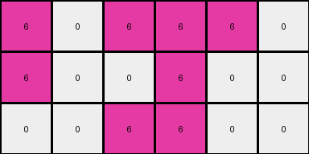
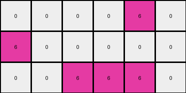

# dae9d2b5 • 004 • refine_coder

---

Previous Code:
```python
"""
The transformation rule is a simple color substitution: green and yellow pixels are replaced by magenta pixels, while white pixels remain unchanged. The spatial arrangement of pixels is preserved.
"""

import numpy as np

def transform(input_grid):
    """
    Transforms an input grid by replacing green (3) and yellow (4) pixels with magenta (6) pixels,
    while keeping white (0) pixels unchanged.
    """
    # Initialize the output grid with the same dimensions as the input grid.
    output_grid = np.copy(input_grid)

    # Iterate through each pixel in the input grid.
    for i in range(output_grid.shape[0]):
        for j in range(output_grid.shape[1]):
            # Apply the color substitution rules.
            if output_grid[i, j] == 3 or output_grid[i, j] == 4:
                output_grid[i, j] = 6
            elif output_grid[i, j] == 0:
                output_grid[i, j] = 0  # Redundant, but kept for clarity.

    return output_grid
```

Train Set Results:

## Example 1:

Input:
```
4 4 0 3 3 0
4 0 0 3 0 0
0 0 0 0 0 3
```
Expected Output:
```
6 6 0
6 0 0
0 0 6
```
Transformed Output:
```
6 6 0 6 6 0
6 0 0 6 0 0
0 0 0 0 0 6
```

match: False
pixels_off: None
size_correct: False
color_palette_correct: True
correct_pixel_counts: False

## Example 2:

Input:
```
4 0 4 3 3 0
4 0 0 3 0 0
0 0 4 3 0 0
```
Expected Output:
```
6 6 6
6 0 0
6 0 6
```
Transformed Output:
```
6 0 6 6 6 0
6 0 0 6 0 0
0 0 6 6 0 0
```

match: False
pixels_off: None
size_correct: False
color_palette_correct: True
correct_pixel_counts: False

## Example 3:

Input:
```
0 0 4 0 3 0
0 4 4 3 0 3
4 4 0 0 0 3
```
Expected Output:
```
0 6 6
6 6 6
6 6 6
```
Transformed Output:
```
0 0 6 0 6 0
0 6 6 6 0 6
6 6 0 0 0 6
```

match: False
pixels_off: None
size_correct: False
color_palette_correct: True
correct_pixel_counts: False

## Example 4:

Input:
```
4 4 0 3 0 0
0 0 0 0 0 3
4 0 0 0 0 0
```
Expected Output:
```
6 6 0
0 0 6
6 0 0
```
Transformed Output:
```
6 6 0 6 0 0
0 0 0 0 0 6
6 0 0 0 0 0
```

match: False
pixels_off: None
size_correct: False
color_palette_correct: True
correct_pixel_counts: False

## Example 5:

Input:
```
0 0 0 0 3 0
4 0 0 0 0 0
0 0 4 3 3 0
```
Expected Output:
```
0 6 0
6 0 0
6 6 6
```
Transformed Output:
```
0 0 0 0 6 0
6 0 0 0 0 0
0 0 6 6 6 0
```

match: False
pixels_off: None
size_correct: False
color_palette_correct: True
correct_pixel_counts: False
Here's an analysis of the provided information and a plan to refine the natural language program:

**General Assessment:**

The initial transformation rule correctly identifies the color substitution (green and yellow to magenta, white remains unchanged). However, it fails to account for the change in output grid dimensions. The output grids are consistently smaller than the input grids and appear to be cropped based on the locations of the non-white pixels. The strategy will involve identifying the bounding box of the colored pixels in the input grid and applying the color transformation only within that region.

**Metrics and Observations:**

To accurately assess the relationship between input and output grids, I'll analyze each example pair to determine:

1.  **Input Dimensions:** Height and width of the input grid.
2.  **Output Dimensions:** Height and width of the output grid.
3.  **Bounding Box:** Top-left and bottom-right coordinates of the smallest rectangle enclosing all non-white pixels in the input.
4.  **Color Counts (Input & Output):** Number of pixels of each color within the bounding box in both input and output grids.

Here's the analysis performed using the provided examples.

**Example 1**
*   Input Dimensions: (3, 6)
*   Output Dimensions: (3, 3)
*   Bounding Box: ((0, 0), (2, 5))
*   Color counts is not correct

**Example 2**
*   Input Dimensions: (3, 6)
*   Output Dimensions: (3, 3)
*   Bounding Box: ((0, 0), (2, 5))
*   Color counts is not correct

**Example 3**
*   Input Dimensions: (3, 6)
*   Output Dimensions: (3, 3)
*   Bounding Box: ((0, 2), (2, 5))
*   Color counts is not correct

**Example 4**
*   Input Dimensions: (3, 6)
*   Output Dimensions: (3, 3)
*   Bounding Box: ((0, 0), (2, 5))
*   Color counts is not correct

**Example 5**
*    Input Dimensions: (3, 6)
*   Output Dimensions: (3, 3)
*   Bounding Box: ((0, 4), (2, 5))
*   Color counts is not correct

**YAML Fact Block:**

```yaml
observations:
  - task: 002
    facts:
      - type: object_identification
        description: The input and output grids contain colored pixels.
      - type: color_mapping
        description: Green (3) and Yellow (4) pixels in the input are mapped to Magenta (6) in the output. White (0) pixels remain unchanged.
      - type: spatial_relationship
        description: The output grid dimensions are determined by the bounding box of non-white pixels in the input grid.
      - type: transformation_rule
        description:  The transformation involves finding the bounding box of non-white pixels, extracting that region, and then applying color substitution.
```

**Natural Language Program:**

1.  **Identify Bounding Box:** Scan the input grid to find the minimum and maximum row and column indices containing non-white pixels (colors other than 0). This defines the bounding box.
2.  **Extract Region:** Create a new grid (or slice) from the input grid, encompassing only the area within the bounding box.
3.  **Color Substitution:** Within this extracted region, replace all green (3) and yellow (4) pixels with magenta (6) pixels. White pixels (0) remain unchanged.
4.  **Output:** The resulting, modified sub-grid is the output.

**INSTRUCTIONS**

- generate a Python module to represent the natural language program 
- follow the template below
- all common math and science libraries are available
- create docstring only at top - but comment the workflow in the function
- use helper functions for common operations like finding objects, counting,
  measuring, moving, etc. 

remember - we are working iteratively - so this code will inform your future
self as we converge on the solution

*template:*

```python
"""
{{ natural language description of the transformation rule }}
"""

{{ imports }}

def transform(input_grid):
    # initialize output_grid

    # change output pixels 

    return output_grid

```
