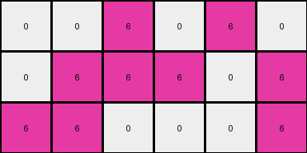
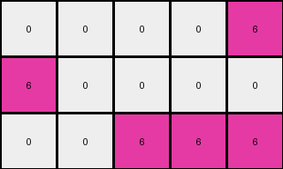

# dae9d2b5 • 005 • refine_dreamer

---


Previous Code:
```python
"""
The transformation rule involves two steps: 
1. Cropping the input grid to the bounding box of non-white pixels.
2. Applying a color substitution within the cropped region: green (3) and yellow (4) pixels become magenta (6), while white (0) pixels remain unchanged.
"""

import numpy as np

def find_bounding_box(grid):
    """
    Finds the bounding box of non-white pixels in a grid.

    Args:
        grid: A 2D numpy array representing the grid.

    Returns:
        A tuple ((min_row, min_col), (max_row, max_col)) representing the top-left and
        bottom-right corners of the bounding box.  Returns ((-1,-1),(-1,-1)) if no
        non-white pixels are found.
    """
    rows, cols = grid.shape
    min_row, min_col = rows, cols
    max_row, max_col = -1, -1

    for i in range(rows):
        for j in range(cols):
            if grid[i, j] != 0:
                min_row = min(min_row, i)
                min_col = min(min_col, j)
                max_row = max(max_row, i)
                max_col = max(max_col, j)
    if (min_row, min_col) == (rows,cols):
      return ((-1,-1),(-1,-1))
    else:
      return ((min_row, min_col), (max_row, max_col))

def transform(input_grid):
    """
    Transforms an input grid by first cropping it to the bounding box of non-white pixels,
    then replacing green (3) and yellow (4) pixels with magenta (6) pixels within the cropped region.
    """
    # Find the bounding box of non-white pixels.
    ((min_row, min_col), (max_row, max_col)) = find_bounding_box(input_grid)

    # if no bounding box, return an empty array.
    if (min_row, min_col) == (-1,-1):
      return np.array([[]])

    # Extract the region within the bounding box.
    cropped_grid = input_grid[min_row:max_row+1, min_col:max_col+1]

    # Initialize the output grid with the same dimensions as the cropped region.
    output_grid = np.copy(cropped_grid)

    # Apply color substitution within the cropped region.
    for i in range(output_grid.shape[0]):
        for j in range(output_grid.shape[1]):
            if output_grid[i, j] == 3 or output_grid[i, j] == 4:
                output_grid[i, j] = 6

    return output_grid
```

Train Set Results:

## Example 1:

Input:
```
4 4 0 3 3 0
4 0 0 3 0 0
0 0 0 0 0 3
```
Expected Output:
```
6 6 0
6 0 0
0 0 6
```
Transformed Output:
```
6 6 0 6 6 0
6 0 0 6 0 0
0 0 0 0 0 6
```

match: False
pixels_off: None
size_correct: False
color_palette_correct: True
correct_pixel_counts: False

## Example 2:

Input:
```
4 0 4 3 3 0
4 0 0 3 0 0
0 0 4 3 0 0
```
Expected Output:
```
6 6 6
6 0 0
6 0 6
```
Transformed Output:
```
6 0 6 6 6
6 0 0 6 0
0 0 6 6 0
```

match: False
pixels_off: None
size_correct: False
color_palette_correct: True
correct_pixel_counts: False

## Example 3:

Input:
```
0 0 4 0 3 0
0 4 4 3 0 3
4 4 0 0 0 3
```
Expected Output:
```
0 6 6
6 6 6
6 6 6
```
Transformed Output:
```
0 0 6 0 6 0
0 6 6 6 0 6
6 6 0 0 0 6
```

match: False
pixels_off: None
size_correct: False
color_palette_correct: True
correct_pixel_counts: False

## Example 4:

Input:
```
4 4 0 3 0 0
0 0 0 0 0 3
4 0 0 0 0 0
```
Expected Output:
```
6 6 0
0 0 6
6 0 0
```
Transformed Output:
```
6 6 0 6 0 0
0 0 0 0 0 6
6 0 0 0 0 0
```

match: False
pixels_off: None
size_correct: False
color_palette_correct: True
correct_pixel_counts: False

## Example 5:

Input:
```
0 0 0 0 3 0
4 0 0 0 0 0
0 0 4 3 3 0
```
Expected Output:
```
0 6 0
6 0 0
6 6 6
```
Transformed Output:
```
0 0 0 0 6
6 0 0 0 0
0 0 6 6 6
```

match: False
pixels_off: None
size_correct: False
color_palette_correct: True
correct_pixel_counts: False

**INSTRUCTIONS**

The code above was generated based on observations from the first training
example

we have tested the transform function on each of the task example inputs and
compared with the expected output

review each of the examples provided and the results and consider how the
natural language program should be updated to accommodate this new knowledge

respond with the following deliverables:

- general assessment of the information provided and strategy for resolving the
  errors
- gather metrics about each of the examples and results - use code_execution to
  develop accurate reports on your assumptions
- a YAML block documenting facts - Focus on identifying objects, their properties, and the actions performed on them.
- a natural language program - Be as clear and concise as possible, providing a complete description of the transformation rule.


your responses should be considered as information in a report - not a
conversation
