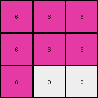
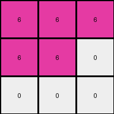

# dae9d2b5 • 017 • refine_dreamer

---

Previous Code:
```python
"""
The output is a 3x3 grid. The grid is composed of only magenta and white pixels.
The position of the magenta and white pixels is determined by the input grid.
The input grid is interpreted as a 1-dimensional sequence by reading rows
left-to-right, top-to-bottom. The sequence of pixels, excluding zeros, from the
input becomes the sequence of output pixels, starting in the top-left and
reading left-to-right, top-to-bottom, and replacing the values with 6. The
remaining pixels are set to zero.
"""

import numpy as np

def transform(input_grid):
    # Flatten the input grid into a 1D sequence.
    flattened_input = input_grid.flatten()

    # Remove zeros from the sequence.
    filtered_sequence = flattened_input[flattened_input != 0]

    # Initialize a 3x3 output grid filled with zeros (white).
    output_grid = np.zeros((3, 3), dtype=int)
    
    # Replace elements in the flattened output grid with 6 (magenta) up to the length of filtered_sequence.
    output_grid_flat = output_grid.flatten()
    for i in range(min(len(filtered_sequence), 9)):
        output_grid_flat[i] = 6
    
    # Reshape back into 3 x 3
    output_grid = output_grid_flat.reshape((3,3))

    return output_grid
```

Train Set Results:

## Example 1:

Input:
```
4 4 0 3 3 0
4 0 0 3 0 0
0 0 0 0 0 3
```
Expected Output:
```
6 6 0
6 0 0
0 0 6
```
Transformed Output:
```
6 6 6
6 6 6
6 0 0
```

match: False
pixels_off: 5
size_correct: True
color_palette_correct: True
correct_pixel_counts: False

## Example 2:

Input:
```
4 0 4 3 3 0
4 0 0 3 0 0
0 0 4 3 0 0
```
Expected Output:
```
6 6 6
6 0 0
6 0 6
```
Transformed Output:
```
6 6 6
6 6 6
6 6 0
```

match: False
pixels_off: 4
size_correct: True
color_palette_correct: True
correct_pixel_counts: False

## Example 3:

Input:
```
0 0 4 0 3 0
0 4 4 3 0 3
4 4 0 0 0 3
```
Expected Output:
```
0 6 6
6 6 6
6 6 6
```
Transformed Output:
```
6 6 6
6 6 6
6 6 6
```

match: False
pixels_off: 1
size_correct: True
color_palette_correct: True
correct_pixel_counts: False

## Example 4:

Input:
```
4 4 0 3 0 0
0 0 0 0 0 3
4 0 0 0 0 0
```
Expected Output:
```
6 6 0
0 0 6
6 0 0
```
Transformed Output:
```
6 6 6
6 6 0
0 0 0
```

match: False
pixels_off: 5
size_correct: True
color_palette_correct: True
correct_pixel_counts: False

## Example 5:

Input:
```
0 0 0 0 3 0
4 0 0 0 0 0
0 0 4 3 3 0
```
Expected Output:
```
0 6 0
6 0 0
6 6 6
```
Transformed Output:
```
6 6 6
6 6 0
0 0 0
```

match: False
pixels_off: 6
size_correct: True
color_palette_correct: True
correct_pixel_counts: True
**INSTRUCTIONS**

The code above was generated based on observations from the first training
example

we have tested the transform function on each of the task example inputs and
compared with the expected output

review each of the examples provided and the results and consider how the
natural language program should be updated to accommodate this new knowledge

respond with the following deliverables:

- general assessment of the information provided and strategy for resolving the
  errors
- gather metrics about each of the examples and results - use code_execution to
  develop accurate reports on your assumptions
- a YAML block documenting facts - Focus on identifying objects, their properties, and the actions performed on them.
- a natural language program - Be as clear and concise as possible, providing a complete description of the transformation rule.


your responses should be considered as information in a report - not a
conversation
