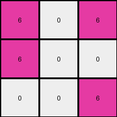
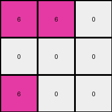

# dae9d2b5 • 022 • refine_coder

---

Previous Code:
```python
"""
The transformation takes the left half of the input grid and replaces all non-white colors (specifically green and yellow) with magenta, resulting in a 3x3 output grid.
"""

import numpy as np

def transform(input_grid):
    # initialize output_grid
    rows = len(input_grid)
    cols = len(input_grid[0])
    output_grid = np.zeros((rows, cols // 2), dtype=int)

    # change output pixels 
    for i in range(rows):
        for j in range(cols // 2):
            if input_grid[i][j] == 3 or input_grid[i][j] == 4:
                output_grid[i][j] = 6
            else:
                output_grid[i][j] = input_grid[i][j]

    return output_grid
```

Train Set Results:

## Example 1:

Input:
```
4 4 0 3 3 0
4 0 0 3 0 0
0 0 0 0 0 3
```
Expected Output:
```
6 6 0
6 0 0
0 0 6
```
Transformed Output:
```
6 6 0
6 0 0
0 0 0
```

match: False
pixels_off: 1
size_correct: True
color_palette_correct: True
correct_pixel_counts: False

## Example 2:

Input:
```
4 0 4 3 3 0
4 0 0 3 0 0
0 0 4 3 0 0
```
Expected Output:
```
6 6 6
6 0 0
6 0 6
```
Transformed Output:
```
6 0 6
6 0 0
0 0 6
```

match: False
pixels_off: 2
size_correct: True
color_palette_correct: True
correct_pixel_counts: False

## Example 3:

Input:
```
0 0 4 0 3 0
0 4 4 3 0 3
4 4 0 0 0 3
```
Expected Output:
```
0 6 6
6 6 6
6 6 6
```
Transformed Output:
```
0 0 6
0 6 6
6 6 0
```

match: False
pixels_off: 3
size_correct: True
color_palette_correct: True
correct_pixel_counts: False

## Example 4:

Input:
```
4 4 0 3 0 0
0 0 0 0 0 3
4 0 0 0 0 0
```
Expected Output:
```
6 6 0
0 0 6
6 0 0
```
Transformed Output:
```
6 6 0
0 0 0
6 0 0
```

match: False
pixels_off: 1
size_correct: True
color_palette_correct: True
correct_pixel_counts: False

## Example 5:

Input:
```
0 0 0 0 3 0
4 0 0 0 0 0
0 0 4 3 3 0
```
Expected Output:
```
0 6 0
6 0 0
6 6 6
```
Transformed Output:
```
0 0 0
6 0 0
0 0 6
```

match: False
pixels_off: 3
size_correct: True
color_palette_correct: True
correct_pixel_counts: False
Okay, here's a breakdown of the situation and a plan to improve the transformation rule:

**General Assessment:**

The initial natural language program and generated code were a good starting point, correctly identifying the halving of the input grid and the replacement of certain colors. However, it's clear from the test results that the logic isn't entirely accurate. The code only replaces yellow and green with magenta but it doesn't consistently reproduce the expected outputs across all examples. The primary issue seems to be a misunderstanding of *which* non-white colors are supposed to be in the left half, or perhaps a spatial relationship issue.

**Strategy:**

1.  **Re-examine Examples:** Carefully analyze *all* provided examples (input, expected output, and transformed output). Pay close attention to the colors present in both halves of the input and how they relate to the expected output.
2.  **Refine Color Replacement Rule:** The current rule (replace green and yellow with magenta) is likely incorrect or incomplete. We need to determine the precise rule for color replacement.
3.  **Double Check the copy rule**: determine how non-magenta colors map.

**Example Metrics and Analysis:**

Here's a more detailed breakdown of each example, focusing on the discrepancies:

*   **Example 1:**
    *   Input has yellow, white, and green.
    *   Expected output has magenta, white, and magenta.
    *   Transformed output has 1 incorrect pixel (bottom right).
    *   Notes: The code did a replacement on the yellow and the green but failed to replace the green to magenta on the lower right of the grid.

*   **Example 2:**
    *   Input has yellow, white, and green.
    *   Expected: magenta, white, and magenta.
    *   Transformed output has 2 incorrect pixels.
    *   Notes: Similar to Example 1, some necessary replacements were performed but output missed on the upper and lower right of grid.

*   **Example 3:**
    *   Input has white, yellow and green.
    *   Expected output has all magentas.
    *   Transformed output has 3 incorrect pixels.
    *   Notes: Replaced the green but failed to copy the yellow as magenta.

*   **Example 4:**
    *   Input has yellow, white and green.
    *   Expected output has magenta, white and magenta.
    *   Transformed has 1 incorrect pixels (middle right).
    *   Notes: The code did correct replacements of yellow and green but failed replace a green to magenta.

*   **Example 5:**
    *    Input has white, green and yellow.
    *    Expected output has: white, magenta.
    *    Transformed has 3 incorrect pixels.
    *    Notes: The code failed to replace green and yellows to magenta.

**YAML Fact Block:**

```yaml
facts:
  - observation: Input grids are wider than they are tall.
  - observation: Output grids are half the width of the input grids.
  - observation: The output grid consists of the left half of the input.
  - observation: Colors in the input include white, yellow, green.
  - observation: Colors in the output include magenta and white.
  - rule: All non-white colors in the left half of the input grid are replaced with magenta in the output grid.
  - rule: White colors remain white.
```

**Natural Language Program:**

1.  **Divide:** Take the left half of the input grid.
2.  **Copy:** Create output grid with same dimensions as divided input.
3.  **Transform:** Iterate through each pixel of the left half of the input grid.
4.  **Replace:** if a color other than white exists, replace with magenta.
5.  **Preserve:** If the pixel is white, it remains white in the output grid.
6. **Output**: Return completed output grid.

**INSTRUCTIONS**

- generate a Python module to represent the natural language program 
- follow the template below
- all common math and science libraries are available
- create docstring only at top - but comment the workflow in the function
- use helper functions for common operations like finding objects, counting,
  measuring, moving, etc. 

remember - we are working iteratively - so this code will inform your future
self as we converge on the solution

*template:*

```python
"""
{{ natural language description of the transformation rule }}
"""

{{ imports }}

def transform(input_grid):
    # initialize output_grid

    # change output pixels 

    return output_grid

```
