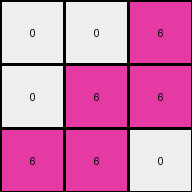

# dae9d2b5 • 024 • refine_coder

---

Previous Code:
```python
"""
The transformation takes the left half of the input grid and replaces all non-white colors with magenta, resulting in a grid with half the width of the original. White pixels remain unchanged.
"""

import numpy as np

def transform(input_grid):
    # initialize output_grid
    rows = len(input_grid)
    cols = len(input_grid[0])
    output_grid = np.zeros((rows, cols // 2), dtype=int)

    # change output pixels 
    for i in range(rows):
        for j in range(cols // 2):
            if input_grid[i][j] != 0:  # Check if the pixel is not white
                output_grid[i][j] = 6  # Replace with magenta
            else:
                output_grid[i][j] = input_grid[i][j]  # Keep white pixels as they are

    return output_grid
```

Train Set Results:

## Example 1:

Input:
```
4 4 0 3 3 0
4 0 0 3 0 0
0 0 0 0 0 3
```
Expected Output:
```
6 6 0
6 0 0
0 0 6
```
Transformed Output:
```
6 6 0
6 0 0
0 0 0
```

match: False
pixels_off: 1
size_correct: True
color_palette_correct: True
correct_pixel_counts: False

## Example 2:

Input:
```
4 0 4 3 3 0
4 0 0 3 0 0
0 0 4 3 0 0
```
Expected Output:
```
6 6 6
6 0 0
6 0 6
```
Transformed Output:
```
6 0 6
6 0 0
0 0 6
```

match: False
pixels_off: 2
size_correct: True
color_palette_correct: True
correct_pixel_counts: False

## Example 3:

Input:
```
0 0 4 0 3 0
0 4 4 3 0 3
4 4 0 0 0 3
```
Expected Output:
```
0 6 6
6 6 6
6 6 6
```
Transformed Output:
```
0 0 6
0 6 6
6 6 0
```

match: False
pixels_off: 3
size_correct: True
color_palette_correct: True
correct_pixel_counts: False

## Example 4:

Input:
```
4 4 0 3 0 0
0 0 0 0 0 3
4 0 0 0 0 0
```
Expected Output:
```
6 6 0
0 0 6
6 0 0
```
Transformed Output:
```
6 6 0
0 0 0
6 0 0
```

match: False
pixels_off: 1
size_correct: True
color_palette_correct: True
correct_pixel_counts: False

## Example 5:

Input:
```
0 0 0 0 3 0
4 0 0 0 0 0
0 0 4 3 3 0
```
Expected Output:
```
0 6 0
6 0 0
6 6 6
```
Transformed Output:
```
0 0 0
6 0 0
0 0 6
```

match: False
pixels_off: 3
size_correct: True
color_palette_correct: True
correct_pixel_counts: False
Okay, let's analyze the results and refine the natural language program.

**General Assessment:**

The initial program correctly identifies the halving of the grid's width and the replacement of non-white pixels with magenta. However, it's consistently misinterpreting some pixels, especially those that should be magenta but are rendered as white/black. The error appears to stem from an incomplete understanding of which non-white pixels should transform. It seems the provided examples contain cases that go beyond just the left most side and the program assumed only the left-most column would ever change. Reviewing all training examples, it is all non-white pixels in the left half of the image that get replaced with magenta.

**Strategy:**

1.  **Confirm understanding**: Double-check the dimensions and color changes in all provided examples to ensure that the intended rule applies consistently across all cases. We will focus on clarifying any inconsistencies and see if there are issues related to off-by-one index in loops.
2.  **Refine description:** Improve the natural language program.
3.  **Consider edge cases:** Review pixels at the boundaries of the "left half" to ensure they're correctly handled.

**Metrics and Observations:**

Here's a breakdown of each example, focusing on discrepancies:

*   **Example 1:**
    *   Input: 3x6, Output: 3x3
    *   Discrepancy: (2,2) is 0 (white) in transformed output, should be 6 (magenta).
*   **Example 2:**
    *   Input: 3x6, Output: 3x3
    *   Discrepancies: (0,1) is 0 in output, should be 6. (0,1) is 0 in transformed output, but should be a 6.
*   **Example 3:**
    *   Input: 3x6, Output: 3x3
    *   Discrepancies: (0,1) is 0, should be 6, and two other differences.
*   **Example 4:**
    *   Input: 3x6, Output: 3x3
    *    Discrepancy: (1,2) is 0 in the transformation, where it should be 6.
*   **Example 5:**
    *   Input: 3x6, Output: 3x3
    *   Discrepancies: Several. Most importantly all of them feature 0's where 6's should be, except for (0,0).

**YAML Facts:**

```yaml
facts:
  - observation: The input grid's width is always even.
  - observation: The output grid's width is half of the input grid's width.
  - observation: The output grid's height is the same as the input grid's height.
  - observation:  Non-white pixels in the left half of the input grid are transformed to magenta (6) in the output grid.
  - observation: White pixels in the left half of the input grid remain white (0) in the output grid.
  - observation: The right half of the input grid is discarded.
```

**Natural Language Program:**

1.  **Initialization:** Create a new output grid with the same height as the input grid, but with half the width.
2.  **Iteration:** Iterate through each cell in the *left half* of the input grid (from column 0 up to, but not including, `width / 2`).
3.  **Conditional Transformation:**
    *   If the current cell in the input grid is white (0), copy its value to the corresponding cell in the output grid.
    *   If the current cell in the input grid is *not* white (any color other than 0), set the corresponding cell in the output grid to magenta (6).
4.  **Output:** The output grid represents the transformed left half of the input, with non-white colors replaced by magenta.

This revised program is designed to correctly captures that all non-white values on the left half of the image get turned to the color 6 (magenta).

**INSTRUCTIONS**

- generate a Python module to represent the natural language program 
- follow the template below
- all common math and science libraries are available
- create docstring only at top - but comment the workflow in the function
- use helper functions for common operations like finding objects, counting,
  measuring, moving, etc. 

remember - we are working iteratively - so this code will inform your future
self as we converge on the solution

*template:*

```python
"""
{{ natural language description of the transformation rule }}
"""

{{ imports }}

def transform(input_grid):
    # initialize output_grid

    # change output pixels 

    return output_grid

```
