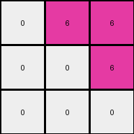
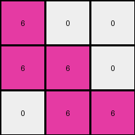
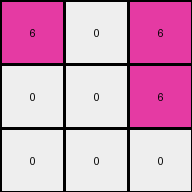
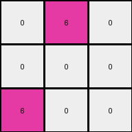

# dae9d2b5 • 029 • refine_dreamer

---

Previous Code:
```python
"""
1.  **Input:** Receive a 2D grid of color values.
2.  **Rotation**: Rotate the grid 90 degrees clockwise.
3.  **Identify Non-White:** Locate all pixels in the rotated input grid that are not white (0).
4.  **Create Output Grid:** Create a 3x3 output grid initialized with all zeros (white).
5.  **Map Colors:** For the first 3 rows and 3 columns of the rotated input, map any non-white pixel to the value 6 (magenta) in the corresponding location in the output grid.
6.  **Output:** Return the 3x3 output grid.
"""

import numpy as np

def rotate_grid(grid):
    """Rotates a 2D grid 90 degrees clockwise."""
    return np.rot90(grid, k=-1).tolist()


def transform(input_grid):
    # Rotate the input grid 90 degrees clockwise
    rotated_grid = rotate_grid(input_grid)
    
    # Create a 3x3 output grid initialized with zeros
    output_grid = [[0] * 3 for _ in range(3)]

    # Iterate through the first 3 rows and columns of the rotated grid
    for i in range(min(3, len(rotated_grid))):
        for j in range(min(3, len(rotated_grid[0]))):
            # If the pixel is not white, map it to 6 in the output grid
            if rotated_grid[i][j] != 0:
                output_grid[i][j] = 6

    return output_grid
```

Train Set Results:

## Example 1:

Input:
```
4 4 0 3 3 0
4 0 0 3 0 0
0 0 0 0 0 3
```
Expected Output:
```
6 6 0
6 0 0
0 0 6
```
Transformed Output:
```
0 6 6
0 0 6
0 0 0
```

match: False
pixels_off: 5
size_correct: True
color_palette_correct: True
correct_pixel_counts: False

## Example 2:

Input:
```
4 0 4 3 3 0
4 0 0 3 0 0
0 0 4 3 0 0
```
Expected Output:
```
6 6 6
6 0 0
6 0 6
```
Transformed Output:
```
0 6 6
0 0 0
6 0 6
```

match: False
pixels_off: 2
size_correct: True
color_palette_correct: True
correct_pixel_counts: False

## Example 3:

Input:
```
0 0 4 0 3 0
0 4 4 3 0 3
4 4 0 0 0 3
```
Expected Output:
```
0 6 6
6 6 6
6 6 6
```
Transformed Output:
```
6 0 0
6 6 0
0 6 6
```

match: False
pixels_off: 5
size_correct: True
color_palette_correct: True
correct_pixel_counts: False

## Example 4:

Input:
```
4 4 0 3 0 0
0 0 0 0 0 3
4 0 0 0 0 0
```
Expected Output:
```
6 6 0
0 0 6
6 0 0
```
Transformed Output:
```
6 0 6
0 0 6
0 0 0
```

match: False
pixels_off: 3
size_correct: True
color_palette_correct: True
correct_pixel_counts: False

## Example 5:

Input:
```
0 0 0 0 3 0
4 0 0 0 0 0
0 0 4 3 3 0
```
Expected Output:
```
0 6 0
6 0 0
6 6 6
```
Transformed Output:
```
0 6 0
0 0 0
6 0 0
```

match: False
pixels_off: 3
size_correct: True
color_palette_correct: True
correct_pixel_counts: False
**INSTRUCTIONS**

The code above was generated based on observations from the first training
example

we have tested the transform function on each of the task example inputs and
compared with the expected output

review each of the examples provided and the results and consider how the
natural language program should be updated to accommodate this new knowledge

respond with the following deliverables:

- general assessment of the information provided and strategy for resolving the
  errors
- gather metrics about each of the examples and results - use code_execution to
  develop accurate reports on your assumptions
- a YAML block documenting facts - Focus on identifying objects, their properties, and the actions performed on them.
- a natural language program - Be as clear and concise as possible, providing a complete description of the transformation rule.


your responses should be considered as information in a report - not a
conversation
