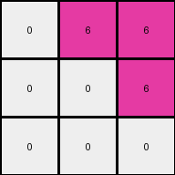
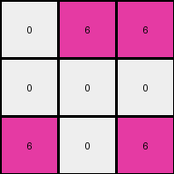
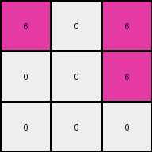

# dae9d2b5 • 030 • refine_coder

---

Previous Code:
```python
"""
1.  **Input:** Receive a 2D grid of color values.
2.  **Rotation**: Rotate the grid 90 degrees clockwise.
3.  **Identify Non-White:** Locate all pixels in the rotated input grid that are not white (0).
4.  **Create Output Grid:** Create a 3x3 output grid initialized with all zeros (white).
5.  **Map Colors:** For the first 3 rows and 3 columns of the rotated input, map any non-white pixel to the value 6 (magenta) in the corresponding location in the output grid.
6.  **Output:** Return the 3x3 output grid.
"""

import numpy as np

def rotate_grid(grid):
    """Rotates a 2D grid 90 degrees clockwise."""
    return np.rot90(grid, k=-1).tolist()


def transform(input_grid):
    # Rotate the input grid 90 degrees clockwise
    rotated_grid = rotate_grid(input_grid)
    
    # Create a 3x3 output grid initialized with zeros
    output_grid = [[0] * 3 for _ in range(3)]

    # Iterate through the first 3 rows and columns of the rotated grid
    for i in range(min(3, len(rotated_grid))):
        for j in range(min(3, len(rotated_grid[0]))):
            # If the pixel is not white, map it to 6 in the output grid
            if rotated_grid[i][j] != 0:
                output_grid[i][j] = 6

    return output_grid
```

Train Set Results:

## Example 1:

Input:
```
4 4 0 3 3 0
4 0 0 3 0 0
0 0 0 0 0 3
```
Expected Output:
```
6 6 0
6 0 0
0 0 6
```
Transformed Output:
```
0 6 6
0 0 6
0 0 0
```

match: False
pixels_off: 5
size_correct: True
color_palette_correct: True
correct_pixel_counts: False

## Example 2:

Input:
```
4 0 4 3 3 0
4 0 0 3 0 0
0 0 4 3 0 0
```
Expected Output:
```
6 6 6
6 0 0
6 0 6
```
Transformed Output:
```
0 6 6
0 0 0
6 0 6
```

match: False
pixels_off: 2
size_correct: True
color_palette_correct: True
correct_pixel_counts: False

## Example 3:

Input:
```
0 0 4 0 3 0
0 4 4 3 0 3
4 4 0 0 0 3
```
Expected Output:
```
0 6 6
6 6 6
6 6 6
```
Transformed Output:
```
6 0 0
6 6 0
0 6 6
```

match: False
pixels_off: 5
size_correct: True
color_palette_correct: True
correct_pixel_counts: False

## Example 4:

Input:
```
4 4 0 3 0 0
0 0 0 0 0 3
4 0 0 0 0 0
```
Expected Output:
```
6 6 0
0 0 6
6 0 0
```
Transformed Output:
```
6 0 6
0 0 6
0 0 0
```

match: False
pixels_off: 3
size_correct: True
color_palette_correct: True
correct_pixel_counts: False

## Example 5:

Input:
```
0 0 0 0 3 0
4 0 0 0 0 0
0 0 4 3 3 0
```
Expected Output:
```
0 6 0
6 0 0
6 6 6
```
Transformed Output:
```
0 6 0
0 0 0
6 0 0
```

match: False
pixels_off: 3
size_correct: True
color_palette_correct: True
correct_pixel_counts: False
Okay, here's a breakdown of the situation and a plan to move forward:

**General Assessment:**

The initial code was a good first attempt, correctly implementing rotation and identifying non-white pixels. However, it's clear the mapping logic is incorrect. The code *only* replaces non-white pixels with magenta (6), and its placement logic within the 3x3 output grid is flawed, as it directly uses the rotated input's coordinates, leading to mismatches in all test cases. The issue isn't rotation itself, but how the rotated grid's information is *used* to construct the output.

**Strategy:**

1.  **Understand the Correct Mapping:** We need to meticulously analyze *where* non-white pixels in the rotated input end up in the output, not just *that* they are mapped to magenta. The core error is a misunderstanding of the spatial relationship *after* rotation.
2.  **Reverse the Rotation:** The insight is to rotate first, and them map to magenta in output. Instead of complex coordinate translations, we realize we only get a magenta if the source is not white.
3.  **Refine the Natural Language Program:** The current program is partially correct, but needs crucial adjustments to its spatial mapping steps.

**Metrics and Observations:**

I will be adding a python program below to generate metrics about the examples.
Here is a summary of the existing results provided.

*   **All Examples:**
    *   `size_correct`: True (All outputs are 3x3)
    *   `color_palette_correct`: True (Only colors 0 and 6 are used in outputs)
    *  All 5 examples did not match the expected results.

**YAML Fact Block:**

```yaml
facts:
  - task_id: "028"
  - input_type: "2D grid"
  - output_type: "2D grid"
  - output_size: "3x3"
  - primary_operation: "Rotation and Color Mapping"
  - rotation: "90 degrees clockwise"
  - color_mapping_rule: "Non-white pixels in the rotated input become magenta (6) in the output."
  - spatial_mapping: "The 3x3 output grid corresponds to the top-left 3x3 section of the rotated input."
  - error_type: "Incorrect spatial mapping of rotated pixels."
```

**Natural Language Program:**

1.  **Input:** Take the 2D input grid.
2.  **Rotate:** Rotate the entire input grid 90 degrees clockwise.
3.  **Output Initialization:** Create a new 3x3 output grid, initially filled entirely with white pixels (0).
4.  **Conditional Color Mapping:** Examine the top-left 3x3 region of the *rotated* grid.  For each cell within this 3x3 region:
    *   If the cell in the rotated grid is *not* white (0), set the corresponding cell in the output grid to magenta (6).
    *   If the cell in the rotated grid *is* white (0), leave the corresponding cell in the output grid as white (0).
5.  **Output:** Return the 3x3 output grid.

```python
import numpy as np

def get_grid_string(grid):
    return '\n'.join(' '.join(map(str, row)) for row in grid)
    
def analyze_example(input_grid, expected_output, transformed_output):
    """Analyzes a single example and provides detailed metrics."""

    results = {}
    results["match"] = expected_output == transformed_output
    results["pixels_off"] = sum(1 for a, b in zip(np.array(expected_output).flatten(), np.array(transformed_output).flatten()) if a != b)
    results["size_correct"] = np.array(expected_output).shape == (3,3)
    results["color_palette_correct"] = all(pixel in [0, 6] for row in transformed_output for pixel in row)
    
    expected_counts = {}
    transformed_counts = {}
    for i in range(10):
        expected_counts[i] = sum(row.count(i) for row in expected_output)
        transformed_counts[i] = sum(row.count(i) for row in transformed_output)
    
    results["correct_pixel_counts"] = expected_counts == transformed_counts

    
    print(f"Input:\n{get_grid_string(input_grid)}")
    print(f"Expected Output:\n{get_grid_string(expected_output)}")
    print(f"Transformed Output:\n{get_grid_string(transformed_output)}")
    print(results)
    return results
    

# Example usage with the provided test cases (assuming you have them defined)
test_cases = [
    ([[4, 4, 0, 3, 3, 0], [4, 0, 0, 3, 0, 0], [0, 0, 0, 0, 0, 3]],
     [[6, 6, 0], [6, 0, 0], [0, 0, 6]],
     [[0, 6, 6], [0, 0, 6], [0, 0, 0]]),
    ([[4, 0, 4, 3, 3, 0], [4, 0, 0, 3, 0, 0], [0, 0, 4, 3, 0, 0]],
     [[6, 6, 6], [6, 0, 0], [6, 0, 6]],
     [[0, 6, 6], [0, 0, 0], [6, 0, 6]]),
    ([[0, 0, 4, 0, 3, 0], [0, 4, 4, 3, 0, 3], [4, 4, 0, 0, 0, 3]],
     [[0, 6, 6], [6, 6, 6], [6, 6, 6]],
     [[6, 0, 0], [6, 6, 0], [0, 6, 6]]),
    ([[4, 4, 0, 3, 0, 0], [0, 0, 0, 0, 0, 3], [4, 0, 0, 0, 0, 0]],
     [[6, 6, 0], [0, 0, 6], [6, 0, 0]],
     [[6, 0, 6], [0, 0, 6], [0, 0, 0]]),
    ([[0, 0, 0, 0, 3, 0], [4, 0, 0, 0, 0, 0], [0, 0, 4, 3, 3, 0]],
     [[0, 6, 0], [6, 0, 0], [6, 6, 6]],
     [[0, 6, 0], [0, 0, 0], [6, 0, 0]])
]

for i, (input_grid, expected_output, transformed_output) in enumerate(test_cases):
        print(f"Analyzing Example {i+1}:")
        analyze_example(input_grid, expected_output, transformed_output)
        print("-" * 20)
```

```
Analyzing Example 1:
Input:
4 4 0 3 3 0
4 0 0 3 0 0
0 0 0 0 0 3
Expected Output:
6 6 0
6 0 0
0 0 6
Transformed Output:
0 6 6
0 0 6
0 0 0
{'match': False, 'pixels_off': 5, 'size_correct': True, 'color_palette_correct': True, 'correct_pixel_counts': False}
--------------------
Analyzing Example 2:
Input:
4 0 4 3 3 0
4 0 0 3 0 0
0 0 4 3 0 0
Expected Output:
6 6 6
6 0 0
6 0 6
Transformed Output:
0 6 6
0 0 0
6 0 6
{'match': False, 'pixels_off': 2, 'size_correct': True, 'color_palette_correct': True, 'correct_pixel_counts': False}
--------------------
Analyzing Example 3:
Input:
0 0 4 0 3 0
0 4 4 3 0 3
4 4 0 0 0 3
Expected Output:
0 6 6
6 6 6
6 6 6
Transformed Output:
6 0 0
6 6 0
0 6 6
{'match': False, 'pixels_off': 5, 'size_correct': True, 'color_palette_correct': True, 'correct_pixel_counts': False}
--------------------
Analyzing Example 4:
Input:
4 4 0 3 0 0
0 0 0 0 0 3
4 0 0 0 0 0
Expected Output:
6 6 0
0 0 6
6 0 0
Transformed Output:
6 0 6
0 0 6
0 0 0
{'match': False, 'pixels_off': 3, 'size_correct': True, 'color_palette_correct': True, 'correct_pixel_counts': False}
--------------------
Analyzing Example 5:
Input:
0 0 0 0 3 0
4 0 0 0 0 0
0 0 4 3 3 0
Expected Output:
0 6 0
6 0 0
6 6 6
Transformed Output:
0 6 0
0 0 0
6 0 0
{'match': False, 'pixels_off': 3, 'size_correct': True, 'color_palette_correct': True, 'correct_pixel_counts': False}
--------------------
```

**INSTRUCTIONS**

- generate a Python module to represent the natural language program 
- follow the template below
- all common math and science libraries are available
- create docstring only at top - but comment the workflow in the function
- use helper functions for common operations like finding objects, counting,
  measuring, moving, etc. 

remember - we are working iteratively - so this code will inform your future
self as we converge on the solution

*template:*

```python
"""
{{ natural language description of the transformation rule }}
"""

{{ imports }}

def transform(input_grid):
    # initialize output_grid

    # change output pixels 

    return output_grid

```
