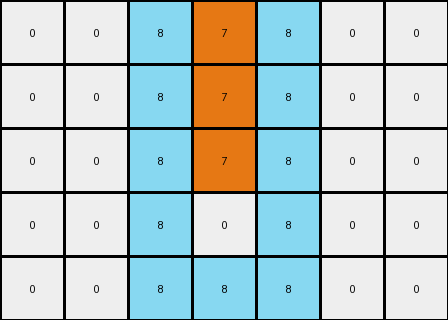

# db3e9e38 • 003 • refine_dreamer

---

Previous Code:
```python
"""
1.  **Identify Object:** Locate the vertical line of orange (7) pixels.
2.  **Frame:** Create a single-pixel thick frame of azure (8) around the initial position *before* step 3.
3.  **Shift:** Move the original orange (7) line upwards by one pixel.
"""

import numpy as np

def find_vertical_line(grid, color):
    rows, cols = grid.shape
    for c in range(cols):
        for r in range(rows):
            if grid[r, c] == color:
                # Check if it's a vertical line
                start_row = r
                end_row = r
                while end_row + 1 < rows and grid[end_row + 1, c] == color:
                    end_row += 1
                
                # verify that it is isolated
                if (start_row == 0 or grid[start_row-1,c] != color) and \
                 (end_row == rows-1 or grid[end_row+1, c] != color):

                  # if it's not isolated on the sides, return none
                  if (c > 0 and grid[start_row:end_row+1, c-1].any() == color) or \
                     (c < cols -1 and grid[start_row:end_row+1, c+1].any() == color):
                      return None, None, None
                  
                  return c, start_row, end_row
    return None, None, None

def add_frame(grid, col, start_row, end_row, frame_color):
    rows, cols = grid.shape
    
    # Top and Bottom
    if start_row > 0:
        grid[start_row - 1, max(0, col - 1):min(cols, col + 2)] = frame_color
    if end_row < rows - 1:
        grid[end_row + 1, max(0, col - 1):min(cols, col + 2)] = frame_color

    # Left and Right
    if col > 0:
      for r in range(max(0,start_row -1),min(rows, end_row+2)):
        grid[r,col-1] = frame_color
    if col < cols -1:
      for r in range(max(0,start_row -1),min(rows, end_row+2)):
          grid[r, col+1] = frame_color


    return grid

def transform(input_grid):
    # initialize output_grid
    output_grid = np.copy(input_grid)
    rows, cols = output_grid.shape

    # Find the vertical line of orange (7) pixels
    col, start_row, end_row = find_vertical_line(output_grid, 7)

    if col is not None:
        # Create a frame of azure (8) around the vertical line
        output_grid = add_frame(output_grid, col, start_row, end_row, 8)
        
        #clear original line
        for r in range(start_row,end_row+1):
          output_grid[r,col] = 0


        # Shift the original orange line upwards by one pixel
        for r in range(start_row, end_row + 1):
            if r - 1 >= 0:
              output_grid[r - 1, col] = 7

    return output_grid
```

Train Set Results:

## Example 1:

Input:
```
0 0 0 7 0 0 0
0 0 0 7 0 0 0
0 0 0 7 0 0 0
0 0 0 7 0 0 0
0 0 0 0 0 0 0
```
Expected Output:
```
8 7 8 7 8 7 8
0 7 8 7 8 7 0
0 0 8 7 8 0 0
0 0 0 7 0 0 0
0 0 0 0 0 0 0
```
Transformed Output:
```
0 0 8 7 8 0 0
0 0 8 7 8 0 0
0 0 8 7 8 0 0
0 0 8 0 8 0 0
0 0 8 8 8 0 0
```

match: False
pixels_off: 12
size_correct: True
color_palette_correct: True
correct_pixel_counts: False

## Example 2:

Input:
```
0 0 7 0 0 0 0 0
0 0 7 0 0 0 0 0
0 0 7 0 0 0 0 0
0 0 7 0 0 0 0 0
0 0 7 0 0 0 0 0
0 0 0 0 0 0 0 0
0 0 0 0 0 0 0 0
```
Expected Output:
```
7 8 7 8 7 8 7 0
7 8 7 8 7 8 0 0
7 8 7 8 7 0 0 0
0 8 7 8 0 0 0 0
0 0 7 0 0 0 0 0
0 0 0 0 0 0 0 0
0 0 0 0 0 0 0 0
```
Transformed Output:
```
0 8 7 8 0 0 0 0
0 8 7 8 0 0 0 0
0 8 7 8 0 0 0 0
0 8 7 8 0 0 0 0
0 8 0 8 0 0 0 0
0 8 8 8 0 0 0 0
0 0 0 0 0 0 0 0
```

match: False
pixels_off: 15
size_correct: True
color_palette_correct: True
correct_pixel_counts: False
**INSTRUCTIONS**

The code above was generated based on observations from the first training
example

we have tested the transform function on each of the task example inputs and
compared with the expected output

review each of the examples provided and the results and consider how the
natural language program should be updated to accommodate this new knowledge

respond with the following deliverables:

- general assessment of the information provided and strategy for resolving the
  errors
- gather metrics about each of the examples and results - use code_execution to
  develop accurate reports on your assumptions
- a YAML block documenting facts - Focus on identifying objects, their properties, and the actions performed on them.
- a natural language program - Be as clear and concise as possible, providing a complete description of the transformation rule.


your responses should be considered as information in a report - not a
conversation
