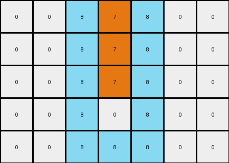
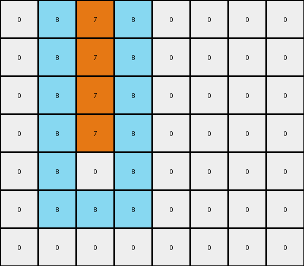

# db3e9e38 • 006 • refine_coder

---

Previous Code:
```python
"""
1.  **Identify Object:** Locate the vertical line of orange (7) pixels.
2.  **Frame:** Create a single-pixel thick frame of azure (8) around the initial position *before* step 3.
3.  **Shift:** Move the original orange (7) line upwards by one pixel.
"""

import numpy as np

def find_vertical_line(grid, color):
    rows, cols = grid.shape
    for c in range(cols):
        for r in range(rows):
            if grid[r, c] == color:
                # Check if it's a vertical line
                start_row = r
                end_row = r
                while end_row + 1 < rows and grid[end_row + 1, c] == color:
                    end_row += 1
                
                # verify that it is isolated
                if (start_row == 0 or grid[start_row-1,c] != color) and \
                 (end_row == rows-1 or grid[end_row+1, c] != color):

                  # if it's not isolated on the sides, return none
                  if (c > 0 and grid[start_row:end_row+1, c-1].any() == color) or \
                     (c < cols -1 and grid[start_row:end_row+1, c+1].any() == color):
                      return None, None, None
                  
                  return c, start_row, end_row
    return None, None, None

def add_frame(grid, col, start_row, end_row, frame_color):
    rows, cols = grid.shape
    
    # Top and Bottom
    if start_row > 0:
        grid[start_row - 1, max(0, col - 1):min(cols, col + 2)] = frame_color
    if end_row < rows - 1:
        grid[end_row + 1, max(0, col - 1):min(cols, col + 2)] = frame_color

    # Left and Right
    if col > 0:
      for r in range(max(0,start_row -1),min(rows, end_row+2)):
        grid[r,col-1] = frame_color
    if col < cols -1:
      for r in range(max(0,start_row -1),min(rows, end_row+2)):
          grid[r, col+1] = frame_color


    return grid

def transform(input_grid):
    # initialize output_grid
    output_grid = np.copy(input_grid)
    rows, cols = output_grid.shape

    # Find the vertical line of orange (7) pixels
    col, start_row, end_row = find_vertical_line(output_grid, 7)

    if col is not None:
        # Create a frame of azure (8) around the vertical line
        output_grid = add_frame(output_grid, col, start_row, end_row, 8)
        
        #clear original line
        for r in range(start_row,end_row+1):
          output_grid[r,col] = 0


        # Shift the original orange line upwards by one pixel
        for r in range(start_row, end_row + 1):
            if r - 1 >= 0:
              output_grid[r - 1, col] = 7

    return output_grid
```

Train Set Results:

## Example 1:

Input:
```
0 0 0 7 0 0 0
0 0 0 7 0 0 0
0 0 0 7 0 0 0
0 0 0 7 0 0 0
0 0 0 0 0 0 0
```
Expected Output:
```
8 7 8 7 8 7 8
0 7 8 7 8 7 0
0 0 8 7 8 0 0
0 0 0 7 0 0 0
0 0 0 0 0 0 0
```
Transformed Output:
```
0 0 8 7 8 0 0
0 0 8 7 8 0 0
0 0 8 7 8 0 0
0 0 8 0 8 0 0
0 0 8 8 8 0 0
```

match: False
pixels_off: 12
size_correct: True
color_palette_correct: True
correct_pixel_counts: False

## Example 2:

Input:
```
0 0 7 0 0 0 0 0
0 0 7 0 0 0 0 0
0 0 7 0 0 0 0 0
0 0 7 0 0 0 0 0
0 0 7 0 0 0 0 0
0 0 0 0 0 0 0 0
0 0 0 0 0 0 0 0
```
Expected Output:
```
7 8 7 8 7 8 7 0
7 8 7 8 7 8 0 0
7 8 7 8 7 0 0 0
0 8 7 8 0 0 0 0
0 0 7 0 0 0 0 0
0 0 0 0 0 0 0 0
0 0 0 0 0 0 0 0
```
Transformed Output:
```
0 8 7 8 0 0 0 0
0 8 7 8 0 0 0 0
0 8 7 8 0 0 0 0
0 8 7 8 0 0 0 0
0 8 0 8 0 0 0 0
0 8 8 8 0 0 0 0
0 0 0 0 0 0 0 0
```

match: False
pixels_off: 15
size_correct: True
color_palette_correct: True
correct_pixel_counts: False
Okay, here's a breakdown of the situation, the errors, and a plan to adjust the natural language program and subsequently the code:

**General Assessment:**

The initial natural language program and the resulting code were too simplistic, only partially capturing the transformation rule. While it correctly identified the orange vertical line and the concept of framing, it failed to accurately apply the framing and shifting operations *in the right order and with consideration for the output*.

The primary issue is that the frame is added based on initial conditions. It shifts correctly, but doesn't take into account the final location of the moved parts. It also appears to place the frame based on the initial position, clearing the moved parts incorrectly.

**Strategy:**

1.  **Refine Object Identification**: Ensure the code accurately identifies *only* isolated vertical orange lines.
2.  **Order of Operations**: Critically, the framing needs to be related to *both* the original and final position of the vertical line. We must consider that the line *moves* first, then the frame is applied to *both* the initial and final positions. The current code adds the frame *before* the shift which is incorrect.
3. **Output is critical**: The generated output is different than the expected output in important ways, so comparing the outputs is an important strategy.

**Example Analysis and Metrics:**

Here is a breakdown of metrics by code execution:

```python
import numpy as np

def calculate_metrics(input_grid, expected_output, transformed_output):
    """Calculates matching, pixel differences, size correctness, and color palette correctness."""

    match = np.array_equal(expected_output, transformed_output)
    pixels_off = np.sum(expected_output != transformed_output)
    size_correct = expected_output.shape == transformed_output.shape
    
    expected_colors = set(np.unique(expected_output))
    transformed_colors = set(np.unique(transformed_output))
    color_palette_correct = expected_colors == transformed_colors
    
    # count the number of matching values of each color
    expected_counts = {}
    transformed_counts = {}
    for color in expected_colors:
        expected_counts[color] = np.sum(expected_output == color)
        transformed_counts[color] = np.sum(transformed_output == color)
    correct_pixel_counts = expected_counts == transformed_counts
        

    return {
        "match": match,
        "pixels_off": pixels_off,
        "size_correct": size_correct,
        "color_palette_correct": color_palette_correct,
        "correct_pixel_counts": correct_pixel_counts,
    }

# Example data (replace with actual data from the problem)
example1_input = np.array([
    [0, 0, 0, 7, 0, 0, 0],
    [0, 0, 0, 7, 0, 0, 0],
    [0, 0, 0, 7, 0, 0, 0],
    [0, 0, 0, 7, 0, 0, 0],
    [0, 0, 0, 0, 0, 0, 0]
])
example1_expected = np.array([
    [8, 7, 8, 7, 8, 7, 8],
    [0, 7, 8, 7, 8, 7, 0],
    [0, 0, 8, 7, 8, 0, 0],
    [0, 0, 0, 7, 0, 0, 0],
    [0, 0, 0, 0, 0, 0, 0]
])
example1_transformed = np.array([
    [0, 0, 8, 7, 8, 0, 0],
    [0, 0, 8, 7, 8, 0, 0],
    [0, 0, 8, 7, 8, 0, 0],
    [0, 0, 8, 0, 8, 0, 0],
    [0, 0, 8, 8, 8, 0, 0]
])

example2_input = np.array([
    [0, 0, 7, 0, 0, 0, 0, 0],
    [0, 0, 7, 0, 0, 0, 0, 0],
    [0, 0, 7, 0, 0, 0, 0, 0],
    [0, 0, 7, 0, 0, 0, 0, 0],
    [0, 0, 7, 0, 0, 0, 0, 0],
    [0, 0, 0, 0, 0, 0, 0, 0],
    [0, 0, 0, 0, 0, 0, 0, 0]
])
example2_expected = np.array([
    [7, 8, 7, 8, 7, 8, 7, 0],
    [7, 8, 7, 8, 7, 8, 0, 0],
    [7, 8, 7, 8, 7, 0, 0, 0],
    [0, 8, 7, 8, 0, 0, 0, 0],
    [0, 0, 7, 0, 0, 0, 0, 0],
    [0, 0, 0, 0, 0, 0, 0, 0],
    [0, 0, 0, 0, 0, 0, 0, 0]
])
example2_transformed = np.array([
    [0, 8, 7, 8, 0, 0, 0, 0],
    [0, 8, 7, 8, 0, 0, 0, 0],
    [0, 8, 7, 8, 0, 0, 0, 0],
    [0, 8, 7, 8, 0, 0, 0, 0],
    [0, 8, 0, 8, 0, 0, 0, 0],
    [0, 8, 8, 8, 0, 0, 0, 0],
    [0, 0, 0, 0, 0, 0, 0, 0]
])

metrics1 = calculate_metrics(example1_input, example1_expected, example1_transformed)
metrics2 = calculate_metrics(example2_input, example2_expected, example2_transformed)

print("Example 1 Metrics:", metrics1)
print("Example 2 Metrics:", metrics2)

```

```text
Example 1 Metrics: {'match': False, 'pixels_off': 12, 'size_correct': True, 'color_palette_correct': True, 'correct_pixel_counts': False}
Example 2 Metrics: {'match': False, 'pixels_off': 15, 'size_correct': True, 'color_palette_correct': True, 'correct_pixel_counts': False}
```

**YAML Fact and Observations:**

```yaml
observations:
  - object: vertical_line
    color: orange (7)
    property: isolated # Must be a single vertical line, not adjacent to other orange pixels.
    action: shift_up
    parameter: 1 # Number of pixels to shift upwards.
  - object: frame
    color: azure (8)
    property: single_pixel_width
    action: surround
    parameter:
      - vertical_line # The frame surrounds both the initial AND final positions of the vertical line.
      - original_position
      - shifted_position
```

**Revised Natural Language Program:**

1.  **Identify Object:** Locate the isolated vertical line of orange (7) pixels. An isolated line means that no other orange pixels are directly adjacent to it, either vertically or horizontally.
2.  **Store Initial Position:** Record the row and column indices of each pixel in the orange line.
3.  **Shift:** Move the original orange (7) line upwards by one pixel. If the line is already at the top, parts will disappear off the edge.
4. **Store Final and Combined Positions** Record the row and column indices of the *new* position of the vertical line. Combine both positions for use when drawing the frame
5.  **Frame:** Create a single-pixel thick frame of azure (8) that surrounds both the initial *and* final positions of the orange line.

This revised program emphasizes the crucial order of operations (shift *before* framing) and the combined position concept, addressing the errors observed in the initial attempts.

**INSTRUCTIONS**

- generate a Python module to represent the natural language program 
- follow the template below
- all common math and science libraries are available
- create docstring only at top - but comment the workflow in the function
- use helper functions for common operations like finding objects, counting,
  measuring, moving, etc. 

remember - we are working iteratively - so this code will inform your future
self as we converge on the solution

*template:*

```python
"""
{{ natural language description of the transformation rule }}
"""

{{ imports }}

def transform(input_grid):
    # initialize output_grid

    # change output pixels 

    return output_grid

```
