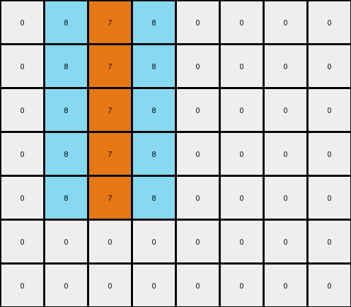

# db3e9e38 • 009 • refine_dreamer

---

Previous Code:
```python
"""
Transforms an input grid by expanding a vertical orange line into a checkerboard pattern of orange and azure, leaving the area below the line unchanged.
"""

import numpy as np

def find_orange_line(grid):
    """Finds the vertical orange line in the grid."""
    rows, cols = grid.shape
    for j in range(cols):
        for i in range(rows):
            if grid[i, j] == 7:
                # Found start of potential line
                start_row = i
                end_row = i
                while end_row + 1 < rows and grid[end_row + 1, j] == 7:
                    end_row += 1
                return start_row, end_row, j
    return None, None, None

def transform(input_grid):
    """Transforms the input grid according to the described rule."""
    output_grid = np.copy(input_grid)
    start_row, end_row, col = find_orange_line(input_grid)

    if start_row is None:  # No orange line found
        return output_grid

    rows, cols = input_grid.shape

    # Checkerboard expansion
    for i in range(start_row, end_row + 1):
           if i - 1 >= 0 :
              if output_grid[i-1,col] == 0:
                output_grid[i-1, col] = 8
           if i + 1 < rows and i + 1 <= end_row:
              if output_grid[i + 1, col] == 0:
                output_grid[i+1, col] = 8
           if col - 1 >= 0 :
              if output_grid[i,col-1] == 0:
                output_grid[i, col-1] = 8
           if col + 1 < cols :
              if output_grid[i,col+1] == 0:
                output_grid[i, col+1] = 8
    return output_grid
```

Train Set Results:

## Example 1:

Input:
```
0 0 0 7 0 0 0
0 0 0 7 0 0 0
0 0 0 7 0 0 0
0 0 0 7 0 0 0
0 0 0 0 0 0 0
```
Expected Output:
```
8 7 8 7 8 7 8
0 7 8 7 8 7 0
0 0 8 7 8 0 0
0 0 0 7 0 0 0
0 0 0 0 0 0 0
```
Transformed Output:
```
0 0 8 7 8 0 0
0 0 8 7 8 0 0
0 0 8 7 8 0 0
0 0 8 7 8 0 0
0 0 0 0 0 0 0
```

match: False
pixels_off: 8
size_correct: True
color_palette_correct: True
correct_pixel_counts: False

## Example 2:

Input:
```
0 0 7 0 0 0 0 0
0 0 7 0 0 0 0 0
0 0 7 0 0 0 0 0
0 0 7 0 0 0 0 0
0 0 7 0 0 0 0 0
0 0 0 0 0 0 0 0
0 0 0 0 0 0 0 0
```
Expected Output:
```
7 8 7 8 7 8 7 0
7 8 7 8 7 8 0 0
7 8 7 8 7 0 0 0
0 8 7 8 0 0 0 0
0 0 7 0 0 0 0 0
0 0 0 0 0 0 0 0
0 0 0 0 0 0 0 0
```
Transformed Output:
```
0 8 7 8 0 0 0 0
0 8 7 8 0 0 0 0
0 8 7 8 0 0 0 0
0 8 7 8 0 0 0 0
0 8 7 8 0 0 0 0
0 0 0 0 0 0 0 0
0 0 0 0 0 0 0 0
```

match: False
pixels_off: 11
size_correct: True
color_palette_correct: True
correct_pixel_counts: False
**INSTRUCTIONS**

The code above was generated based on observations from the first training
example

we have tested the transform function on each of the task example inputs and
compared with the expected output

review each of the examples provided and the results and consider how the
natural language program should be updated to accommodate this new knowledge

respond with the following deliverables:

- general assessment of the information provided and strategy for resolving the
  errors
- gather metrics about each of the examples and results - use code_execution to
  develop accurate reports on your assumptions
- a YAML block documenting facts - Focus on identifying objects, their properties, and the actions performed on them.
- a natural language program - Be as clear and concise as possible, providing a complete description of the transformation rule.


your responses should be considered as information in a report - not a
conversation
