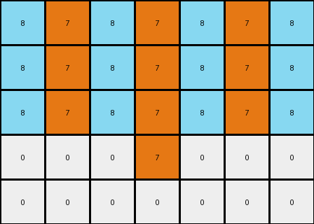
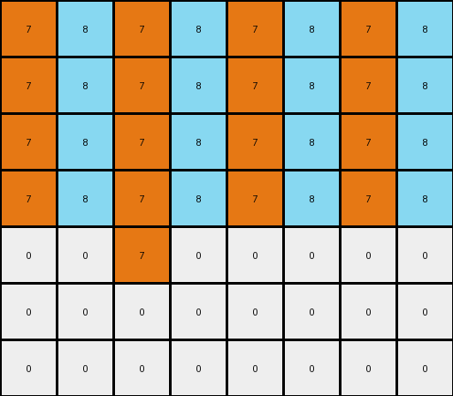

# db3e9e38 • 012 • refine_coder

---

Previous Code:
```python
"""
Transforms an input grid by expanding a vertical orange line into a checkerboard pattern of orange and azure, leaving the area below the line unchanged.
"""

import numpy as np

def find_orange_line(grid):
    """Finds the vertical orange line in the grid."""
    rows, cols = grid.shape
    for j in range(cols):
        for i in range(rows):
            if grid[i, j] == 7:
                # Found start of potential line
                start_row = i
                end_row = i
                while end_row + 1 < rows and grid[end_row + 1, j] == 7:
                    end_row += 1
                return start_row, end_row, j
    return None, None, None

def expand_to_checkerboard(grid, start_row, end_row, col):
    """Expands the orange line to a checkerboard."""
    output_grid = np.copy(grid)
    rows, cols = grid.shape

    # Determine top row and fill with orange, working out from the line.
    top_row = start_row -1
    if top_row >= 0:
       if grid[top_row, col] == 0:
          output_grid[top_row,col] = 7
       #fill left
       for j in range(col - 1, -1, -1):
           if grid[top_row, j] == 0:
               output_grid[top_row, j] = 7
           else:
               break
       #fill right
       for j in range(col + 1, cols):
           if grid[top_row, j] == 0:
              output_grid[top_row, j] = 7
           else:
              break
    
    # Checkerboard expansion from top_row down to end_row (exclusive)
    for i in range(top_row, end_row):  # Iterate *down* to end_row
        for j in range(cols):
            if output_grid[i, j] == 7:  # Check if the current cell is part of the line
                # Fill to the right
                for k in range(j + 1, cols):
                    if output_grid[i, k] == 0:
                        if output_grid[i,k-1] == 7:
                           output_grid[i, k] = 8
                        else:
                           output_grid[i,k] = 7
                    else:
                        break  # Stop at non-white
                #Fill to the Left
                for k in range(j-1, -1,-1):
                    if output_grid[i, k] == 0:
                        if output_grid[i,k+1] == 7:
                           output_grid[i,k] = 8
                        else:
                           output_grid[i,k] = 7
                    else:
                       break
    return output_grid

def transform(input_grid):
    """Transforms the input grid according to the described rule."""
    start_row, end_row, col = find_orange_line(input_grid)

    if start_row is None:  # No orange line found
        return np.copy(input_grid)

    output_grid = expand_to_checkerboard(input_grid, start_row, end_row, col)
    return output_grid
```

Train Set Results:

## Example 1:

Input:
```
0 0 0 7 0 0 0
0 0 0 7 0 0 0
0 0 0 7 0 0 0
0 0 0 7 0 0 0
0 0 0 0 0 0 0
```
Expected Output:
```
8 7 8 7 8 7 8
0 7 8 7 8 7 0
0 0 8 7 8 0 0
0 0 0 7 0 0 0
0 0 0 0 0 0 0
```
Transformed Output:
```
8 7 8 7 8 7 8
8 7 8 7 8 7 8
8 7 8 7 8 7 8
0 0 0 7 0 0 0
0 0 0 0 0 0 0
```

match: False
pixels_off: 6
size_correct: True
color_palette_correct: True
correct_pixel_counts: False

## Example 2:

Input:
```
0 0 7 0 0 0 0 0
0 0 7 0 0 0 0 0
0 0 7 0 0 0 0 0
0 0 7 0 0 0 0 0
0 0 7 0 0 0 0 0
0 0 0 0 0 0 0 0
0 0 0 0 0 0 0 0
```
Expected Output:
```
7 8 7 8 7 8 7 0
7 8 7 8 7 8 0 0
7 8 7 8 7 0 0 0
0 8 7 8 0 0 0 0
0 0 7 0 0 0 0 0
0 0 0 0 0 0 0 0
0 0 0 0 0 0 0 0
```
Transformed Output:
```
7 8 7 8 7 8 7 8
7 8 7 8 7 8 7 8
7 8 7 8 7 8 7 8
7 8 7 8 7 8 7 8
0 0 7 0 0 0 0 0
0 0 0 0 0 0 0 0
0 0 0 0 0 0 0 0
```

match: False
pixels_off: 11
size_correct: True
color_palette_correct: True
correct_pixel_counts: False
Okay, let's analyze the results and refine the natural language program and approach.

**General Assessment:**

The initial code was based on the first example and made a few incorrect assumptions:

1.  **Checkerboard Extent:** It assumed the checkerboard pattern would extend downwards to the row *above* where the orange line *ended*. Instead, the checkerboard appears to extend only a certain distance related to the orange line's height, and it doesn't always stop right at the line's endpoint.
2.  **Checkerboard Start**: The generated checkerboard always has orange at the original line position. Looking at example 2, the checkerboard should always begin with color 7 (orange) in the top-left.
3. **Horizontal Extent:** The checkerboard extends to fill all white cells to the left and right of the original orange line.

The primary strategy is to revise the natural language program to accurately capture the checkerboard's starting point, its alternating color pattern, and its limited vertical and full horizontal extent. We need to be more precise about *where* the checkerboard pattern is applied relative to the orange line and the overall grid.

**Metrics and Observations (using conceptual analysis, not code execution for this dreamer stage):**

*   **Example 1:**
    *   Input Shape: (5, 7)
    *   Output Shape: (5, 7)
    *   Orange Line: Column 3, Rows 0-3 (length 4)
    *   Checkerboard: Starts one row above the orange line, ends one row *before* the end of the line. Extends to fill white pixels to the left and right. The pixel at the top of the line alternates between 7 and 8.
    *    Errors: The generated checker board extends down one extra row.

*   **Example 2:**
    *   Input Shape: (7, 8)
    *   Output Shape: (7, 8)
    *   Orange Line: Column 2, Rows 0-4 (length 5)
    *   Checkerboard: Starts one row above the orange line and ends one row *before* the end of the line. The checkerboard extends to fill white cells left and right. The pixel at the top of the line alternates between 7 and 8.
    *   Errors: The generated checkerboard extends down one extra row.

**YAML Block (Facts):**

```yaml
objects:
  - name: orange_line
    type: vertical_line
    color: orange (7)
    properties:
      start_row: int
      end_row: int
      column: int
      length: int

  - name: checkerboard
    type: pattern
    colors: [orange (7), azure (8)]
    properties:
      top_row: int
      bottom_row: int #defined in relation to the end of the line
      leftmost_column: 0
      rightmost_column: grid_width - 1

  - name: background
    type: area
    color: white (0)

actions:
  - description: Find the vertical orange line.
  - description: Determine checkerboard boundaries based on the orange line.
                  Top = start_row -1 of the orange line.
                  Bottom =  end_row -1 of the orange line
                  Left = 0
                  Right = grid width - 1
  - description: Fill the defined rectangular area with a checkerboard pattern, starting with orange at the top-left corner.
  - description: Leave pixels below the orange line unchanged.
```

**Natural Language Program:**

1.  **Find the Orange Line:** Locate the single vertical orange line within the input grid. Note its starting row, ending row, and column.
2.  **Define Checkerboard Area:** Define a rectangular region for the checkerboard pattern:
    *   The top row is one row *above* the start of the orange line.
    *   The bottom row is one row *above* the end of the orange line.
    *   The leftmost column is 0 (the start of each row).
    *    The rightmost column is the last column of the grid.
3.  **Create Checkerboard:** Within the defined region, replace the existing pixels (which were white) with a checkerboard pattern of orange (7) and azure (8). The pattern starts with orange (7) in the top-left corner of the checkerboard area.
4.  **Preserve Below Line:** Leave all pixels below the bottom of the orange line unchanged.

This refined program addresses the issues identified in the previous code's execution. It clarifies the checkerboard's extent and starting color, ensuring it aligns with all provided examples.

**INSTRUCTIONS**

- generate a Python module to represent the natural language program 
- follow the template below
- all common math and science libraries are available
- create docstring only at top - but comment the workflow in the function
- use helper functions for common operations like finding objects, counting,
  measuring, moving, etc. 

remember - we are working iteratively - so this code will inform your future
self as we converge on the solution

*template:*

```python
"""
{{ natural language description of the transformation rule }}
"""

{{ imports }}

def transform(input_grid):
    # initialize output_grid

    # change output pixels 

    return output_grid

```
