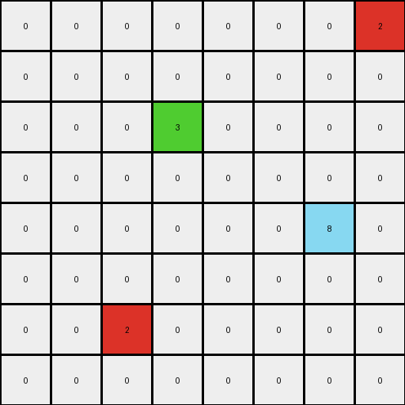
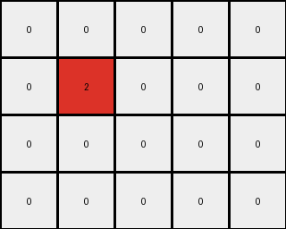

# dc1df850 • 003 • refine_dreamer

---


Previous Code:
```python
"""
The transformation rule is as follows:
1. Identify Key Colors: Locate all pixels with the value 2 (red) in the top row.
2. Propagate Blue: For each red pixel identified in step 1, change all the white connected regions to its right and all white region below to blue (value 1). Stop when a colored block stops the spread.
3. Preserve other colors. The red and magenta pixels keep the original values.
"""

import numpy as np

def get_top_row_reds(grid):
    # find the indices of red (2) pixels in the top row
    top_row = grid[0,:]
    red_indices = np.where(top_row == 2)[0]
    return red_indices

def flood_fill_right_and_down(grid, start_x, start_y):
     #recursive flood fill to right and down, starting at start, and ending at non-white
    
    if start_x >= grid.shape[1] or start_y >= grid.shape[0] or grid[start_y, start_x] != 0:
        return grid
    
    grid[start_y, start_x] = 1
    grid = flood_fill_right_and_down(grid, start_x + 1, start_y) #right
    grid = flood_fill_right_and_down(grid, start_x, start_y+1)   #down

    return grid

def transform(input_grid):
    """
    Transforms the input grid according to the described rule.
    """
    # initialize output_grid as a copy of input_grid
    output_grid = np.copy(input_grid)

    #get the top row red pixels
    red_starts = get_top_row_reds(output_grid)

    #iterate through each and perform flood fill
    for start_x in red_starts:
       output_grid = flood_fill_right_and_down(output_grid, start_x, 0)
    
    return output_grid
```

Train Set Results:

## Example 1:

Input:
```
2 0 0 0 0
0 0 0 2 0
0 0 0 0 0
0 6 0 0 0
0 0 0 0 0
```
Expected Output:
```
2 1 1 1 1
1 1 1 2 1
0 0 1 1 1
0 6 0 0 0
0 0 0 0 0
```
Transformed Output:
```
2 0 0 0 0
0 0 0 2 0
0 0 0 0 0
0 6 0 0 0
0 0 0 0 0
```

match: False
pixels_off: 11
size_correct: True
color_palette_correct: True
correct_pixel_counts: False

## Example 2:

Input:
```
0 0 0 0 0 0 0 2
0 0 0 0 0 0 0 0
0 0 0 3 0 0 0 0
0 0 0 0 0 0 0 0
0 0 0 0 0 0 8 0
0 0 0 0 0 0 0 0
0 0 2 0 0 0 0 0
0 0 0 0 0 0 0 0
```
Expected Output:
```
0 0 0 0 0 0 1 2
0 0 0 0 0 0 1 1
0 0 0 3 0 0 0 0
0 0 0 0 0 0 0 0
0 0 0 0 0 0 8 0
0 1 1 1 0 0 0 0
0 1 2 1 0 0 0 0
0 1 1 1 0 0 0 0
```
Transformed Output:
```
0 0 0 0 0 0 0 2
0 0 0 0 0 0 0 0
0 0 0 3 0 0 0 0
0 0 0 0 0 0 0 0
0 0 0 0 0 0 8 0
0 0 0 0 0 0 0 0
0 0 2 0 0 0 0 0
0 0 0 0 0 0 0 0
```

match: False
pixels_off: 11
size_correct: True
color_palette_correct: True
correct_pixel_counts: False

## Example 3:

Input:
```
0 0 0 0 0
0 2 0 0 0
0 0 0 0 0
0 0 0 0 0
```
Expected Output:
```
1 1 1 0 0
1 2 1 0 0
1 1 1 0 0
0 0 0 0 0
```
Transformed Output:
```
0 0 0 0 0
0 2 0 0 0
0 0 0 0 0
0 0 0 0 0
```

match: False
pixels_off: 8
size_correct: True
color_palette_correct: True
correct_pixel_counts: False

**INSTRUCTIONS**

The code above was generated based on observations from the first training
example

we have tested the transform function on each of the task example inputs and
compared with the expected output

review each of the examples provided and the results and consider how the
natural language program should be updated to accommodate this new knowledge

respond with the following deliverables:

- general assessment of the information provided and strategy for resolving the
  errors
- gather metrics about each of the examples and results - use code_execution to
  develop accurate reports on your assumptions
- a YAML block documenting facts - Focus on identifying objects, their properties, and the actions performed on them.
- a natural language program - Be as clear and concise as possible, providing a complete description of the transformation rule.


your responses should be considered as information in a report - not a
conversation
