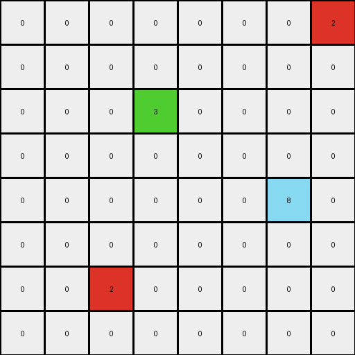
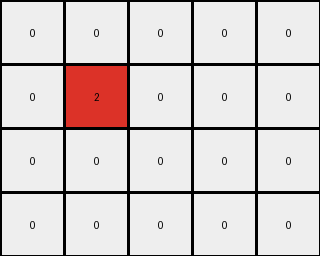

# dc1df850 • 005 • refine_dreamer

---

Previous Code:
```python
"""
1.  **Identify Starting Points:** Locate all red pixels (value 2) in the grid.
2.  **Propagate Blue:** For each red pixel, change the color of connected white pixels (value 0) to its right and below it to blue (value 1). The change stops when a non-white pixel is encountered in either direction.
3.  **Preservation:** All other color pixels stay.
"""

import numpy as np

def flood_fill(grid, x, y):
    """
    Performs a flood fill operation, changing connected white pixels (0) to blue (1)
    to the right and below the starting point (x, y). Stops when hitting non-white pixels.
    """
    if x < 0 or x >= grid.shape[1] or y < 0 or y >= grid.shape[0] or grid[y, x] != 0:
        return

    grid[y, x] = 1
    flood_fill(grid, x + 1, y)  # Right
    flood_fill(grid, x, y + 1)  # Down

def transform(input_grid):
    """
    Transforms the input grid according to the described rule.
    """
    output_grid = np.copy(input_grid)

    # Iterate through all pixels in the grid
    for y in range(output_grid.shape[0]):
        for x in range(output_grid.shape[1]):
            # If a red pixel is found, initiate flood fill
            if output_grid[y, x] == 2:
                flood_fill(output_grid, x, y)

    return output_grid
```

Train Set Results:

## Example 1:

Input:
```
2 0 0 0 0
0 0 0 2 0
0 0 0 0 0
0 6 0 0 0
0 0 0 0 0
```
Expected Output:
```
2 1 1 1 1
1 1 1 2 1
0 0 1 1 1
0 6 0 0 0
0 0 0 0 0
```
Transformed Output:
```
2 0 0 0 0
0 0 0 2 0
0 0 0 0 0
0 6 0 0 0
0 0 0 0 0
```

match: False
pixels_off: 11
size_correct: True
color_palette_correct: True
correct_pixel_counts: False

## Example 2:

Input:
```
0 0 0 0 0 0 0 2
0 0 0 0 0 0 0 0
0 0 0 3 0 0 0 0
0 0 0 0 0 0 0 0
0 0 0 0 0 0 8 0
0 0 0 0 0 0 0 0
0 0 2 0 0 0 0 0
0 0 0 0 0 0 0 0
```
Expected Output:
```
0 0 0 0 0 0 1 2
0 0 0 0 0 0 1 1
0 0 0 3 0 0 0 0
0 0 0 0 0 0 0 0
0 0 0 0 0 0 8 0
0 1 1 1 0 0 0 0
0 1 2 1 0 0 0 0
0 1 1 1 0 0 0 0
```
Transformed Output:
```
0 0 0 0 0 0 0 2
0 0 0 0 0 0 0 0
0 0 0 3 0 0 0 0
0 0 0 0 0 0 0 0
0 0 0 0 0 0 8 0
0 0 0 0 0 0 0 0
0 0 2 0 0 0 0 0
0 0 0 0 0 0 0 0
```

match: False
pixels_off: 11
size_correct: True
color_palette_correct: True
correct_pixel_counts: False

## Example 3:

Input:
```
0 0 0 0 0
0 2 0 0 0
0 0 0 0 0
0 0 0 0 0
```
Expected Output:
```
1 1 1 0 0
1 2 1 0 0
1 1 1 0 0
0 0 0 0 0
```
Transformed Output:
```
0 0 0 0 0
0 2 0 0 0
0 0 0 0 0
0 0 0 0 0
```

match: False
pixels_off: 8
size_correct: True
color_palette_correct: True
correct_pixel_counts: False
**INSTRUCTIONS**

The code above was generated based on observations from the first training
example

we have tested the transform function on each of the task example inputs and
compared with the expected output

review each of the examples provided and the results and consider how the
natural language program should be updated to accommodate this new knowledge

respond with the following deliverables:

- general assessment of the information provided and strategy for resolving the
  errors
- gather metrics about each of the examples and results - use code_execution to
  develop accurate reports on your assumptions
- a YAML block documenting facts - Focus on identifying objects, their properties, and the actions performed on them.
- a natural language program - Be as clear and concise as possible, providing a complete description of the transformation rule.


your responses should be considered as information in a report - not a
conversation
