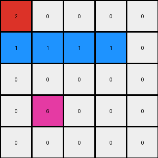
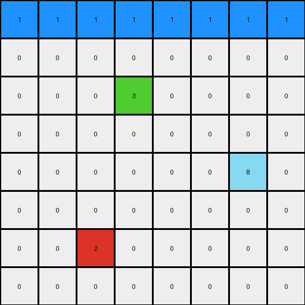
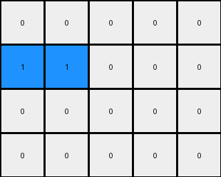

# dc1df850 • 009 • refine_dreamer

---


Previous Code:
```python
"""
1.  **Identify** the red (2) pixels in the input grid.
2.  Change the color of the red pixel at the top right to blue (1).
3.  Change to blue(1) all white pixels (0) to the left.
4. **Identify** the red (2) pixel in the input grid that is at the bottom-left
5.  **Flood Fill:** Starting from the bottom red (2) pixel, change all directly adjacent or diagonally adjacent white (0) pixels to blue (1). Continue this expansion until no more directly or diagonally adjacent white pixels can be changed to blue.
6.  **Preserve:** The green (3) and azure (8) pixels remain unchanged in their original positions and colors.
"""

import numpy as np

def find_pixels_by_color(grid, color):
    return np.argwhere(grid == color)

def flood_fill(grid, start_row, start_col, target_color, replacement_color):
    rows, cols = grid.shape
    if grid[start_row, start_col] != target_color:
        return

    stack = [(start_row, start_col)]
    while stack:
        row, col = stack.pop()
        if grid[row, col] == target_color:
            grid[row, col] = replacement_color

            # Check adjacent and diagonal cells
            for dr in [-1, 0, 1]:
                for dc in [-1, 0, 1]:
                    if dr == 0 and dc == 0:
                        continue
                    nr, nc = row + dr, col + dc
                    if 0 <= nr < rows and 0 <= nc < cols:
                        stack.append((nr, nc))


def transform(input_grid):
    # Initialize output_grid as a copy of input_grid
    output_grid = np.copy(input_grid)
    rows, cols = output_grid.shape

    # Find all red pixels
    red_pixels = find_pixels_by_color(input_grid, 2)

    # Find the top-rightmost red pixel
    if len(red_pixels) > 0:
        top_right_red = max(red_pixels, key=lambda item: (item[1], -item[0]))

      # change the color of top_right_red
        output_grid[top_right_red[0], top_right_red[1]] = 1

        # change to blue all white pixels to the left
        for c in range(top_right_red[1]-1, -1, -1):
          if output_grid[top_right_red[0],c] == 0:
            output_grid[top_right_red[0], c] = 1
          else:
             break # stop at first non-white

    #find other red pixel that is not the top_right
    for red_pixel in red_pixels:
        if not np.array_equal(red_pixel, top_right_red):

            # Flood fill from the other red pixel
            flood_fill(output_grid, red_pixel[0], red_pixel[1], 0, 1)

    return output_grid
```

Train Set Results:

## Example 1:

Input:
```
2 0 0 0 0
0 0 0 2 0
0 0 0 0 0
0 6 0 0 0
0 0 0 0 0
```
Expected Output:
```
2 1 1 1 1
1 1 1 2 1
0 0 1 1 1
0 6 0 0 0
0 0 0 0 0
```
Transformed Output:
```
2 0 0 0 0
1 1 1 1 0
0 0 0 0 0
0 6 0 0 0
0 0 0 0 0
```

match: False
pixels_off: 9
size_correct: True
color_palette_correct: True
correct_pixel_counts: False

## Example 2:

Input:
```
0 0 0 0 0 0 0 2
0 0 0 0 0 0 0 0
0 0 0 3 0 0 0 0
0 0 0 0 0 0 0 0
0 0 0 0 0 0 8 0
0 0 0 0 0 0 0 0
0 0 2 0 0 0 0 0
0 0 0 0 0 0 0 0
```
Expected Output:
```
0 0 0 0 0 0 1 2
0 0 0 0 0 0 1 1
0 0 0 3 0 0 0 0
0 0 0 0 0 0 0 0
0 0 0 0 0 0 8 0
0 1 1 1 0 0 0 0
0 1 2 1 0 0 0 0
0 1 1 1 0 0 0 0
```
Transformed Output:
```
1 1 1 1 1 1 1 1
0 0 0 0 0 0 0 0
0 0 0 3 0 0 0 0
0 0 0 0 0 0 0 0
0 0 0 0 0 0 8 0
0 0 0 0 0 0 0 0
0 0 2 0 0 0 0 0
0 0 0 0 0 0 0 0
```

match: False
pixels_off: 17
size_correct: True
color_palette_correct: True
correct_pixel_counts: False

## Example 3:

Input:
```
0 0 0 0 0
0 2 0 0 0
0 0 0 0 0
0 0 0 0 0
```
Expected Output:
```
1 1 1 0 0
1 2 1 0 0
1 1 1 0 0
0 0 0 0 0
```
Transformed Output:
```
0 0 0 0 0
1 1 0 0 0
0 0 0 0 0
0 0 0 0 0
```

match: False
pixels_off: 8
size_correct: True
color_palette_correct: True
correct_pixel_counts: False

**INSTRUCTIONS**

The code above was generated based on observations from the first training
example

we have tested the transform function on each of the task example inputs and
compared with the expected output

review each of the examples provided and the results and consider how the
natural language program should be updated to accommodate this new knowledge

respond with the following deliverables:

- general assessment of the information provided and strategy for resolving the
  errors
- gather metrics about each of the examples and results - use code_execution to
  develop accurate reports on your assumptions
- a YAML block documenting facts - Focus on identifying objects, their properties, and the actions performed on them.
- a natural language program - Be as clear and concise as possible, providing a complete description of the transformation rule.


your responses should be considered as information in a report - not a
conversation
