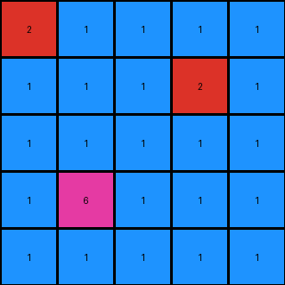
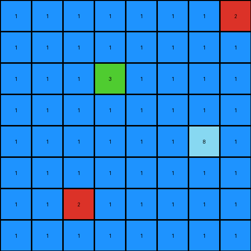
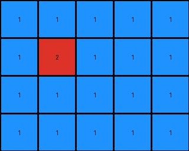

# dc1df850 • 011 • refine_dreamer

---

Previous Code:
```python
"""
1.  **Identify** all red (2) pixels in the input grid.
2.  **L-Shape Detection and Flood Fill:** Iterate through each red pixel.  For each red pixel:
    *   Check if it forms the corner of an "L" shape, where the other two points of the "L" are made up of white pixels. If so, apply the Flood Fill starting with the white pixel.
        *   An "L" shape can be any 3 adjacent pixels that consist of a corner and two lines of length one in each major axis direction
3.  **Flood Fill:** Change the white(0) pixels that are either directly or diagonally adjacent. Continue expanding until no more directly or diagonally adjacent pixels can be changed to blue (1).
4. **Preserve:** All non-white and non-red pixels keep their original values.
"""

import numpy as np

def find_pixels_by_color(grid, color):
    return np.argwhere(grid == color)

def flood_fill(grid, start_row, start_col, target_color, replacement_color):
    rows, cols = grid.shape
    if grid[start_row, start_col] != target_color:
        return

    stack = [(start_row, start_col)]
    while stack:
        row, col = stack.pop()
        if grid[row, col] == target_color:
            grid[row, col] = replacement_color

            # Check adjacent and diagonal cells
            for dr in [-1, 0, 1]:
                for dc in [-1, 0, 1]:
                    if dr == 0 and dc == 0:
                        continue
                    nr, nc = row + dr, col + dc
                    if 0 <= nr < rows and 0 <= nc < cols:
                        stack.append((nr, nc))

def check_for_l_shape(grid, row, col, corner_color, l_color):
    rows, cols = grid.shape
    
    # Define potential L-shape offsets
    l_offsets = [
        [(0, 1), (1, 0)],  # Down and Right
        [(0, 1), (-1, 0)], # Up and Right
        [(0, -1), (1, 0)], # Down and Left
        [(0, -1), (-1, 0)],# Up and Left
        [(1, 0), (0, 1)],  # Right and Down
        [(-1, 0), (0, 1)], # Right and Up
        [(1, 0), (0, -1)],  # Left and Down
        [(-1, 0), (0, -1)] # Left and Up       
    ]
    
    for offset_pair in l_offsets:
        try:
            offset1, offset2 = offset_pair
            r1, c1 = row + offset1[0], col + offset1[1]
            r2, c2 = row + offset2[0], col + offset2[1]
            
            #check bounds
            if not (0 <= r1 < rows and 0 <= c1 < cols and 0 <= r2 < rows and 0<= c2 < cols):
                continue

            if grid[row, col] == corner_color and grid[r1, c1] == l_color and grid[r2, c2] == l_color:
                return (r1, c1), (r2, c2) #return the coordinates of the l
        except IndexError:
            pass  # Ignore out-of-bounds errors
    return None, None

def transform(input_grid):
    # Initialize output_grid as a copy of input_grid
    output_grid = np.copy(input_grid)
    rows, cols = output_grid.shape

    # Find all red pixels
    red_pixels = find_pixels_by_color(input_grid, 2)

    # Iterate through red pixels to check L and flood fill
    for red_pixel in red_pixels:
        row, col = red_pixel
        l_coord1, l_coord2 = check_for_l_shape(output_grid, row, col, 2, 0)
        if l_coord1:
            flood_fill(output_grid, l_coord1[0], l_coord1[1], 0, 1)
        if l_coord2:
            flood_fill(output_grid, l_coord2[0], l_coord2[1], 0, 1)
    return output_grid
```

Train Set Results:

## Example 1:

Input:
```
2 0 0 0 0
0 0 0 2 0
0 0 0 0 0
0 6 0 0 0
0 0 0 0 0
```
Expected Output:
```
2 1 1 1 1
1 1 1 2 1
0 0 1 1 1
0 6 0 0 0
0 0 0 0 0
```
Transformed Output:
```
2 1 1 1 1
1 1 1 2 1
1 1 1 1 1
1 6 1 1 1
1 1 1 1 1
```

match: False
pixels_off: 11
size_correct: True
color_palette_correct: True
correct_pixel_counts: False

## Example 2:

Input:
```
0 0 0 0 0 0 0 2
0 0 0 0 0 0 0 0
0 0 0 3 0 0 0 0
0 0 0 0 0 0 0 0
0 0 0 0 0 0 8 0
0 0 0 0 0 0 0 0
0 0 2 0 0 0 0 0
0 0 0 0 0 0 0 0
```
Expected Output:
```
0 0 0 0 0 0 1 2
0 0 0 0 0 0 1 1
0 0 0 3 0 0 0 0
0 0 0 0 0 0 0 0
0 0 0 0 0 0 8 0
0 1 1 1 0 0 0 0
0 1 2 1 0 0 0 0
0 1 1 1 0 0 0 0
```
Transformed Output:
```
1 1 1 1 1 1 1 2
1 1 1 1 1 1 1 1
1 1 1 3 1 1 1 1
1 1 1 1 1 1 1 1
1 1 1 1 1 1 8 1
1 1 1 1 1 1 1 1
1 1 2 1 1 1 1 1
1 1 1 1 1 1 1 1
```

match: False
pixels_off: 49
size_correct: True
color_palette_correct: True
correct_pixel_counts: False

## Example 3:

Input:
```
0 0 0 0 0
0 2 0 0 0
0 0 0 0 0
0 0 0 0 0
```
Expected Output:
```
1 1 1 0 0
1 2 1 0 0
1 1 1 0 0
0 0 0 0 0
```
Transformed Output:
```
1 1 1 1 1
1 2 1 1 1
1 1 1 1 1
1 1 1 1 1
```

match: False
pixels_off: 11
size_correct: True
color_palette_correct: True
correct_pixel_counts: False
**INSTRUCTIONS**

The code above was generated based on observations from the first training
example

we have tested the transform function on each of the task example inputs and
compared with the expected output

review each of the examples provided and the results and consider how the
natural language program should be updated to accommodate this new knowledge

respond with the following deliverables:

- general assessment of the information provided and strategy for resolving the
  errors
- gather metrics about each of the examples and results - use code_execution to
  develop accurate reports on your assumptions
- a YAML block documenting facts - Focus on identifying objects, their properties, and the actions performed on them.
- a natural language program - Be as clear and concise as possible, providing a complete description of the transformation rule.


your responses should be considered as information in a report - not a
conversation
