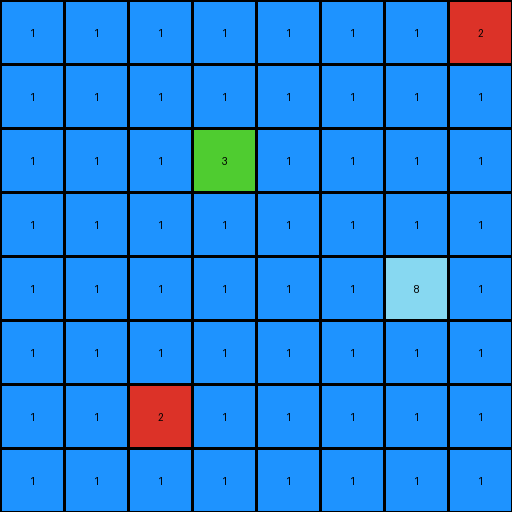

# dc1df850 • 012 • refine_coder

---

Previous Code:
```python
"""
1.  **Identify** all red (2) pixels in the input grid.
2.  **L-Shape Detection and Flood Fill:** Iterate through each red pixel.  For each red pixel:
    *   Check if it forms the corner of an "L" shape, where the other two points of the "L" are made up of white pixels. If so, apply the Flood Fill starting with the white pixel.
        *   An "L" shape can be any 3 adjacent pixels that consist of a corner and two lines of length one in each major axis direction
3.  **Flood Fill:** Change the white(0) pixels that are either directly or diagonally adjacent. Continue expanding until no more directly or diagonally adjacent pixels can be changed to blue (1).
4. **Preserve:** All non-white and non-red pixels keep their original values.
"""

import numpy as np

def find_pixels_by_color(grid, color):
    return np.argwhere(grid == color)

def flood_fill(grid, start_row, start_col, target_color, replacement_color):
    rows, cols = grid.shape
    if grid[start_row, start_col] != target_color:
        return

    stack = [(start_row, start_col)]
    while stack:
        row, col = stack.pop()
        if grid[row, col] == target_color:
            grid[row, col] = replacement_color

            # Check adjacent and diagonal cells
            for dr in [-1, 0, 1]:
                for dc in [-1, 0, 1]:
                    if dr == 0 and dc == 0:
                        continue
                    nr, nc = row + dr, col + dc
                    if 0 <= nr < rows and 0 <= nc < cols:
                        stack.append((nr, nc))

def check_for_l_shape(grid, row, col, corner_color, l_color):
    rows, cols = grid.shape
    
    # Define potential L-shape offsets
    l_offsets = [
        [(0, 1), (1, 0)],  # Down and Right
        [(0, 1), (-1, 0)], # Up and Right
        [(0, -1), (1, 0)], # Down and Left
        [(0, -1), (-1, 0)],# Up and Left
        [(1, 0), (0, 1)],  # Right and Down
        [(-1, 0), (0, 1)], # Right and Up
        [(1, 0), (0, -1)],  # Left and Down
        [(-1, 0), (0, -1)] # Left and Up       
    ]
    
    for offset_pair in l_offsets:
        try:
            offset1, offset2 = offset_pair
            r1, c1 = row + offset1[0], col + offset1[1]
            r2, c2 = row + offset2[0], col + offset2[1]
            
            #check bounds
            if not (0 <= r1 < rows and 0 <= c1 < cols and 0 <= r2 < rows and 0<= c2 < cols):
                continue

            if grid[row, col] == corner_color and grid[r1, c1] == l_color and grid[r2, c2] == l_color:
                return (r1, c1), (r2, c2) #return the coordinates of the l
        except IndexError:
            pass  # Ignore out-of-bounds errors
    return None, None

def transform(input_grid):
    # Initialize output_grid as a copy of input_grid
    output_grid = np.copy(input_grid)
    rows, cols = output_grid.shape

    # Find all red pixels
    red_pixels = find_pixels_by_color(input_grid, 2)

    # Iterate through red pixels to check L and flood fill
    for red_pixel in red_pixels:
        row, col = red_pixel
        l_coord1, l_coord2 = check_for_l_shape(output_grid, row, col, 2, 0)
        if l_coord1:
            flood_fill(output_grid, l_coord1[0], l_coord1[1], 0, 1)
        if l_coord2:
            flood_fill(output_grid, l_coord2[0], l_coord2[1], 0, 1)
    return output_grid
```

Train Set Results:

## Example 1:

Input:
```
2 0 0 0 0
0 0 0 2 0
0 0 0 0 0
0 6 0 0 0
0 0 0 0 0
```
Expected Output:
```
2 1 1 1 1
1 1 1 2 1
0 0 1 1 1
0 6 0 0 0
0 0 0 0 0
```
Transformed Output:
```
2 1 1 1 1
1 1 1 2 1
1 1 1 1 1
1 6 1 1 1
1 1 1 1 1
```

match: False
pixels_off: 11
size_correct: True
color_palette_correct: True
correct_pixel_counts: False

## Example 2:

Input:
```
0 0 0 0 0 0 0 2
0 0 0 0 0 0 0 0
0 0 0 3 0 0 0 0
0 0 0 0 0 0 0 0
0 0 0 0 0 0 8 0
0 0 0 0 0 0 0 0
0 0 2 0 0 0 0 0
0 0 0 0 0 0 0 0
```
Expected Output:
```
0 0 0 0 0 0 1 2
0 0 0 0 0 0 1 1
0 0 0 3 0 0 0 0
0 0 0 0 0 0 0 0
0 0 0 0 0 0 8 0
0 1 1 1 0 0 0 0
0 1 2 1 0 0 0 0
0 1 1 1 0 0 0 0
```
Transformed Output:
```
1 1 1 1 1 1 1 2
1 1 1 1 1 1 1 1
1 1 1 3 1 1 1 1
1 1 1 1 1 1 1 1
1 1 1 1 1 1 8 1
1 1 1 1 1 1 1 1
1 1 2 1 1 1 1 1
1 1 1 1 1 1 1 1
```

match: False
pixels_off: 49
size_correct: True
color_palette_correct: True
correct_pixel_counts: False

## Example 3:

Input:
```
0 0 0 0 0
0 2 0 0 0
0 0 0 0 0
0 0 0 0 0
```
Expected Output:
```
1 1 1 0 0
1 2 1 0 0
1 1 1 0 0
0 0 0 0 0
```
Transformed Output:
```
1 1 1 1 1
1 2 1 1 1
1 1 1 1 1
1 1 1 1 1
```

match: False
pixels_off: 11
size_correct: True
color_palette_correct: True
correct_pixel_counts: False
Okay, let's analyze the results and refine the natural language program.

**General Assessment:**

The initial strategy of detecting "L" shapes formed by a red pixel and two adjacent white pixels, then flood-filling from the white pixels, is partially correct. However, it's overly sensitive and incorrectly triggers flood fills in many cases. The main issue is that the flood fill expands *too much*, including both adjacent and diagonal pixels, leading to large areas being incorrectly colored blue. The L-shape detection logic also needs refinement, as it can initiate multiple flood fills from the same red pixel.

The core problem stems from a too-broad definition of "adjacency" during the flood fill. It should only fill directly adjacent (up, down, left, right), not diagonally adjacent white pixels. The "L" shape detection is also too permissive.

**Strategy for Resolving Errors:**

1.  **Restrict Flood Fill:** Modify the `flood_fill` function to only consider directly adjacent pixels (up, down, left, right) and not diagonal ones.

2.  **Improve L-Shape Condition:** Refine the L-shape condition logic for a more specific and robust solution.

3.  **Re-evaluate Natural Language Program:** Rewrite the natural language program to reflect the corrected logic.

**Metrics and Observations:**

Here's a summary of observations from each example:

*   **Example 1:**
    *   Input: 5x5 grid
    *   Expected Output: Some white (0) pixels adjacent to a red (2) "L" change to blue (1).
    *   Actual Output: Too many pixels change to blue. The flood fill expanded diagonally, which it shouldn't have.
*   **Example 2:**
    *   Input: 8x8 grid
    *   Expected Output: Similar to Example 1, white pixels near red "L" shapes are turned to blue.
    *   Actual Output: Almost the entire grid is turned blue. The flood fill has propagated excessively.
*   **Example 3:**
    *   Input: 4 x 5
    *   Expected output: a 3x3 block of blue, with the red pixel in the center
    *   Actual Output: similar to example 2, filled too much.

**YAML Block - Facts:**

```yaml
objects:
  - name: red_pixel
    color: 2
    role: initiator
    properties:
      shape: single pixel
  - name: white_pixel
    color: 0
    role: target
    properties:
      shape: single pixel
  - name: blue_pixel
    color: 1
    role: result
    properties:
      shape: single pixel
  - name: L_shape
    description: One red pixel and two adjacent white pixels forming an "L". The white pixels can be adjacent to each other or diagonal.
    properties:
        colors: [2, 0, 0]

actions:
  - name: find_red_pixels
    description: Locate all red pixels in the input grid.
  - name: check_L_shape
    description: Determine if a red pixel forms an L-shape with two adjacent white pixels.
  - name: flood_fill
    description: Change the color of directly adjacent white pixels to blue, starting from a white pixel in the L-shape.
  - name: preserve_other_colors
    description: Keep the colors of pixels that aren't white or part of a flood fill.
```

**Natural Language Program:**

1.  **Locate Red Pixels:** Find all pixels with the color red (2) in the input grid.
2.  **L-Shape Identification:** For each red pixel, check if it forms the corner of an "L" shape with two *directly adjacent* white (0) pixels. The "L" can be in any orientation.
3. **Adjacent Flood Fill** If an "L" shape made of one red and two white pixels is found, perform a flood-fill operation:
    *   Start the flood fill on the white pixels of the l.
    *   Change the color of the white pixel to blue (1).
    *   Continue the flood fill to any *directly adjacent* (up, down, left, or right) white pixels, changing them to blue.  Do *not* fill diagonally adjacent pixels.
    *   Stop when no more directly adjacent white pixels can be filled.
4.  **Preservation:** All pixels that are not white or red in an identified L-shape should retain their original color.

**INSTRUCTIONS**

- generate a Python module to represent the natural language program 
- follow the template below
- all common math and science libraries are available
- create docstring only at top - but comment the workflow in the function
- use helper functions for common operations like finding objects, counting,
  measuring, moving, etc. 

remember - we are working iteratively - so this code will inform your future
self as we converge on the solution

*template:*

```python
"""
{{ natural language description of the transformation rule }}
"""

{{ imports }}

def transform(input_grid):
    # initialize output_grid

    # change output pixels 

    return output_grid

```
