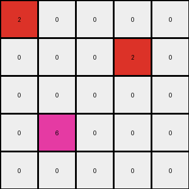
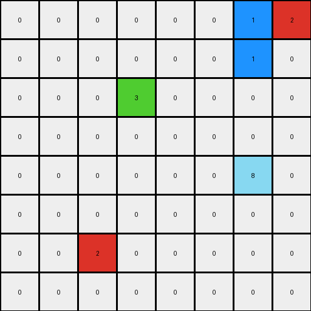
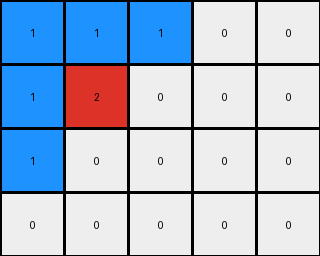

# dc1df850 • 015 • refine_dreamer

---


Previous Code:
```python
"""
Identifies a red pixel (value '2') in the input grid and changes its immediate top, left, and top-left, top-right, and bottom-left neighbors to blue (value '1') if those are '0' (white)
The original '2' pixel is left on the same place and same value.
The remaining '0' are left unchanged.
"""

import numpy as np

def find_pixel_by_color(grid, color):
    """Finds the coordinates of a pixel of the specified color."""
    for r in range(grid.shape[0]):
        for c in range(grid.shape[1]):
            if grid[r, c] == color:
                return (r, c)
    return None

def transform(input_grid):
    """Transforms the input grid according to the specified rule."""
    output_grid = np.copy(input_grid)
    target_color = 2
    surrounding_color = 1

    # Find the target pixel (red)
    target_pos = find_pixel_by_color(input_grid, target_color)

    if target_pos is None:
        return output_grid  # No target pixel found, return original grid

    target_row, target_col = target_pos

    # Define the relative positions of the neighbors to be changed
    neighbors = [
        (target_row - 1, target_col),  # Top
        (target_row, target_col - 1),  # Left
        (target_row - 1, target_col - 1),  # Top-left
        (target_row - 1, target_col + 1),  # Top-right
        (target_row + 1, target_col - 1)  # Bottom-left
    ]

    # Iterate through the neighbors and change their color if they are '0'
    for row, col in neighbors:
        if 0 <= row < output_grid.shape[0] and 0 <= col < output_grid.shape[1]:  # Check boundaries
            if output_grid[row, col] == 0:
                output_grid[row, col] = surrounding_color

    return output_grid
```

Train Set Results:

## Example 1:

Input:
```
2 0 0 0 0
0 0 0 2 0
0 0 0 0 0
0 6 0 0 0
0 0 0 0 0
```
Expected Output:
```
2 1 1 1 1
1 1 1 2 1
0 0 1 1 1
0 6 0 0 0
0 0 0 0 0
```
Transformed Output:
```
2 0 0 0 0
0 0 0 2 0
0 0 0 0 0
0 6 0 0 0
0 0 0 0 0
```

match: False
pixels_off: 11
size_correct: True
color_palette_correct: True
correct_pixel_counts: False

## Example 2:

Input:
```
0 0 0 0 0 0 0 2
0 0 0 0 0 0 0 0
0 0 0 3 0 0 0 0
0 0 0 0 0 0 0 0
0 0 0 0 0 0 8 0
0 0 0 0 0 0 0 0
0 0 2 0 0 0 0 0
0 0 0 0 0 0 0 0
```
Expected Output:
```
0 0 0 0 0 0 1 2
0 0 0 0 0 0 1 1
0 0 0 3 0 0 0 0
0 0 0 0 0 0 0 0
0 0 0 0 0 0 8 0
0 1 1 1 0 0 0 0
0 1 2 1 0 0 0 0
0 1 1 1 0 0 0 0
```
Transformed Output:
```
0 0 0 0 0 0 1 2
0 0 0 0 0 0 1 0
0 0 0 3 0 0 0 0
0 0 0 0 0 0 0 0
0 0 0 0 0 0 8 0
0 0 0 0 0 0 0 0
0 0 2 0 0 0 0 0
0 0 0 0 0 0 0 0
```

match: False
pixels_off: 9
size_correct: True
color_palette_correct: True
correct_pixel_counts: False

## Example 3:

Input:
```
0 0 0 0 0
0 2 0 0 0
0 0 0 0 0
0 0 0 0 0
```
Expected Output:
```
1 1 1 0 0
1 2 1 0 0
1 1 1 0 0
0 0 0 0 0
```
Transformed Output:
```
1 1 1 0 0
1 2 0 0 0
1 0 0 0 0
0 0 0 0 0
```

match: False
pixels_off: 3
size_correct: True
color_palette_correct: True
correct_pixel_counts: False

**INSTRUCTIONS**

The code above was generated based on observations from the first training
example

we have tested the transform function on each of the task example inputs and
compared with the expected output

review each of the examples provided and the results and consider how the
natural language program should be updated to accommodate this new knowledge

respond with the following deliverables:

- general assessment of the information provided and strategy for resolving the
  errors
- gather metrics about each of the examples and results - use code_execution to
  develop accurate reports on your assumptions
- a YAML block documenting facts - Focus on identifying objects, their properties, and the actions performed on them.
- a natural language program - Be as clear and concise as possible, providing a complete description of the transformation rule.


your responses should be considered as information in a report - not a
conversation
