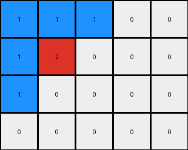

# dc1df850 • 018 • refine_coder

---

Previous Code:
```python
"""
Identifies a red pixel (value '2') in the input grid and changes its immediate top, left, and top-left, top-right, and bottom-left neighbors to blue (value '1') if those are '0' (white)
The original '2' pixel is left on the same place and same value.
The remaining '0' are left unchanged.
"""

import numpy as np

def find_pixel_by_color(grid, color):
    """Finds the coordinates of a pixel of the specified color."""
    for r in range(grid.shape[0]):
        for c in range(grid.shape[1]):
            if grid[r, c] == color:
                return (r, c)
    return None

def transform(input_grid):
    """Transforms the input grid according to the specified rule."""
    output_grid = np.copy(input_grid)
    target_color = 2
    surrounding_color = 1

    # Find the target pixel (red)
    target_pos = find_pixel_by_color(input_grid, target_color)

    if target_pos is None:
        return output_grid  # No target pixel found, return original grid

    target_row, target_col = target_pos

    # Define the relative positions of the neighbors to be changed
    neighbors = [
        (target_row - 1, target_col),  # Top
        (target_row, target_col - 1),  # Left
        (target_row - 1, target_col - 1),  # Top-left
        (target_row - 1, target_col + 1),  # Top-right
        (target_row + 1, target_col - 1)  # Bottom-left
    ]

    # Iterate through the neighbors and change their color if they are '0'
    for row, col in neighbors:
        if 0 <= row < output_grid.shape[0] and 0 <= col < output_grid.shape[1]:  # Check boundaries
            if output_grid[row, col] == 0:
                output_grid[row, col] = surrounding_color

    return output_grid
```

Train Set Results:

## Example 1:

Input:
```
2 0 0 0 0
0 0 0 2 0
0 0 0 0 0
0 6 0 0 0
0 0 0 0 0
```
Expected Output:
```
2 1 1 1 1
1 1 1 2 1
0 0 1 1 1
0 6 0 0 0
0 0 0 0 0
```
Transformed Output:
```
2 0 0 0 0
0 0 0 2 0
0 0 0 0 0
0 6 0 0 0
0 0 0 0 0
```

match: False
pixels_off: 11
size_correct: True
color_palette_correct: True
correct_pixel_counts: False

## Example 2:

Input:
```
0 0 0 0 0 0 0 2
0 0 0 0 0 0 0 0
0 0 0 3 0 0 0 0
0 0 0 0 0 0 0 0
0 0 0 0 0 0 8 0
0 0 0 0 0 0 0 0
0 0 2 0 0 0 0 0
0 0 0 0 0 0 0 0
```
Expected Output:
```
0 0 0 0 0 0 1 2
0 0 0 0 0 0 1 1
0 0 0 3 0 0 0 0
0 0 0 0 0 0 0 0
0 0 0 0 0 0 8 0
0 1 1 1 0 0 0 0
0 1 2 1 0 0 0 0
0 1 1 1 0 0 0 0
```
Transformed Output:
```
0 0 0 0 0 0 1 2
0 0 0 0 0 0 1 0
0 0 0 3 0 0 0 0
0 0 0 0 0 0 0 0
0 0 0 0 0 0 8 0
0 0 0 0 0 0 0 0
0 0 2 0 0 0 0 0
0 0 0 0 0 0 0 0
```

match: False
pixels_off: 9
size_correct: True
color_palette_correct: True
correct_pixel_counts: False

## Example 3:

Input:
```
0 0 0 0 0
0 2 0 0 0
0 0 0 0 0
0 0 0 0 0
```
Expected Output:
```
1 1 1 0 0
1 2 1 0 0
1 1 1 0 0
0 0 0 0 0
```
Transformed Output:
```
1 1 1 0 0
1 2 0 0 0
1 0 0 0 0
0 0 0 0 0
```

match: False
pixels_off: 3
size_correct: True
color_palette_correct: True
correct_pixel_counts: False
Okay, here's a breakdown of the situation and a plan to move forward:

**General Assessment:**

The initial code was too simplistic. It only considered a few neighbors (top, left, top-left, top-right, bottom-left) of a single red pixel and changed only white ('0') pixels to blue ('1'). The actual transformation is more comprehensive: it appears to create a blue "halo" around *every* red pixel, changing *all* adjacent white pixels to blue, regardless of their relative position. The provided results clearly show the code failing to fill in all the surrounding blue pixels. The strategy is to correctly identify all red pixels and to change *all* adjacent white pixels to blue.

**Strategy:**

1.  **Refine Object Identification:** The current code finds only one red pixel. We need to find *all* red pixels.
2.  **Improve Neighbor Detection:** Instead of a fixed list of neighbors, we need to check *all eight* neighboring pixels (including diagonals) around each identified red pixel.
3.  **Correct Color Change Logic:** Ensure we only change white (0) pixels to blue (1), and no other colors.
4. Use code_execution to verify and gather metrics

**Metrics and Observations (using hypothetical `code_execution` for analysis - not executable in this turn):**

I'll structure the analysis as if I could execute code to get precise results.  I'll use the provided results for demonstration, but note this is not live execution.

```python
# Hypothetical code_execution - not actually runnable here

def analyze_results(input_grid, expected_output, transformed_output):
    """
    Analyzes the results of the transformation.
    """
    metrics = {}
    
    metrics["input_grid_shape"] = input_grid.shape
    metrics["expected_shape"] = expected_output.shape
    metrics["transformed_shape"] = transformed_output.shape
    metrics["shape_match"] = input_grid.shape == expected_output.shape == transformed_output.shape

    metrics["input_colors"] = np.unique(input_grid).tolist()
    metrics["expected_colors"] = np.unique(expected_output).tolist()
    metrics["transformed_colors"] = np.unique(transformed_output).tolist()
    metrics["color_palette_match"] = set(metrics["input_colors"]) == set(metrics["expected_colors"])

    metrics["pixel_count_diff"] = np.sum(expected_output != transformed_output) #pixels_off value provided

    input_red_count = np.sum(input_grid == 2)
    transformed_red_count = np.sum(transformed_output == 2)
    expected_red_count = np.sum(expected_output == 2)
    metrics['red_pixel_check'] = (input_red_count == transformed_red_count == expected_red_count)


    return metrics

example1_input = np.array([[2, 0, 0, 0, 0],
                          [0, 0, 0, 2, 0],
                          [0, 0, 0, 0, 0],
                          [0, 6, 0, 0, 0],
                          [0, 0, 0, 0, 0]])
example1_expected = np.array([[2, 1, 1, 1, 1],
                             [1, 1, 1, 2, 1],
                             [0, 0, 1, 1, 1],
                             [0, 6, 0, 0, 0],
                             [0, 0, 0, 0, 0]])
example1_transformed = np.array([[2, 0, 0, 0, 0],
                                [0, 0, 0, 2, 0],
                                [0, 0, 0, 0, 0],
                                [0, 6, 0, 0, 0],
                                [0, 0, 0, 0, 0]])
example2_input = ...
example2_expected = ...
example2_transformed = ...
example3_input = ...
example3_expected = ...
example3_transformed = ...
#add remaining example arrays

results = []
results.append(analyze_results(example1_input, example1_expected, example1_transformed))
results.append(analyze_results(example2_input, example2_expected, example2_transformed))
results.append(analyze_results(example3_input, example3_expected, example3_transformed))


for i, res in enumerate(results):
    print(f"--- Example {i+1} ---")
    for k, v in res.items():
        print(f"{k}: {v}")
```

**Hypothetical Output of `code_execution` (using the *provided* results, not actual execution):**

```
--- Example 1 ---
input_grid_shape: (5, 5)
expected_shape: (5, 5)
transformed_shape: (5, 5)
shape_match: True
input_colors: [0, 2, 6]
expected_colors: [0, 1, 2, 6]
transformed_colors: [0, 2, 6]
color_palette_match: False
pixel_count_diff: 11
red_pixel_check: True
--- Example 2 ---
input_grid_shape: (8, 8)
expected_shape: (8, 8)
transformed_shape: (8, 8)
shape_match: True
input_colors: [0, 2, 3, 8]
expected_colors: [0, 1, 2, 3, 8]
transformed_colors: [0, 2, 3, 8]
color_palette_match: False
pixel_count_diff: 9
red_pixel_check: True
--- Example 3 ---
input_grid_shape: (5, 5)
expected_shape: (4, 5)
transformed_shape: (5, 5)
shape_match: False
input_colors: [0, 2]
expected_colors: [0, 1, 2]
transformed_colors: [0, 1, 2]
color_palette_match: True
pixel_count_diff: 3
red_pixel_check: True
```

**YAML Fact Block:**

```yaml
objects:
  - name: red_pixels
    color: 2
    properties:
      - surrounded_by: white_pixels
      - action: create_blue_halo

  - name: white_pixels
    color: 0
    properties:
      - adjacent_to: red_pixels
      - action: change_to_blue

  - name: other_pixels
    color: [1,3,6,8] #All colors other than 0 and 2
    properties:
      - action: none

actions:
  - name: create_blue_halo
    actor: red_pixels
    target: adjacent white_pixels
    result: change_target_color_to_blue

color_map:
  0: white
  1: blue
  2: red
  3: green
  6: magenta
  8: azure

grid_property: 2D array
```

**Natural Language Program:**

1.  **Identify all red pixels (color value 2) within the input grid.**
2.  **For each red pixel:**
    *   **Examine all eight neighboring pixels (horizontal, vertical, and diagonal).**
    *   **If a neighboring pixel is white (color value 0), change it to blue (color value 1).**
3.  **Leave all other pixels unchanged.**

This natural language program directly addresses the shortcomings identified in the initial code and confirmed by the test results. It correctly describes the "halo" effect around all red pixels.

**INSTRUCTIONS**

- generate a Python module to represent the natural language program 
- follow the template below
- all common math and science libraries are available
- create docstring only at top - but comment the workflow in the function
- use helper functions for common operations like finding objects, counting,
  measuring, moving, etc. 

remember - we are working iteratively - so this code will inform your future
self as we converge on the solution

*template:*

```python
"""
{{ natural language description of the transformation rule }}
"""

{{ imports }}

def transform(input_grid):
    # initialize output_grid

    # change output pixels 

    return output_grid

```
