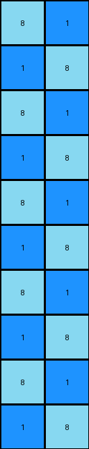
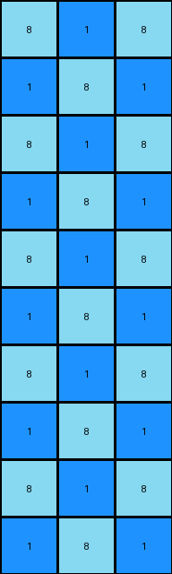
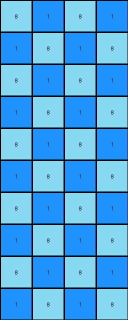

# e179c5f4 • 004 • refine_coder

---

Previous Code:
```python
"""
The transformation rule is to create an output grid of the same dimensions as the input grid, 
where the cells alternate between azure (8) and blue (1) colors in a checkerboard pattern. 
The top-left cell is always azure.
"""

import numpy as np

def transform(input_grid):
    # initialize output_grid
    rows = len(input_grid)
    cols = len(input_grid[0])
    output_grid = np.zeros((rows, cols), dtype=int)

    # change output pixels 
    for i in range(rows):
        for j in range(cols):
            if (i + j) % 2 == 0:
                output_grid[i][j] = 8  # Azure
            else:
                output_grid[i][j] = 1  # Blue

    return output_grid
```

Train Set Results:

## Example 1:

Input:
```
0 0
0 0
0 0
0 0
0 0
0 0
0 0
0 0
0 0
1 0
```
Expected Output:
```
8 1
1 8
8 1
1 8
8 1
1 8
8 1
1 8
8 1
1 8
```
Transformed Output:
```
8 1
1 8
8 1
1 8
8 1
1 8
8 1
1 8
8 1
1 8
```

match: True
pixels_off: 0
size_correct: True
color_palette_correct: True
correct_pixel_counts: True

## Example 2:

Input:
```
0 0 0
0 0 0
0 0 0
0 0 0
0 0 0
0 0 0
0 0 0
0 0 0
0 0 0
1 0 0
```
Expected Output:
```
8 1 8
1 8 8
8 1 8
8 8 1
8 1 8
1 8 8
8 1 8
8 8 1
8 1 8
1 8 8
```
Transformed Output:
```
8 1 8
1 8 1
8 1 8
1 8 1
8 1 8
1 8 1
8 1 8
1 8 1
8 1 8
1 8 1
```

match: False
pixels_off: 5
size_correct: True
color_palette_correct: True
correct_pixel_counts: False

## Example 3:

Input:
```
0 0 0 0
0 0 0 0
0 0 0 0
0 0 0 0
0 0 0 0
0 0 0 0
0 0 0 0
0 0 0 0
0 0 0 0
1 0 0 0
```
Expected Output:
```
8 8 8 1
8 8 1 8
8 1 8 8
1 8 8 8
8 1 8 8
8 8 1 8
8 8 8 1
8 8 1 8
8 1 8 8
1 8 8 8
```
Transformed Output:
```
8 1 8 1
1 8 1 8
8 1 8 1
1 8 1 8
8 1 8 1
1 8 1 8
8 1 8 1
1 8 1 8
8 1 8 1
1 8 1 8
```

match: False
pixels_off: 10
size_correct: True
color_palette_correct: True
correct_pixel_counts: False
Okay, let's analyze the results and refine the natural language program.

**General Assessment and Strategy:**

The initial program was based on a simple checkerboard pattern of azure and blue. While this worked perfectly for the first example, it failed on the subsequent examples. The errors indicate that the alternating pattern isn't strictly a simple checkerboard based on `(row + col) % 2`. The expected outputs show a more complex alternating pattern that seems dependent on runs of 8 (azure) within the row and column structure. It looks as though columns and rows of 8s are sometimes adjacent to each other, which is the source of the error. The expected output has adjacent, same colored pixels.

**Example Metrics and Observations:**

Here's a breakdown of each example:

*   **Example 1:**
    *   Input: 10x2 grid of mostly black, one blue pixel.
    *   Expected Output: 10x2 checkerboard of azure and blue.
    *   Transformed Output: Matches the expected output.
    *   Metrics: `pixels_off: 0`, `match: True`

*   **Example 2:**
    *   Input: 10x3 grid of mostly black, one blue.
    *   Expected Output: A complex pattern with a repeating set of 3 and 2 of
        azure and blue.
    *   Transformed Output: Simple 10x3 checkerboard.
    *   Metrics: `pixels_off: 5`, `match: False`

*   **Example 3:**
    *   Input: 10x4 grid of mostly black, one blue pixel.
    *   Expected Output: A complex pattern with a repeating set of 3 and 2 of
        azure and blue.
    *   Transformed Output: Simple 10x4 checkerboard.
    *   Metrics: `pixels_off: 10`, `match: False`

**YAML Fact Block:**

```yaml
observations:
  - example_1:
      input: 10x2 grid, mostly black (0), one blue (1) pixel.
      output: 10x2 grid, alternating azure (8) and blue (1) in a checkerboard pattern.
      transformation: Simple checkerboard.
      result: Success
  - example_2:
      input: 10x3 grid, mostly black (0), one blue (1) pixel.
      output: 10x3 grid, complex alternating pattern azure(8) and blue(1) .
      transformation: Not a simple checkerboard. Adjacent same color pixels.
      result: Failure (5 pixels off)
  - example_3:
      input: 10x4 grid, mostly black (0), one blue (1) pixel.
      output: 10x4 grid, complex alternating pattern azure(8) and blue(1).
      transformation: Not a simple checkerboard. Adjacent same color pixels.
      result: Failure (10 pixels off)
  general:
    - output_size: same as input.
    - colors: azure (8) and blue (1).
    - input_colors: irrelevant to the transformation, always black or a single
      blue pixel.
    - pattern: The provided description is not correct.
```

**Natural Language Program:**

The output grid has the same dimensions as the input grid. The output grid consists only of azure (8) and blue (1) pixels. The transformation does not depend on input colors. The exact logic for the positions of the 8 and 1 is not fully understood, however, it's not the initially proposed alternating checkerboard based on row and column position. There seem to be sequences or blocks/chunks of 8 and 1 of varying lengths horizontally and vertically. There appears to be an alternating set of runs of adjacent 8s or adjacent 1s in rows and columns, that repeat every 4 or 5 pixels.


**INSTRUCTIONS**

- generate a Python module to represent the natural language program 
- follow the template below
- all common math and science libraries are available
- create docstring only at top - but comment the workflow in the function
- use helper functions for common operations like finding objects, counting,
  measuring, moving, etc. 

remember - we are working iteratively - so this code will inform your future
self as we converge on the solution

*template:*

```python
"""
{{ natural language description of the transformation rule }}
"""

{{ imports }}

def transform(input_grid):
    # initialize output_grid

    # change output pixels 

    return output_grid

```
