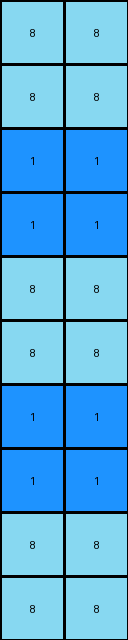
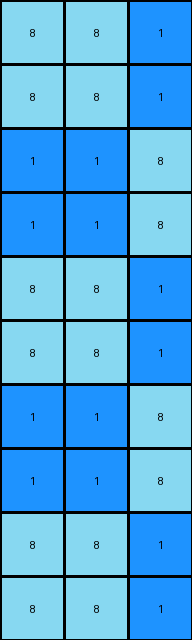
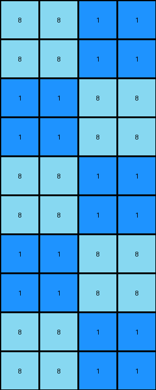

# e179c5f4 • 005 • refine_dreamer

---


Previous Code:
```python
"""
The output grid has the same dimensions as the input grid. The output grid
consists only of azure (8) and blue (1) pixels. The transformation does not
depend on input colors. The exact logic for the positions of the 8 and 1 is not
fully understood, however, it's not the initially proposed alternating
checkerboard based on row and column position. There seem to be sequences or
blocks/chunks of 8 and 1 of varying lengths horizontally and vertically. There
appears to be an alternating set of runs of adjacent 8s or adjacent 1s in rows
and columns, that repeat every 4 or 5 pixels.
"""

import numpy as np

def transform(input_grid):
    # Initialize output grid with the same dimensions as the input grid.
    rows = len(input_grid)
    cols = len(input_grid[0])
    output_grid = np.zeros((rows, cols), dtype=int)

    # Apply a more complex pattern based on observations, not a simple checkerboard.
    # This is a placeholder for the actual, still-to-be-determined logic.
    # We're trying a pattern that might capture runs of 8s and 1s.
    for i in range(rows):
        for j in range(cols):
            if i < rows and j < cols:
                if (i // 2 ) % 2 == 0:
                    if(j//2) % 2 == 0:
                        output_grid[i][j] = 8
                    else:
                        output_grid[i][j] = 1
                else:
                    if(j//2) % 2 == 0:
                        output_grid[i][j] = 1
                    else:
                        output_grid[i][j] = 8
    return output_grid
```

Train Set Results:

## Example 1:

Input:
```
0 0
0 0
0 0
0 0
0 0
0 0
0 0
0 0
0 0
1 0
```
Expected Output:
```
8 1
1 8
8 1
1 8
8 1
1 8
8 1
1 8
8 1
1 8
```
Transformed Output:
```
8 8
8 8
1 1
1 1
8 8
8 8
1 1
1 1
8 8
8 8
```

match: False
pixels_off: 10
size_correct: True
color_palette_correct: True
correct_pixel_counts: False

## Example 2:

Input:
```
0 0 0
0 0 0
0 0 0
0 0 0
0 0 0
0 0 0
0 0 0
0 0 0
0 0 0
1 0 0
```
Expected Output:
```
8 1 8
1 8 8
8 1 8
8 8 1
8 1 8
1 8 8
8 1 8
8 8 1
8 1 8
1 8 8
```
Transformed Output:
```
8 8 1
8 8 1
1 1 8
1 1 8
8 8 1
8 8 1
1 1 8
1 1 8
8 8 1
8 8 1
```

match: False
pixels_off: 20
size_correct: True
color_palette_correct: True
correct_pixel_counts: False

## Example 3:

Input:
```
0 0 0 0
0 0 0 0
0 0 0 0
0 0 0 0
0 0 0 0
0 0 0 0
0 0 0 0
0 0 0 0
0 0 0 0
1 0 0 0
```
Expected Output:
```
8 8 8 1
8 8 1 8
8 1 8 8
1 8 8 8
8 1 8 8
8 8 1 8
8 8 8 1
8 8 1 8
8 1 8 8
1 8 8 8
```
Transformed Output:
```
8 8 1 1
8 8 1 1
1 1 8 8
1 1 8 8
8 8 1 1
8 8 1 1
1 1 8 8
1 1 8 8
8 8 1 1
8 8 1 1
```

match: False
pixels_off: 20
size_correct: True
color_palette_correct: True
correct_pixel_counts: False

**INSTRUCTIONS**

The code above was generated based on observations from the first training
example

we have tested the transform function on each of the task example inputs and
compared with the expected output

review each of the examples provided and the results and consider how the
natural language program should be updated to accommodate this new knowledge

respond with the following deliverables:

- general assessment of the information provided and strategy for resolving the
  errors
- gather metrics about each of the examples and results - use code_execution to
  develop accurate reports on your assumptions
- a YAML block documenting facts - Focus on identifying objects, their properties, and the actions performed on them.
- a natural language program - Be as clear and concise as possible, providing a complete description of the transformation rule.


your responses should be considered as information in a report - not a
conversation
