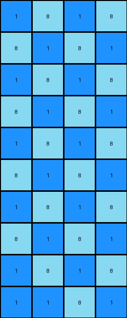

# e179c5f4 • 011 • refine_dreamer

---


Previous Code:
```python
"""
Finds the '1' pixel in the input grid and replaces all '0' pixels with a checkerboard pattern of '8' and '1' values, radiating outwards from the location of the initial '1' pixel, such that the '1' pixel is considered a corner of the radiating pattern.
"""

import numpy as np

def find_pixel(grid, value):
    # Find the coordinates of the pixel with the specified value.
    for r, row in enumerate(grid):
        for c, pixel in enumerate(row):
            if pixel == value:
                return (r, c)
    return None

def transform(input_grid):
    # Initialize the output grid as a copy of the input grid.
    output_grid = np.copy(input_grid)
    rows, cols = input_grid.shape

    # Find the coordinates of the '1' pixel.
    blue_pixel_coords = find_pixel(input_grid, 1)
    if blue_pixel_coords is None:
        return output_grid #should not happen based on prior
    blue_row, blue_col = blue_pixel_coords

    # Iterate through the grid and apply the checkerboard pattern, relative to blue pixel.
    for r in range(rows):
        for c in range(cols):
            if input_grid[r, c] == 0:
                # Calculate the distance from blue
                row_dist = abs(r - blue_row)
                col_dist = abs(c - blue_col)
                if (row_dist + col_dist) % 2 == 0:
                    output_grid[r, c] = 8
                else:
                    output_grid[r, c] = 1

    return output_grid
```

Train Set Results:

## Example 1:

Input:
```
0 0
0 0
0 0
0 0
0 0
0 0
0 0
0 0
0 0
1 0
```
Expected Output:
```
8 1
1 8
8 1
1 8
8 1
1 8
8 1
1 8
8 1
1 8
```
Transformed Output:
```
1 8
8 1
1 8
8 1
1 8
8 1
1 8
8 1
1 8
1 1
```

match: False
pixels_off: 19
size_correct: True
color_palette_correct: True
correct_pixel_counts: False

## Example 2:

Input:
```
0 0 0
0 0 0
0 0 0
0 0 0
0 0 0
0 0 0
0 0 0
0 0 0
0 0 0
1 0 0
```
Expected Output:
```
8 1 8
1 8 8
8 1 8
8 8 1
8 1 8
1 8 8
8 1 8
8 8 1
8 1 8
1 8 8
```
Transformed Output:
```
1 8 1
8 1 8
1 8 1
8 1 8
1 8 1
8 1 8
1 8 1
8 1 8
1 8 1
1 1 8
```

match: False
pixels_off: 24
size_correct: True
color_palette_correct: True
correct_pixel_counts: False

## Example 3:

Input:
```
0 0 0 0
0 0 0 0
0 0 0 0
0 0 0 0
0 0 0 0
0 0 0 0
0 0 0 0
0 0 0 0
0 0 0 0
1 0 0 0
```
Expected Output:
```
8 8 8 1
8 8 1 8
8 1 8 8
1 8 8 8
8 1 8 8
8 8 1 8
8 8 8 1
8 8 1 8
8 1 8 8
1 8 8 8
```
Transformed Output:
```
1 8 1 8
8 1 8 1
1 8 1 8
8 1 8 1
1 8 1 8
8 1 8 1
1 8 1 8
8 1 8 1
1 8 1 8
1 1 8 1
```

match: False
pixels_off: 29
size_correct: True
color_palette_correct: True
correct_pixel_counts: False

**INSTRUCTIONS**

The code above was generated based on observations from the first training
example

we have tested the transform function on each of the task example inputs and
compared with the expected output

review each of the examples provided and the results and consider how the
natural language program should be updated to accommodate this new knowledge

respond with the following deliverables:

- general assessment of the information provided and strategy for resolving the
  errors
- gather metrics about each of the examples and results - use code_execution to
  develop accurate reports on your assumptions
- a YAML block documenting facts - Focus on identifying objects, their properties, and the actions performed on them.
- a natural language program - Be as clear and concise as possible, providing a complete description of the transformation rule.


your responses should be considered as information in a report - not a
conversation
