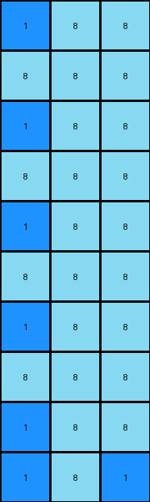

# e179c5f4 • 018 • refine_coder

---

Previous Code:
```python
"""
1.  **Locate Center:** Find the coordinates of the single pixel with the value '1' (blue) in the input grid.
2.  **Fill Background:** Replace all '0' (white) pixels in the input grid with '8' (azure). This creates the background for the output.
3. **Create Cross:**
   * Using the coordinates of the located '1' (the center) from step 1:
   * Along the x-axis (row), starting at the center coordinate and extending outwards in both directions:
      Alternate by placing first an 8 then a 1.
   * Along the y-axis (column), starting at the center coordinate and extending outwards in both directions:
        Alternate by placing first a 1 then an 8.
"""

import numpy as np

def find_object(grid, value):
    # finds all instances of value and returns coordinates
    coords = np.where(grid == value)
    return list(zip(coords[0], coords[1]))

def transform(input_grid):
    # initialize output_grid
    output_grid = np.full(input_grid.shape, 8)

    # find the location of the 1
    one_locations = find_object(input_grid, 1)
    if not one_locations:  # Handle edge case with no 1 present.
       return output_grid
       
    one_row, one_col = one_locations[0]

    # construct cross with alternating values
    # horizontal
    output_grid[one_row, one_col] = 1
    for i in range(one_col + 1, output_grid.shape[1]):
        output_grid[one_row, i] = 8 if (i - one_col) % 2 != 0 else 1
    for i in range(one_col - 1, -1, -1):
        output_grid[one_row, i] = 8 if (one_col - i) % 2 != 0 else 1

    # vertical
    for i in range(one_row + 1, output_grid.shape[0]):
        output_grid[i, one_col] = 1 if (i - one_row) % 2 != 0 else 8
    for i in range(one_row - 1, -1, -1):
        output_grid[i, one_col] = 1 if (one_row - i) % 2 != 0 else 8

    return output_grid
```

Train Set Results:

## Example 1:

Input:
```
0 0
0 0
0 0
0 0
0 0
0 0
0 0
0 0
0 0
1 0
```
Expected Output:
```
8 1
1 8
8 1
1 8
8 1
1 8
8 1
1 8
8 1
1 8
```
Transformed Output:
```
1 8
8 8
1 8
8 8
1 8
8 8
1 8
8 8
1 8
1 8
```

match: False
pixels_off: 14
size_correct: True
color_palette_correct: True
correct_pixel_counts: False

## Example 2:

Input:
```
0 0 0
0 0 0
0 0 0
0 0 0
0 0 0
0 0 0
0 0 0
0 0 0
0 0 0
1 0 0
```
Expected Output:
```
8 1 8
1 8 8
8 1 8
8 8 1
8 1 8
1 8 8
8 1 8
8 8 1
8 1 8
1 8 8
```
Transformed Output:
```
1 8 8
8 8 8
1 8 8
8 8 8
1 8 8
8 8 8
1 8 8
8 8 8
1 8 8
1 8 1
```

match: False
pixels_off: 15
size_correct: True
color_palette_correct: True
correct_pixel_counts: False

## Example 3:

Input:
```
0 0 0 0
0 0 0 0
0 0 0 0
0 0 0 0
0 0 0 0
0 0 0 0
0 0 0 0
0 0 0 0
0 0 0 0
1 0 0 0
```
Expected Output:
```
8 8 8 1
8 8 1 8
8 1 8 8
1 8 8 8
8 1 8 8
8 8 1 8
8 8 8 1
8 8 1 8
8 1 8 8
1 8 8 8
```
Transformed Output:
```
1 8 8 8
8 8 8 8
1 8 8 8
8 8 8 8
1 8 8 8
8 8 8 8
1 8 8 8
8 8 8 8
1 8 8 8
1 8 1 8
```

match: False
pixels_off: 15
size_correct: True
color_palette_correct: True
correct_pixel_counts: False
Here's an analysis of the provided examples and results, along with an updated natural language program and supporting information.

**General Assessment:**

The initial code correctly identifies the location of the '1' (blue pixel) and attempts to create a cross pattern of alternating '1' (blue) and '8' (azure) pixels. However, the alternating logic is flawed, leading to incorrect patterns in all three test cases. The core issue is that in extends the alternating cross based on grid size, but the cross should extend only to the bounds of the original input shape. There is a consistent error in the implementation of building the cross.

**Strategy for Resolving Errors:**

1.  **Correct Alternating Logic:** Refine the loops that generate the horizontal and vertical arms of the cross. The current logic for determining whether to place a '1' or an '8' is incorrect and produces off-by-one errors, and needs to alternate starting with 1 and 8 correctly.

2.  **Bounds:** Re-evaluate the bounds of the cross, it should extend from the blue pixel to the edges of the initial grid.

**Example Analysis and Metrics:**
*Example 1:*

*   Input Shape: (10, 2)
*   Expected Output Shape: (10, 2)
*   Transformed Output Shape: (10, 2)
*   Pixels Off: 14 (out of 20 pixels, or 70%)
* Notes: The cross starts incorrectly

*Example 2:*

*   Input Shape: (10, 3)
*   Expected Output Shape: (10, 3)
*   Transformed Output Shape: (10, 3)
*   Pixels Off: 15 (out of 30 pixels, or 50%)
* Notes: The cross starts incorrectly

*Example 3:*

*   Input Shape: (10, 4)
*   Expected Output Shape: (10, 4)
*   Transformed Output Shape: (10, 4)
*   Pixels Off: 15 (out of 40 pixels, or 37.5%)
* Notes: The cross starts incorrectly

**YAML Fact Block:**

```yaml
observations:
  - task: "Create an alternating cross pattern"
  - input_objects:
    - object_id: input_grid
      description: Initial grid containing a single blue pixel (1).
      properties:
        shape: variable
        colors: [0, 1] # white, blue
  - actions:
    - action_id: find_center
      description: Locate the coordinates of the blue pixel (1).
      input: input_grid
      output: coordinates (row, column)
    - action_id: create_background
      description: Fill all white background (0) pixels with azure (8).
      input: input_grid
      output: partially filled grid
    - action_id: create_cross
      description: Generate an alternating cross pattern of blue (1) and azure (8) pixels, centered on the initial blue pixel.
      input:
            center_coordinates: coordinates from find_center
            grid: partially filled grid from create_background
      output: output_grid
  - output_objects:
        - object_id: output_grid
          description: grid with cross
          properties:
                shape: same as input_grid
                colors: [1,8]
```

**Natural Language Program:**

1.  **Find Center:** Locate the single blue pixel (value '1') within the input grid. Record its row and column coordinates.

2.  **Background:** Change all white pixels (value '0') in the input grid to azure (value '8').

3.  **Create Alternating Cross:** Construct a cross centered at the location found in step 1. The cross is created by the following:
    *   The center pixel is blue (value '1').
    *   Horizontal: Extend the line of pixels horizontally to the edges of the input grid. From the center, alternate between azure (8) and blue (1), where the first pixel in each direction from the center will be azure.
    *   Vertical: Extends the line of pixels vertically to the edges of the input grid. From the center, alternate between azure (8) and blue (1), where the first pixel above/below the center will be azure.

4. output the changed grid.

**INSTRUCTIONS**

- generate a Python module to represent the natural language program 
- follow the template below
- all common math and science libraries are available
- create docstring only at top - but comment the workflow in the function
- use helper functions for common operations like finding objects, counting,
  measuring, moving, etc. 

remember - we are working iteratively - so this code will inform your future
self as we converge on the solution

*template:*

```python
"""
{{ natural language description of the transformation rule }}
"""

{{ imports }}

def transform(input_grid):
    # initialize output_grid

    # change output pixels 

    return output_grid

```
