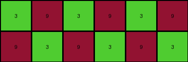

# e9afcf9a • 004 • refine_coder

---

Previous Code:
```python
"""
The transformation rule is to create an alternating pattern of green and maroon. The first cell is green. Adjacent cells (horizontal and vertical) can not have same color.
"""

import numpy as np

def transform(input_grid):
    # initialize output_grid
    rows, cols = input_grid.shape
    output_grid = np.zeros((rows, cols), dtype=int)

    # change output pixels
    for i in range(rows):
        for j in range(cols):
            if (i + j) % 2 == 0:
                output_grid[i, j] = 3  # Green
            else:
                output_grid[i, j] = 9  # Maroon

    return output_grid
```

Train Set Results:

## Example 1:

Input:
```
3 3 3 3 3 3
9 9 9 9 9 9
```
Expected Output:
```
3 9 3 9 3 9
9 3 9 3 9 3
```
Transformed Output:
```
3 9 3 9 3 9
9 3 9 3 9 3
```

match: True
pixels_off: 0
size_correct: True
color_palette_correct: True
correct_pixel_counts: True

## Example 2:

Input:
```
4 4 4 4 4 4
8 8 8 8 8 8
```
Expected Output:
```
4 8 4 8 4 8
8 4 8 4 8 4
```
Transformed Output:
```
3 9 3 9 3 9
9 3 9 3 9 3
```

match: False
pixels_off: 12
size_correct: True
color_palette_correct: False
correct_pixel_counts: False
Okay, here's a breakdown of the situation and a plan to move forward:

**General Assessment:**

The initial natural language program and the resulting code were too simplistic. While it correctly captured the alternating pattern concept, it failed to generalize to different colors present in the input. The code assumes the input will *always* be green and maroon and generates a green and maroon checkerboard. Example 2 demonstrates this flaw, as the input colors are yellow and azure, and the output should maintain this color relationship while alternating, not switch to green and maroon.

The strategy needs to be refocused. Instead of hardcoding the colors, we need to identify the *relationship* between the colors in the input and apply that same relationship in the output, maintaining the alternating pattern. We need to detect the two distinct colors in the input and use *those* in the output pattern.

**Metrics and Observations (per example):**

*   **Example 1:**
    *   Input: Two rows, one all green (3), one all maroon (9).
    *   Expected Output: Alternating green and maroon checkerboard pattern.
    *   Actual Output: Matches the expected output.
    *   Success Metrics: Perfect match. All checks passed.

*   **Example 2:**

    *   Input: Two rows, one all yellow (4), one all azure (8).
    *   Expected Output: Alternating yellow and azure checkerboard pattern.
    *   Actual Output: Incorrect. Produces a green/maroon checkerboard, not yellow/azure.
    *   Failure Metrics: Mismatch in colors and pixel values. The color palette and pixel counts are incorrect.

**YAML Block (Facts):**

```yaml
observations:
  example_1:
    input_colors: [3, 9]
    output_colors: [3, 9]
    pattern: alternating
    pattern_start: top_left
    relationship: |
       adjacent cells (horizontal and vertical) have different colors

  example_2:
    input_colors: [4, 8]
    output_colors: [4, 8]
    pattern: alternating
    pattern_start: top_left
    relationship: |
       adjacent cells (horizontal and vertical) have different colors

general:
    - The input consists of two rows, each of a single, but different, color.
    - The output maintains the two colors from the input.
    - The output establishes an alternating pattern of the two input colors.
    - The top-left cell of the output uses the color from the top-left cell of the input
```

**Natural Language Program:**

1.  **Identify the two distinct colors** present in the input grid.  We can do this by simply taking the color value of the top-left pixel and comparing it to any pixel to its right or down.
2.  **Determine the starting color**: The color of the top-left cell in the output grid should be the same as the color of the top-left cell of the input grid.
3. **Create the output grid:**, matching the dimensions of the input grid.
4.  **Populate the output grid**: Fill the output grid with the two identified colors in an alternating pattern. A cell's color should be different from its immediate horizontal and vertical neighbors. The color of a cell at `(row, col)` depends on `(row + col) % 2`. If the result is 0, use the starting color. If the result is 1, use the other color.

The crucial change from the previous version is that we are no longer assuming the colors are always green and maroon. We are dynamically determining the colors from the input and then applying the alternating pattern using *those* colors.

**INSTRUCTIONS**

- generate a Python module to represent the natural language program 
- follow the template below
- all common math and science libraries are available
- create docstring only at top - but comment the workflow in the function
- use helper functions for common operations like finding objects, counting,
  measuring, moving, etc. 

remember - we are working iteratively - so this code will inform your future
self as we converge on the solution

*template:*

```python
"""
{{ natural language description of the transformation rule }}
"""

{{ imports }}

def transform(input_grid):
    # initialize output_grid

    # change output pixels 

    return output_grid

```
