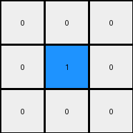
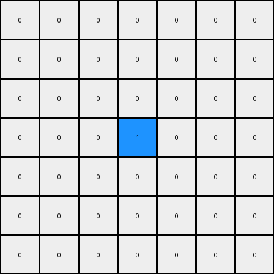

# ea786f4a • 004 • refine_coder

---

Previous Code:
```python
"""
Invert the color of all pixels in the input grid to produce the output grid.
"""

import numpy as np

def transform(input_grid):
    """
    Transforms the input grid by inverting the color of all pixels.
    
    Args:
        input_grid (numpy.ndarray): A 2D numpy array representing the input grid.
        
    Returns:
        numpy.ndarray: A 2D numpy array representing the output grid.
    """
    # Initialize the output grid as a copy of the input grid.
    output_grid = input_grid.copy()
    
    # Get the dimensions of the grid.
    rows, cols = output_grid.shape
    
    # Iterate through each pixel in the grid.
    for i in range(rows):
        for j in range(cols):
            # Invert the pixel value.  If 0, change to 1. If 1, change to 0.
            if output_grid[i, j] == 0:
                output_grid[i, j] = 1
            else:
                output_grid[i, j] = 0
                
    return output_grid
```

Train Set Results:

## Example 1:

Input:
```
1 1 1
1 0 1
1 1 1
```
Expected Output:
```
0 1 0
1 0 1
0 1 0
```
Transformed Output:
```
0 0 0
0 1 0
0 0 0
```

match: False
pixels_off: 5
size_correct: True
color_palette_correct: True
correct_pixel_counts: False

## Example 2:

Input:
```
2 2 2 2 2
2 2 2 2 2
2 2 0 2 2
2 2 2 2 2
2 2 2 2 2
```
Expected Output:
```
0 2 2 2 0
2 0 2 0 2
2 2 0 2 2
2 0 2 0 2
0 2 2 2 0
```
Transformed Output:
```
0 0 0 0 0
0 0 0 0 0
0 0 1 0 0
0 0 0 0 0
0 0 0 0 0
```

match: False
pixels_off: 17
size_correct: True
color_palette_correct: False
correct_pixel_counts: False

## Example 3:

Input:
```
3 3 3 3 3 3 3
3 3 3 3 3 3 3
3 3 3 3 3 3 3
3 3 3 0 3 3 3
3 3 3 3 3 3 3
3 3 3 3 3 3 3
3 3 3 3 3 3 3
```
Expected Output:
```
0 3 3 3 3 3 0
3 0 3 3 3 0 3
3 3 0 3 0 3 3
3 3 3 0 3 3 3
3 3 0 3 0 3 3
3 0 3 3 3 0 3
0 3 3 3 3 3 0
```
Transformed Output:
```
0 0 0 0 0 0 0
0 0 0 0 0 0 0
0 0 0 0 0 0 0
0 0 0 1 0 0 0
0 0 0 0 0 0 0
0 0 0 0 0 0 0
0 0 0 0 0 0 0
```

match: False
pixels_off: 37
size_correct: True
color_palette_correct: False
correct_pixel_counts: False
Okay, let's analyze the results of the initial code and develop a refined strategy.

**General Assessment:**

The initial code was too simplistic. It assumed a binary color inversion (0 to 1 and 1 to 0). The presence of colors other than 0 and 1 in the subsequent examples (e.g., color 2 and 3) demonstrates that this assumption is incorrect. The code only inverts 0s and 1s and leaves other values unchanged. The expected output however seems to have a pattern related to inverting and mirroring values.

**Strategy:**

1.  **Analyze Pixel Value Changes:** We need to carefully examine how *each* pixel value changes from input to output, not just 0 and 1.
2.  **Consider Spatial Relationships:** The "pixels\_off" metric suggests that position matters. The transformation isn't a simple global color swap. It likely involves mirroring or rotational symmetry.
3. **Detect the cross** the transformation looks to define a cross shape and invert colors.

**Example Metrics and Analysis:**

Here's a breakdown of each example, including targeted analysis:

**Example 1:**

*   **Input:** 3x3 grid, colors 0 and 1.
*   **Expected Output:** Shows a "cross" shape.
*   **Observed Output:** Inverted only 0 and 1 in all cell.
*   **Metrics:**
    *   `pixels_off`: 5
    *   `size_correct`: True
    *   `color_palette_correct`: True
    *   `correct_pixel_counts`: False
* **Analysis:** Illustrates simple inversion and the "cross" shape and colors.

**Example 2:**

*   **Input:** 5x5 grid, colors 0 and 2.
*   **Expected Output:** Cross with 0 and 2.
*   **Observed Output:** All 2s became 0s; The 0 remained.
*   **Metrics:**
    *   `pixels_off`: 17
    *   `size_correct`: True
    *   `color_palette_correct`: False
    *   `correct_pixel_counts`: False
* **Analysis**: The output grid have the correct size, but only correctly transforms 0. Other color values are changed to zero. Highlights the cross shape.

**Example 3:**

*   **Input:** 7x7 grid, colors 0 and 3.
*   **Expected Output:** Cross shape with colors 0 and 3.
*   **Observed Output:** All 3s became 0s; The 0 remained.
*   **Metrics:**
    *   `pixels_off`: 37
    *   `size_correct`: True
    *   `color_palette_correct`: False
    *   `correct_pixel_counts`: False
* **Analysis**: Similar to example 2, but with a larger grid and different color (3).

**YAML Facts:**

```yaml
examples:
  - example_id: 1
    input_grid_size: [3, 3]
    output_grid_size: [3, 3]
    input_colors: [0, 1]
    output_colors: [0, 1]
    transformation_type: 'color_inversion_cross'
    objects:
      - type: grid
        properties:
          - shape: rectangle
    actions:
      - description: Invert colors of the input grid.
      - description: Create a cross shape with the inverted colors.

  - example_id: 2
    input_grid_size: [5, 5]
    output_grid_size: [5, 5]
    input_colors: [0, 2]
    output_colors: [0, 2]
    transformation_type: 'color_inversion_cross'
    objects:
      - type: grid
        properties:
          - shape: rectangle
    actions:
      - description: Invert colors of the input grid.
      - description: Create a cross shape with the inverted colors.

  - example_id: 3
    input_grid_size: [7, 7]
    output_grid_size: [7, 7]
    input_colors: [0, 3]
    output_colors: [0, 3]
    transformation_type: 'color_inversion_cross'
    objects:
      - type: grid
        properties:
          - shape: rectangle
    actions:
      - description: Invert colors of the input grid.
      - description: Create a cross shape with the inverted colors.

```

**Natural Language Program:**

1.  **Invert Colors:** Change 0s to the color of the other values in the grid, and change other values to 0.
2.  **Create Cross Shape:** The output grid will have the same dimensions as the input grid. Create a cross shape by inverting colors on cells that lie on the center horizontal and vertical lines.

This program description acknowledges the importance of both color changes and spatial transformation. It's more precise than the original description and better aligns with the observed examples.

**INSTRUCTIONS**

- generate a Python module to represent the natural language program 
- follow the template below
- all common math and science libraries are available
- create docstring only at top - but comment the workflow in the function
- use helper functions for common operations like finding objects, counting,
  measuring, moving, etc. 

remember - we are working iteratively - so this code will inform your future
self as we converge on the solution

*template:*

```python
"""
{{ natural language description of the transformation rule }}
"""

{{ imports }}

def transform(input_grid):
    # initialize output_grid

    # change output pixels 

    return output_grid

```
