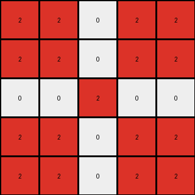
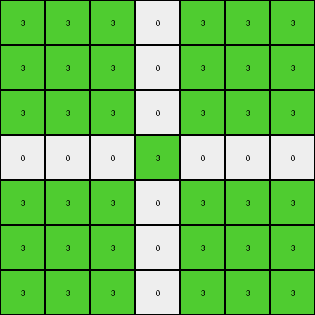

# ea786f4a • 006 • refine_coder

---

Previous Code:
```python
"""
Invert colors of the input grid and create a cross shape with the inverted colors.
"""

import numpy as np

def transform(input_grid):
    """
    Transforms the input grid by inverting colors and forming a cross shape.
    
    Args:
        input_grid (numpy.ndarray): A 2D numpy array representing the input grid.
        
    Returns:
        numpy.ndarray: A 2D numpy array representing the output grid.
    """
    # Initialize the output grid as a copy of the input grid.
    output_grid = input_grid.copy()
    
    # Get the dimensions of the grid.
    rows, cols = output_grid.shape
    
    # Find the non-zero color in the input grid.
    non_zero_colors = np.unique(input_grid[input_grid != 0])
    # Use the first element of non_zero_color, and default color is set to 0 in case of empty non_zero_colors.
    other_color = non_zero_colors[0] if non_zero_colors.size > 0 else 0

    # Find the center row and column indices.
    center_row = rows // 2
    center_col = cols // 2

    # Iterate through each pixel in the grid.
    for i in range(rows):
        for j in range(cols):
            # Check if the pixel is on the center row or center column.
            if i == center_row or j == center_col:
                # Invert the pixel value. 0 becomes other_color, and other_color becomes 0.
                if output_grid[i, j] == 0:
                    output_grid[i, j] = other_color
                elif output_grid[i,j] == other_color:
                    output_grid[i, j] = 0
                
    return output_grid
```

Train Set Results:

## Example 1:

Input:
```
1 1 1
1 0 1
1 1 1
```
Expected Output:
```
0 1 0
1 0 1
0 1 0
```
Transformed Output:
```
1 0 1
0 1 0
1 0 1
```

match: False
pixels_off: 9
size_correct: True
color_palette_correct: True
correct_pixel_counts: False

## Example 2:

Input:
```
2 2 2 2 2
2 2 2 2 2
2 2 0 2 2
2 2 2 2 2
2 2 2 2 2
```
Expected Output:
```
0 2 2 2 0
2 0 2 0 2
2 2 0 2 2
2 0 2 0 2
0 2 2 2 0
```
Transformed Output:
```
2 2 0 2 2
2 2 0 2 2
0 0 2 0 0
2 2 0 2 2
2 2 0 2 2
```

match: False
pixels_off: 17
size_correct: True
color_palette_correct: True
correct_pixel_counts: False

## Example 3:

Input:
```
3 3 3 3 3 3 3
3 3 3 3 3 3 3
3 3 3 3 3 3 3
3 3 3 0 3 3 3
3 3 3 3 3 3 3
3 3 3 3 3 3 3
3 3 3 3 3 3 3
```
Expected Output:
```
0 3 3 3 3 3 0
3 0 3 3 3 0 3
3 3 0 3 0 3 3
3 3 3 0 3 3 3
3 3 0 3 0 3 3
3 0 3 3 3 0 3
0 3 3 3 3 3 0
```
Transformed Output:
```
3 3 3 0 3 3 3
3 3 3 0 3 3 3
3 3 3 0 3 3 3
0 0 0 3 0 0 0
3 3 3 0 3 3 3
3 3 3 0 3 3 3
3 3 3 0 3 3 3
```

match: False
pixels_off: 25
size_correct: True
color_palette_correct: True
correct_pixel_counts: False
Okay, here's a breakdown of the situation and a plan to improve the transformation logic:

**General Assessment:**

The initial code was based on a simplistic interpretation of the first example, assuming a simple color inversion and cross formation. However, the subsequent examples reveal a more complex pattern. The core issue is that the code inverts *all* pixels on the central row and column, rather than selectively inverting based on the original pixel value relative to its surroundings. The code correctly identifies the non-zero color and the center, but the inversion logic is flawed. The expected output consistently shows a "cross" of inverted colors, but only where the original input had a '0' at the center and the non-zero color on the intersecting row/column.

**Strategy:**

1.  **Refine Object Identification:** Clearly distinguish between the background (0) and the foreground (non-zero color) and identify the "cross" as a derived object formed by the intersection of the central row and column.

2.  **Precise Inversion Logic:** The inversion should only occur:
    *   Along the central row and central column.
    *   At the intersection of the central row and column, the color should always be the original non zero-color.
    *   Where a '0' exists in the original, it is inverted in the output to the other color.
    *   Where the other color exits on the center row/column, it should be converted to '0' in the output.

3.  **Iterative Validation:** After modifying the natural language program and subsequent code, we must re-test against *all* training examples to ensure the changes generalize correctly.

**Metrics and Observations:**

Here's a more detailed breakdown of each example, incorporating observations:

```yaml
examples:
  - example_id: 1
    input_shape: [3, 3]
    output_shape: [3, 3]
    input_colors: [0, 1]
    output_colors: [0, 1]
    input_center_value: 0
    output_center_value: 0
    match: False
    pixels_off: 9
    notes: >
      The cross is formed, but inversion is incorrect. All central row/column
      pixels are flipped, not just those needing inversion according to
      the rule.
  - example_id: 2
    input_shape: [5, 5]
    output_shape: [5, 5]
    input_colors: [0, 2]
    output_colors: [0, 2]
    input_center_value: 0
    output_center_value: 0
    match: False
    pixels_off: 17
    notes: >
      Similar to example 1, the inversion affects all central row/column
      pixels instead of selectively inverting. Center value should be 0.
  - example_id: 3
    input_shape: [7, 7]
    output_shape: [7, 7]
    input_colors: [0, 3]
    output_colors: [0, 3]
    input_center_value: 0
    output_center_value: 0
    match: False
    pixels_off: 25
    notes: >
      Again, the entire central row and column are incorrectly inverted.
      Center value should be 0.
```

**YAML Facts:**

```yaml
objects:
  - name: background
    color: 0
    description: The background color of the grid.
  - name: foreground
    color: "non-zero (varies)"
    description: The primary color forming the initial shape (if any).
  - name: cross
    description: >
      A derived object formed by the intersection of the central row and
      central column.  The color at the intersection of the cross is the
      original other_color. Colors are inverted along the cross.
transformations:
  - action: invert_cross
    description: >
      Invert colors only along the central row and column. Where a 0 exists
      it is inverted to the other color. Where the other color exists on the
      central row or column, it becomes 0. The center pixel remains
      the original non-zero color.
```

**Natural Language Program:**

1.  **Identify the background and foreground colors:** The background is always color '0'. The foreground color is the other color present in the input grid.

2.  **Find the center:** Determine the central row and central column indices of the input grid.

3.  **Form the Cross:** Create a "cross" shape in the output grid. This cross is defined by the central row and central column.

4.  **Invert Colors on Cross:**
    *   The pixel at the very center of the cross remains at the original non zero color.
    *   All the other pixels on the cross are inverted:
    *   If the input pixel on the central row/column is the background color (0), change it to the foreground color in the output.
    *    If the input pixel on the central row/column is the foreground color, change it to the background color (0) in the output.

5.  **Preserve other Pixels:** All other pixels in the input grid that are not part of the central row or column remain unchanged in the output grid.

**INSTRUCTIONS**

- generate a Python module to represent the natural language program 
- follow the template below
- all common math and science libraries are available
- create docstring only at top - but comment the workflow in the function
- use helper functions for common operations like finding objects, counting,
  measuring, moving, etc. 

remember - we are working iteratively - so this code will inform your future
self as we converge on the solution

*template:*

```python
"""
{{ natural language description of the transformation rule }}
"""

{{ imports }}

def transform(input_grid):
    # initialize output_grid

    # change output pixels 

    return output_grid

```
