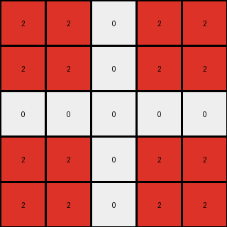

# ea786f4a • 015 • refine_dreamer

---


Previous Code:
```python
"""
1.  **Identify the Center:** Locate the single white pixel (value 0) in the input grid. This is the center of the transformation.

2.  **Invert Colors in cross pattern:** all pixels that are the same color as the most frequent color get flipped to 0 if they are the same Manhattan distance in the x or y direction from the center. All instances of 0 are also changed to the most frequent color.
"""

import numpy as np
from collections import Counter

def find_center(grid):
    # Find the coordinates of the white pixel (value 0).
    rows, cols = np.where(grid == 0)
    if len(rows) > 0:  # Check if a white pixel was found
       return rows[0], cols[0]
    return None

def most_frequent_color(grid):
    # Flatten the grid and use Counter to find the most common color
    flat_grid = grid.flatten()
    color_counts = Counter(flat_grid)
    most_common = color_counts.most_common(1)
    return most_common[0][0]

def transform(input_grid):
    # Initialize output_grid as a copy of the input_grid
    output_grid = np.copy(input_grid)
    
    #find center
    center = find_center(input_grid)
    if center is None: #if no center of this type, return
        return output_grid
    center_row, center_col = center

    #get most frequent color
    freq_color = most_frequent_color(input_grid)

    #change the 0 cell
    output_grid[center_row, center_col] = freq_color

    # Iterate through the grid and invert colors based on Manhattan distance
    for row in range(output_grid.shape[0]):
        for col in range(output_grid.shape[1]):
            if output_grid[row,col] == freq_color:
                if row == center_row or col == center_col:
                    output_grid[row, col] = 0

    return output_grid
```

Train Set Results:

## Example 1:

Input:
```
1 1 1
1 0 1
1 1 1
```
Expected Output:
```
0 1 0
1 0 1
0 1 0
```
Transformed Output:
```
1 0 1
0 0 0
1 0 1
```

match: False
pixels_off: 8
size_correct: True
color_palette_correct: True
correct_pixel_counts: True

## Example 2:

Input:
```
2 2 2 2 2
2 2 2 2 2
2 2 0 2 2
2 2 2 2 2
2 2 2 2 2
```
Expected Output:
```
0 2 2 2 0
2 0 2 0 2
2 2 0 2 2
2 0 2 0 2
0 2 2 2 0
```
Transformed Output:
```
2 2 0 2 2
2 2 0 2 2
0 0 0 0 0
2 2 0 2 2
2 2 0 2 2
```

match: False
pixels_off: 16
size_correct: True
color_palette_correct: True
correct_pixel_counts: True

## Example 3:

Input:
```
3 3 3 3 3 3 3
3 3 3 3 3 3 3
3 3 3 3 3 3 3
3 3 3 0 3 3 3
3 3 3 3 3 3 3
3 3 3 3 3 3 3
3 3 3 3 3 3 3
```
Expected Output:
```
0 3 3 3 3 3 0
3 0 3 3 3 0 3
3 3 0 3 0 3 3
3 3 3 0 3 3 3
3 3 0 3 0 3 3
3 0 3 3 3 0 3
0 3 3 3 3 3 0
```
Transformed Output:
```
3 3 3 0 3 3 3
3 3 3 0 3 3 3
3 3 3 0 3 3 3
0 0 0 0 0 0 0
3 3 3 0 3 3 3
3 3 3 0 3 3 3
3 3 3 0 3 3 3
```

match: False
pixels_off: 24
size_correct: True
color_palette_correct: True
correct_pixel_counts: True

**INSTRUCTIONS**

The code above was generated based on observations from the first training
example

we have tested the transform function on each of the task example inputs and
compared with the expected output

review each of the examples provided and the results and consider how the
natural language program should be updated to accommodate this new knowledge

respond with the following deliverables:

- general assessment of the information provided and strategy for resolving the
  errors
- gather metrics about each of the examples and results - use code_execution to
  develop accurate reports on your assumptions
- a YAML block documenting facts - Focus on identifying objects, their properties, and the actions performed on them.
- a natural language program - Be as clear and concise as possible, providing a complete description of the transformation rule.


your responses should be considered as information in a report - not a
conversation
