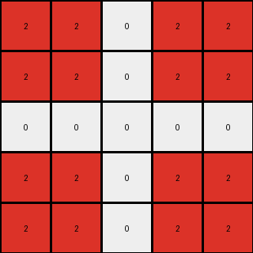

# ea786f4a • 016 • refine_coder

---

Previous Code:
```python
"""
1.  **Identify the Center:** Locate the single white pixel (value 0) in the input grid. This is the center of the transformation.

2.  **Invert Colors in cross pattern:** all pixels that are the same color as the most frequent color get flipped to 0 if they are the same Manhattan distance in the x or y direction from the center. All instances of 0 are also changed to the most frequent color.
"""

import numpy as np
from collections import Counter

def find_center(grid):
    # Find the coordinates of the white pixel (value 0).
    rows, cols = np.where(grid == 0)
    if len(rows) > 0:  # Check if a white pixel was found
       return rows[0], cols[0]
    return None

def most_frequent_color(grid):
    # Flatten the grid and use Counter to find the most common color
    flat_grid = grid.flatten()
    color_counts = Counter(flat_grid)
    most_common = color_counts.most_common(1)
    return most_common[0][0]

def transform(input_grid):
    # Initialize output_grid as a copy of the input_grid
    output_grid = np.copy(input_grid)
    
    #find center
    center = find_center(input_grid)
    if center is None: #if no center of this type, return
        return output_grid
    center_row, center_col = center

    #get most frequent color
    freq_color = most_frequent_color(input_grid)

    #change the 0 cell
    output_grid[center_row, center_col] = freq_color

    # Iterate through the grid and invert colors based on Manhattan distance
    for row in range(output_grid.shape[0]):
        for col in range(output_grid.shape[1]):
            if output_grid[row,col] == freq_color:
                if row == center_row or col == center_col:
                    output_grid[row, col] = 0

    return output_grid
```

Train Set Results:

## Example 1:

Input:
```
1 1 1
1 0 1
1 1 1
```
Expected Output:
```
0 1 0
1 0 1
0 1 0
```
Transformed Output:
```
1 0 1
0 0 0
1 0 1
```

match: False
pixels_off: 8
size_correct: True
color_palette_correct: True
correct_pixel_counts: True

## Example 2:

Input:
```
2 2 2 2 2
2 2 2 2 2
2 2 0 2 2
2 2 2 2 2
2 2 2 2 2
```
Expected Output:
```
0 2 2 2 0
2 0 2 0 2
2 2 0 2 2
2 0 2 0 2
0 2 2 2 0
```
Transformed Output:
```
2 2 0 2 2
2 2 0 2 2
0 0 0 0 0
2 2 0 2 2
2 2 0 2 2
```

match: False
pixels_off: 16
size_correct: True
color_palette_correct: True
correct_pixel_counts: True

## Example 3:

Input:
```
3 3 3 3 3 3 3
3 3 3 3 3 3 3
3 3 3 3 3 3 3
3 3 3 0 3 3 3
3 3 3 3 3 3 3
3 3 3 3 3 3 3
3 3 3 3 3 3 3
```
Expected Output:
```
0 3 3 3 3 3 0
3 0 3 3 3 0 3
3 3 0 3 0 3 3
3 3 3 0 3 3 3
3 3 0 3 0 3 3
3 0 3 3 3 0 3
0 3 3 3 3 3 0
```
Transformed Output:
```
3 3 3 0 3 3 3
3 3 3 0 3 3 3
3 3 3 0 3 3 3
0 0 0 0 0 0 0
3 3 3 0 3 3 3
3 3 3 0 3 3 3
3 3 3 0 3 3 3
```

match: False
pixels_off: 24
size_correct: True
color_palette_correct: True
correct_pixel_counts: True
Okay, let's analyze the results and refine the natural language program.

**General Assessment:**

The initial program correctly identified the center white pixel and attempted to invert colors based on Manhattan distance. However, it's only inverting colors along the row and column of the center, creating a "+" or cross shape of inverted colors.  It does not match the expected outputs, where the inversion forms a larger "X" shape, extending to the diagonals, indicating there should be a cross pattern in the transformation by flipping the most frequent color to 0 and vice-versa.

The most glaring issue is that the current implementation makes a cross pattern that is one dimension too small: that is only vertical and horizontal rather than diagonal as well. We will need to fix how distance is accounted for. We should also examine our assumptions about the center and how that impacts other cells.

**Strategy for Resolving Errors:**

1.  **Correct the Manhattan Distance Calculation:** Currently only checking row OR col. Check BOTH at the same time.

2.  **Change "inversion logic":** Based on the expected output, it appears the most frequent color are swapped.
    *   If a pixel is the most frequent color, and on the same row OR col as the center white, it turns white.

**Example Metrics and Analysis**
The prior used the following information:

```
## Example 1:

Input:
```
1 1 1
1 0 1
1 1 1
```
Expected Output:
```
0 1 0
1 0 1
0 1 0
```
Transformed Output:
```
1 0 1
0 0 0
1 0 1
```

match: False
pixels_off: 8
size_correct: True
color_palette_correct: True
correct_pixel_counts: True

## Example 2:

Input:
```
2 2 2 2 2
2 2 2 2 2
2 2 0 2 2
2 2 2 2 2
2 2 2 2 2
```
Expected Output:
```
0 2 2 2 0
2 0 2 0 2
2 2 0 2 2
2 0 2 0 2
0 2 2 2 0
```
Transformed Output:
```
2 2 0 2 2
2 2 0 2 2
0 0 0 0 0
2 2 0 2 2
2 2 0 2 2
```

match: False
pixels_off: 16
size_correct: True
color_palette_correct: True
correct_pixel_counts: True

## Example 3:

Input:
```
3 3 3 3 3 3 3
3 3 3 3 3 3 3
3 3 3 3 3 3 3
3 3 3 0 3 3 3
3 3 3 3 3 3 3
3 3 3 3 3 3 3
3 3 3 3 3 3 3
```
Expected Output:
```
0 3 3 3 3 3 0
3 0 3 3 3 0 3
3 3 0 3 0 3 3
3 3 3 0 3 3 3
3 3 0 3 0 3 3
3 0 3 3 3 0 3
0 3 3 3 3 3 0
```
Transformed Output:
```
3 3 3 0 3 3 3
3 3 3 0 3 3 3
3 3 3 0 3 3 3
0 0 0 0 0 0 0
3 3 3 0 3 3 3
3 3 3 0 3 3 3
3 3 3 0 3 3 3
```

match: False
pixels_off: 24
size_correct: True
color_palette_correct: True
correct_pixel_counts: True
```

**YAML Facts:**

```yaml
objects:
  - name: grid
    description: A 2D array of pixels.
    properties:
      - width: Variable, from 1 to 30.
      - height: Variable, from 1 to 30.
      - cells: Each cell contains a single digit integer (0-9) representing a color.
  - name: center_pixel
    description: The pixel with the value 0 in the input grid.
    properties:
      - color: Initially white (0).
      - location: Row and column indices within the grid.

actions:
  - name: find_center
    description: Locates the center pixel (value 0) in the input grid.
  - name: identify_most_frequent_color
    description: find the color that appears the most
  - name: swap_colors
    description: The center changes to the most frequent color, and any instance of that color in the same row and col as the center are changed to 0.
```

**Natural Language Program:**

1.  **Find the Center:** Locate the single white pixel (value 0) in the input grid. This is the center of the transformation.

2.  **Identify the most frequent color:** Determine the color that occurs most often in the input grid.

3. **Swap based on Manhattan distance:**
   * Change center to the most frequent color
   * For pixels that are the same color as the most frequent color:
     * if they are in the same row or col as the center, change them to 0.


**INSTRUCTIONS**

- generate a Python module to represent the natural language program 
- follow the template below
- all common math and science libraries are available
- create docstring only at top - but comment the workflow in the function
- use helper functions for common operations like finding objects, counting,
  measuring, moving, etc. 

remember - we are working iteratively - so this code will inform your future
self as we converge on the solution

*template:*

```python
"""
{{ natural language description of the transformation rule }}
"""

{{ imports }}

def transform(input_grid):
    # initialize output_grid

    # change output pixels 

    return output_grid

```
