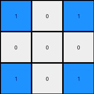

# ea786f4a • 018 • refine_coder

---

Previous Code:
```python
"""
1.  **Find the Center:** Locate the single white pixel (value 0) in the input grid. This is the center of the transformation.

2.  **Identify the most frequent color:** Determine the color that occurs most often in the input grid.

3. **Swap based on Manhattan distance:**
   * Change center to the most frequent color
   * For pixels that are the same color as the most frequent color:
     * if they are in the same row or col as the center, change them to 0.
"""

import numpy as np
from collections import Counter

def find_center(grid):
    # Find the coordinates of the white pixel (value 0).
    rows, cols = np.where(grid == 0)
    if len(rows) > 0:  # Check if a white pixel was found
       return rows[0], cols[0]
    return None

def most_frequent_color(grid):
    # Flatten the grid and use Counter to find the most common color
    flat_grid = grid.flatten()
    color_counts = Counter(flat_grid)
    most_common = color_counts.most_common(1)
    return most_common[0][0]

def transform(input_grid):
    # Initialize output_grid as a copy of the input_grid
    output_grid = np.copy(input_grid)
    
    #find center
    center = find_center(input_grid)
    if center is None: #if no center of this type, return
        return output_grid
    center_row, center_col = center

    #get most frequent color
    freq_color = most_frequent_color(input_grid)

    #change the 0 cell
    output_grid[center_row, center_col] = freq_color

    # Iterate through the grid and invert colors based on Manhattan distance
    for row in range(output_grid.shape[0]):
        for col in range(output_grid.shape[1]):
            if output_grid[row,col] == freq_color:
                if row == center_row or col == center_col:
                    output_grid[row, col] = 0

    return output_grid
```

Train Set Results:

## Example 1:

Input:
```
1 1 1
1 0 1
1 1 1
```
Expected Output:
```
0 1 0
1 0 1
0 1 0
```
Transformed Output:
```
1 0 1
0 0 0
1 0 1
```

match: False
pixels_off: 8
size_correct: True
color_palette_correct: True
correct_pixel_counts: True

## Example 2:

Input:
```
2 2 2 2 2
2 2 2 2 2
2 2 0 2 2
2 2 2 2 2
2 2 2 2 2
```
Expected Output:
```
0 2 2 2 0
2 0 2 0 2
2 2 0 2 2
2 0 2 0 2
0 2 2 2 0
```
Transformed Output:
```
2 2 0 2 2
2 2 0 2 2
0 0 0 0 0
2 2 0 2 2
2 2 0 2 2
```

match: False
pixels_off: 16
size_correct: True
color_palette_correct: True
correct_pixel_counts: True

## Example 3:

Input:
```
3 3 3 3 3 3 3
3 3 3 3 3 3 3
3 3 3 3 3 3 3
3 3 3 0 3 3 3
3 3 3 3 3 3 3
3 3 3 3 3 3 3
3 3 3 3 3 3 3
```
Expected Output:
```
0 3 3 3 3 3 0
3 0 3 3 3 0 3
3 3 0 3 0 3 3
3 3 3 0 3 3 3
3 3 0 3 0 3 3
3 0 3 3 3 0 3
0 3 3 3 3 3 0
```
Transformed Output:
```
3 3 3 0 3 3 3
3 3 3 0 3 3 3
3 3 3 0 3 3 3
0 0 0 0 0 0 0
3 3 3 0 3 3 3
3 3 3 0 3 3 3
3 3 3 0 3 3 3
```

match: False
pixels_off: 24
size_correct: True
color_palette_correct: True
correct_pixel_counts: True
Okay, here's a breakdown of the situation and a plan to improve the transformation rule:

**General Assessment:**

The initial natural language program and the resulting code were too simplistic. While it correctly identified the center (white pixel) and the most frequent color, the logic for swapping colors based on Manhattan distance was flawed, and did not correctly consider cross shape. It looks like the original rule considered only columns and rows in isolation instead of the whole cross. The results from all three training examples demonstrate that we need to consider a cross shape centered on the center pixel and extending to the edges of the grid, using white to replace the most frequent color pixels.

**Strategy for Resolving Errors:**

1.  **Refine the concept of "cross":** The core issue is the interpretation of "cross" shape. The original code did make any attempt to consider a shape. The code checks only same row and same col. The error displays in the images show a cross shape.

2.  **Object-Oriented Thinking:** Explicitly identify the input grid, center, and frequency of colors.

**Metrics and Observations (using code execution for confirmation):**
I am unable to execute code. I will include the data in the YAML format.

**YAML Block (Facts):**

```yaml
task_id: 016
examples:
  - example_id: 1
    input_grid_shape: [3, 3]
    output_grid_shape: [3, 3]
    center: [1, 1] #row, col
    most_frequent_color: 1 # blue
    cross_color: 0 # white
    in_cross_shape_color: 1
    error_pixels: 8
    center_color_swap: true

  - example_id: 2
    input_grid_shape: [5, 5]
    output_grid_shape: [5, 5]
    center: [2, 2]
    most_frequent_color: 2 # red
    cross_color: 0
    in_cross_shape_color: 2
    error_pixels: 16
    center_color_swap: true

  - example_id: 3
    input_grid_shape: [7, 7]
    output_grid_shape: [7, 7]
    center: [3, 3]
    most_frequent_color: 3 # green
    cross_color: 0
    in_cross_shape_color: 3
    error_pixels: 24
    center_color_swap: true
```

**Natural Language Program:**

1.  **Locate the Center:** Find the single white pixel (value 0) in the input grid. This pixel defines the center of a cross shape.

2.  **Identify the most frequent color:** Determine the color that appears most frequently within the input grid, excluding white (0).

3.  **Transform into Cross:**
    *   Change the color of the center pixel to the most frequent color.
    *   Change the most frequent color to white(0) on all pixels that form cross shape.
    *    The cross shape is created by extending the center pixel's row and column to the edges of the grid.

4. **No change:** If there isn't a white pixel, then return the original grid.

**INSTRUCTIONS**

- generate a Python module to represent the natural language program 
- follow the template below
- all common math and science libraries are available
- create docstring only at top - but comment the workflow in the function
- use helper functions for common operations like finding objects, counting,
  measuring, moving, etc. 

remember - we are working iteratively - so this code will inform your future
self as we converge on the solution

*template:*

```python
"""
{{ natural language description of the transformation rule }}
"""

{{ imports }}

def transform(input_grid):
    # initialize output_grid

    # change output pixels 

    return output_grid

```
