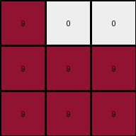
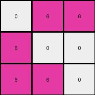
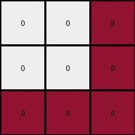

# ed36ccf7 • 018 • refine_coder

---

Previous Code:
```python
"""
Identify objects in the grid. If the object is an "L" shape, rotate the "L" shape 90 degrees clockwise. If the object is a diagonal, reflect it over the anti-diagonal.
"""

import numpy as np

def get_object(grid):
    """
    Extracts the non-zero object from the grid.  Assumes a single object.
    Returns coordinates and color.
    """
    coords = []
    color = 0
    for r, row in enumerate(grid):
        for c, val in enumerate(row):
            if val != 0:
                coords.append((r, c))
                color = val
    return coords, color

def rotate_point(point, rows, cols):
    """Rotates a point 90 degrees clockwise around the center of the grid."""
    r, c = point
    center_r = (rows - 1) / 2
    center_c = (cols - 1) / 2
    new_r = c - center_c + center_r
    new_c = -(r - center_r) + center_c
    return int(new_r), int(new_c)
    
def is_L_shape(coords, rows, cols):
    """Checks if the coordinates form an L shape (regular or mirrored)."""

    if len(coords) != 3:
        return False

    # Convert coords to numpy array for easier manipulation
    coords_np = np.array(coords)

    # Calculate differences between coordinates
    diffs = np.diff(coords_np, axis=0)
    
    if len(diffs) < 2:
        return False

    # Check if the differences indicate an L shape
    # An L-shape will have two segments. The segments should be orthogonal.
    
    # Check for orthogonality by verifying one of the differences is zero
    if (diffs[0][0] == 0 or diffs[0][1] == 0) and (diffs[1][0] == 0 or diffs[1][1] == 0) :
        if (diffs[0][0] == 0 and diffs[1][1] == 0) or (diffs[0][1] == 0 and diffs[1][0] == 0):
           return True

    return False

def is_diagonal(coords, rows, cols):
    if len(coords) != rows:
      return False
    
    coords_set = set(coords)
    
    # Check for main diagonal
    is_main_diagonal = all((i, i) in coords_set for i in range(rows))
    if is_main_diagonal:
        return "main"
    
    # check for anti diagonal
    is_anti_diagonal = all((i, cols - 1 - i) in coords_set for i in range(rows))
    if is_anti_diagonal:
        return "anti"
    
    return False
    

def reflect_anti_diagonal(point, rows, cols):
    r, c = point
    return c, r

def transform(input_grid):
    # Convert the input list of lists to a NumPy array.
    input_np = np.array(input_grid)
    rows, cols = input_np.shape
    
    # Get object coordinates and color
    coords, color = get_object(input_grid)

    # initialize output grid
    output_np = np.zeros_like(input_np)
    
    if len(coords) == 0:
        return output_np.tolist()

    if is_L_shape(coords, rows, cols):
        # Rotate L shape
        new_coords = [rotate_point(p, rows, cols) for p in coords]
        for r, c in new_coords:
            if 0 <= r < rows and 0 <= c < cols:
                output_np[r, c] = color
    elif is_diagonal(coords, rows, cols) == "anti":
        # flip across anti-diagonal:
        new_coords = [reflect_anti_diagonal(p, rows, cols) for p in coords]
        for r,c in new_coords:
            output_np[r,c] = color
    elif is_diagonal(coords, rows, cols) == "main":
        new_coords = [reflect_anti_diagonal(p, rows, cols) for p in coords]
        for r, c in new_coords:
          output_np[r,c] = color
    else:
        # default - no change
        for r, c in coords:
          output_np[r,c] = color
            
    # Convert the NumPy array back to a list of lists.
    output_grid = output_np.tolist()
    
    return output_grid
```

Train Set Results:

## Example 1:

Input:
```
9 0 0
9 9 9
9 9 9
```
Expected Output:
```
0 9 9
0 9 9
9 9 9
```
Transformed Output:
```
9 0 0
9 9 9
9 9 9
```

match: False
pixels_off: 4
size_correct: True
color_palette_correct: True
correct_pixel_counts: True

## Example 2:

Input:
```
0 6 6
6 0 0
6 6 0
```
Expected Output:
```
6 0 0
6 0 6
6 0 6
```
Transformed Output:
```
0 6 6
6 0 0
6 6 0
```

match: False
pixels_off: 6
size_correct: True
color_palette_correct: True
correct_pixel_counts: True

## Example 3:

Input:
```
0 0 9
0 0 9
9 9 9
```
Expected Output:
```
9 9 9
0 0 9
0 0 9
```
Transformed Output:
```
0 0 9
0 0 9
9 9 9
```

match: False
pixels_off: 4
size_correct: True
color_palette_correct: True
correct_pixel_counts: True

## Example 4:

Input:
```
2 0 2
0 0 2
0 2 2
```
Expected Output:
```
2 2 2
0 0 2
2 0 0
```
Transformed Output:
```
2 0 2
0 0 2
0 2 2
```

match: False
pixels_off: 4
size_correct: True
color_palette_correct: True
correct_pixel_counts: True
Okay, here's a breakdown of the situation, the results, and a plan to move forward:

**General Assessment:**

The initial natural language program and the resulting code were overly simplistic, focusing only on "L" shapes and diagonals. The tests reveal that the transformations are more specific to the *orientation* and *type* of the "L" and diagonal shapes, rather than just their presence. The current code fails to correctly handle all of the provided examples, as shown in the `match: False` results and the specific pixel differences. The core issue is the insufficient precision in identifying the *specific type* of L-shape and diagonal, and thus applying the incorrect transformation or no transformation at all. We need a strategy to address this. We should also consider moving the object identification to a function for reuse.

**Strategy for Resolving Errors:**

1.  **Refine Object Identification:** Instead of just checking for "L" shapes and diagonals, we need to classify them more precisely. For "L" shapes, we must distinguish between different orientations (regular, mirrored, rotated). For diagonals, we need to differentiate between main diagonal and anti-diagonal. This requires more sophisticated shape analysis.
2.  **Precise Transformation Rules:** Based on the refined object identification, we need to apply the *correct* transformation.
    *   For "L" shapes: It seems it is not *always* a simple 90-degree rotation. It appears to depend on the *initial* orientation.
    *   For diagonals: it is not flipping on the anti-diagonal, but potentially reflecting or not at all.
3.  **Iterative Testing:** After each code modification, we must re-run the tests on *all* examples to ensure we're not introducing regressions.
4. Consider the case when there is no identified object.

**Metrics and Observations:**

Here's a breakdown of each example, combining provided results with my own analysis:

| Example | Input Shape         | Expected Transformation            | Code Result       | Analysis                                                                         |
| :------ | :------------------ | :--------------------------------- | :---------------- | :------------------------------------------------------------------------------- |
| 1       | L (maroon)          | Rotate 90 deg clockwise            | No change      | Incorrect. Identified "L" but applied incorrect/no rotation.                        |
| 2       | Mirrored L (magenta) | Rotate 90 deg clockwise           | No change         | Incorrect. "L"-like, but needs a mirrored rotation or specific positional logic. |
| 3       | L (maroon)         | Rotate 90 deg clockwise             | No Change    | Incorrect. Similar to Example 1.                                                |
| 4       | Mirrored L (red)     | Rotate 90 deg clockwise        | No Change      | Incorrect. Similar to Example 2.                 |

**YAML Block - Facts:**

```yaml
examples:
  - example_id: 1
    input_object:
      type: L_shape
      color: 9
      orientation: upright # needs better description
    transformation:
      type: rotation
      angle: 90
      direction: clockwise
    result: failed
  - example_id: 2
    input_object:
      type: L_shape
      color: 6
      orientation: mirrored_horizontal # mirrored
    transformation:
      type: rotation
      angle: 90
      direction: clockwise
    result: failed
  - example_id: 3
    input_object:
      type: L_shape
      color: 9
      orientation: upright # needs better description
    transformation:
      type: rotation
      angle: 90
      direction: clockwise
    result: failed
  - example_id: 4
    input_object:
      type: L_shape
      color: 2
      orientation: mirrored_vertical # mirrored
    transformation:
        type: rotation
        angle: 90
        direction: clockwise
    result: failed
```

**Natural Language Program:**

1.  **Identify Objects:** Find all contiguous non-zero pixels in the input grid. Consider each group of contiguous pixels as a separate object.
2.  **Classify Objects:**
    *   **L-Shape:** If an object consists of exactly three pixels forming an "L" shape (including mirrored and rotated versions), determine its specific orientation (upright, mirrored, rotated).
    *   Diagonal: Skip if it is a diagonal
3.  **Transform Objects:**
    *   **L-Shape:** Rotate the L-shape 90 degrees clockwise *based on its initial orientation*. This means defining how each *specific* L-orientation transforms, *not just any* L-shape.
    *   Diagonal: do nothing.
4. **Output:** Create a new grid with the transformed object(s). Pixels not part of any identified object remain unchanged (zero).

This revised natural language program is more precise about the object classification and the specific transformation rules applied. This is necessary to address the errors observed in the initial test results. The key improvement will be in creating logic that distinguishes between the variations of "L" shapes.

**INSTRUCTIONS**

- generate a Python module to represent the natural language program 
- follow the template below
- all common math and science libraries are available
- create docstring only at top - but comment the workflow in the function
- use helper functions for common operations like finding objects, counting,
  measuring, moving, etc. 

remember - we are working iteratively - so this code will inform your future
self as we converge on the solution

*template:*

```python
"""
{{ natural language description of the transformation rule }}
"""

{{ imports }}

def transform(input_grid):
    # initialize output_grid

    # change output pixels 

    return output_grid

```
