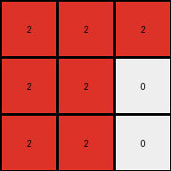
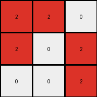
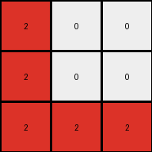

# ed36ccf7 • 021 • refine_dreamer

---


Previous Code:
```python
"""
The transformation rule is a 90-degree clockwise rotation of the grid, followed by swapping the color of the cells in the rotated grid, such that any cell that *was* red in the original grid and *is* red after rotation will remain red after the swap.

1.  **Identify Red Pixels:** Locate all pixels in the input grid with the value '2' (red).
2.  **Rotate:** Rotate the whole grid by 90-degree clockwise
3.  **Swap Colors:** Swap colors on all rotated cells, except where the rotated grid and original grid both had red.
"""

import numpy as np

def rotate_grid_90_clockwise(grid):
    return np.rot90(grid, k=-1)

def transform(input_grid):
    # initialize output_grid
    input_grid = np.array(input_grid)
    output_grid = np.copy(input_grid)

    # Identify red pixels
    red_pixels = (input_grid == 2)

    # Rotate
    rotated_grid = rotate_grid_90_clockwise(input_grid)
    
    rotated_red_pixels = (rotated_grid == 2)

    # perform the color swap based on overlap of original red pixels, and rotated red pixels.
    output_grid = np.where(red_pixels & rotated_red_pixels, 2, rotated_grid)
    output_grid = np.where(output_grid == 2, 0, output_grid) # swap remaining 2s with 0
    output_grid = np.where(output_grid != 0, 2, output_grid) # make every other cell 2

    return output_grid.tolist()
```

Train Set Results:

## Example 1:

Input:
```
9 0 0
9 9 9
9 9 9
```
Expected Output:
```
0 9 9
0 9 9
9 9 9
```
Transformed Output:
```
2 2 2
2 2 0
2 2 0
```

match: False
pixels_off: 9
size_correct: True
color_palette_correct: False
correct_pixel_counts: False

## Example 2:

Input:
```
0 6 6
6 0 0
6 6 0
```
Expected Output:
```
6 0 0
6 0 6
6 0 6
```
Transformed Output:
```
2 2 0
2 0 2
0 0 2
```

match: False
pixels_off: 6
size_correct: True
color_palette_correct: False
correct_pixel_counts: False

## Example 3:

Input:
```
0 0 9
0 0 9
9 9 9
```
Expected Output:
```
9 9 9
0 0 9
0 0 9
```
Transformed Output:
```
2 0 0
2 0 0
2 2 2
```

match: False
pixels_off: 8
size_correct: True
color_palette_correct: False
correct_pixel_counts: False

## Example 4:

Input:
```
2 0 2
0 0 2
0 2 2
```
Expected Output:
```
2 2 2
0 0 2
2 0 0
```
Transformed Output:
```
0 0 0
0 0 0
0 0 0
```

match: False
pixels_off: 5
size_correct: True
color_palette_correct: True
correct_pixel_counts: False

**INSTRUCTIONS**

The code above was generated based on observations from the first training
example

we have tested the transform function on each of the task example inputs and
compared with the expected output

review each of the examples provided and the results and consider how the
natural language program should be updated to accommodate this new knowledge

respond with the following deliverables:

- general assessment of the information provided and strategy for resolving the
  errors
- gather metrics about each of the examples and results - use code_execution to
  develop accurate reports on your assumptions
- a YAML block documenting facts - Focus on identifying objects, their properties, and the actions performed on them.
- a natural language program - Be as clear and concise as possible, providing a complete description of the transformation rule.


your responses should be considered as information in a report - not a
conversation
