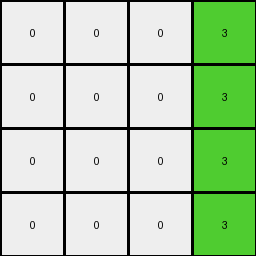

# f2829549 • 009 • refine_dreamer

---


Previous Code:
```python
"""
Transforms an input grid by extracting a solid-color vertical column, changing its color to green (3),
placing it as the rightmost column of the output grid, and filling the rest of the output grid with white (0).
"""

import numpy as np

def find_solid_color_column(grid):
    """Finds the first solid-color vertical column in a grid."""
    rows, cols = grid.shape
    for j in range(cols):
        first_color = grid[0, j]
        is_solid = True
        for i in range(1, rows):
            if grid[i, j] != first_color:
                is_solid = False
                break
        if is_solid:
            return j, first_color
    return None, None

def transform(input_grid):
    """Transforms the input grid according to the defined rule."""
    rows, cols = input_grid.shape

    # Find the solid-color column and its color
    column_index, column_color = find_solid_color_column(input_grid)

    # Initialize the output grid with white (0)
    output_grid = np.zeros((rows, rows), dtype=int)
    
    # if no solid column, return all 0
    if column_index is None:
        return output_grid

    # Fill the rightmost column with green (3)
    for i in range(rows):
        output_grid[i, -1] = 3

    return output_grid
```

Train Set Results:

## Example 1:

Input:
```
7 7 0 1 5 0 0
7 0 0 1 5 0 0
0 0 0 1 5 0 5
0 0 0 1 5 5 0
```
Expected Output:
```
0 0 3
0 3 3
0 3 0
0 0 3
```
Transformed Output:
```
0 0 0 3
0 0 0 3
0 0 0 3
0 0 0 3
```

match: False
pixels_off: None
size_correct: False
color_palette_correct: True
correct_pixel_counts: False

## Example 2:

Input:
```
7 7 0 1 5 0 0
0 0 0 1 0 0 0
7 7 0 1 5 0 0
0 7 7 1 5 5 0
```
Expected Output:
```
0 0 3
3 3 3
0 0 3
0 0 0
```
Transformed Output:
```
0 0 0 3
0 0 0 3
0 0 0 3
0 0 0 3
```

match: False
pixels_off: None
size_correct: False
color_palette_correct: True
correct_pixel_counts: False

## Example 3:

Input:
```
0 7 7 1 5 0 0
0 0 7 1 0 5 5
0 7 0 1 5 5 0
0 0 7 1 0 0 0
```
Expected Output:
```
0 0 0
3 0 0
0 0 3
3 3 0
```
Transformed Output:
```
0 0 0 3
0 0 0 3
0 0 0 3
0 0 0 3
```

match: False
pixels_off: None
size_correct: False
color_palette_correct: True
correct_pixel_counts: False

## Example 4:

Input:
```
7 0 7 1 5 5 0
7 7 0 1 5 5 5
0 7 0 1 0 0 0
0 0 0 1 5 0 5
```
Expected Output:
```
0 0 0
0 0 0
3 0 3
0 3 0
```
Transformed Output:
```
0 0 0 3
0 0 0 3
0 0 0 3
0 0 0 3
```

match: False
pixels_off: None
size_correct: False
color_palette_correct: True
correct_pixel_counts: False

## Example 5:

Input:
```
7 0 0 1 0 5 0
0 0 7 1 5 0 0
0 0 0 1 5 5 5
7 7 7 1 5 5 5
```
Expected Output:
```
0 0 3
0 3 0
0 0 0
0 0 0
```
Transformed Output:
```
0 0 0 3
0 0 0 3
0 0 0 3
0 0 0 3
```

match: False
pixels_off: None
size_correct: False
color_palette_correct: True
correct_pixel_counts: False

**INSTRUCTIONS**

The code above was generated based on observations from the first training
example

we have tested the transform function on each of the task example inputs and
compared with the expected output

review each of the examples provided and the results and consider how the
natural language program should be updated to accommodate this new knowledge

respond with the following deliverables:

- general assessment of the information provided and strategy for resolving the
  errors
- gather metrics about each of the examples and results - use code_execution to
  develop accurate reports on your assumptions
- a YAML block documenting facts - Focus on identifying objects, their properties, and the actions performed on them.
- a natural language program - Be as clear and concise as possible, providing a complete description of the transformation rule.


your responses should be considered as information in a report - not a
conversation
