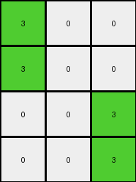
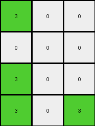
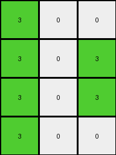
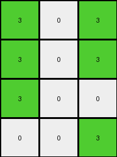
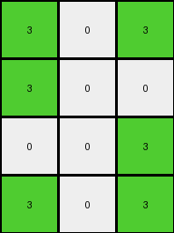

# f2829549 • 015 • refine_dreamer

---

Previous Code:
```python
"""
The transformation rule works as follows:

1.  **Identify Key Feature:** Locate the vertical blue (1) line in the input grid.
2.  **Reduce Columns:** Condense each set of columns into 1.
3.  **Determine New Value:**
      *   If an entire column in original is white, it maps to white (0).
      *   If a column to left of blue contains orange or to right contains grey, then it maps green.
"""

import numpy as np

def find_vertical_line(grid, color):
    """Finds the column index of a full-height vertical line of the specified color."""
    rows, cols = grid.shape
    for j in range(cols):
        if all(grid[i, j] == color for i in range(rows)):
            return j
    return -1  # Return -1 if no such line is found

def transform(input_grid):
    """Transforms the input grid according to the described rules."""
    rows, cols = input_grid.shape
    output_grid = np.zeros((rows, 3), dtype=int)
    blue_line_col = find_vertical_line(input_grid, 1)

    # Iterate through input columns in groups
    col_groups = [(0, 1, 2), (blue_line_col,), (5, 6)] # split in the groups
    
    for i, group in enumerate(col_groups) :
        for row in range(rows) :
            if i == 1 : # blue
                output_grid[row, 1] = 0 # all white
            else:
                is_all_white = True
                for col in group :
                    if input_grid[row, col] != 0:
                        is_all_white = False
                        break
                if is_all_white:
                    output_grid[row, i] = 0
                else:
                     output_grid[row,i] = 3

    return output_grid
```

Train Set Results:

## Example 1:

Input:
```
7 7 0 1 5 0 0
7 0 0 1 5 0 0
0 0 0 1 5 0 5
0 0 0 1 5 5 0
```
Expected Output:
```
0 0 3
0 3 3
0 3 0
0 0 3
```
Transformed Output:
```
3 0 0
3 0 0
0 0 3
0 0 3
```

match: False
pixels_off: 7
size_correct: True
color_palette_correct: True
correct_pixel_counts: False

## Example 2:

Input:
```
7 7 0 1 5 0 0
0 0 0 1 0 0 0
7 7 0 1 5 0 0
0 7 7 1 5 5 0
```
Expected Output:
```
0 0 3
3 3 3
0 0 3
0 0 0
```
Transformed Output:
```
3 0 0
0 0 0
3 0 0
3 0 3
```

match: False
pixels_off: 9
size_correct: True
color_palette_correct: True
correct_pixel_counts: False

## Example 3:

Input:
```
0 7 7 1 5 0 0
0 0 7 1 0 5 5
0 7 0 1 5 5 0
0 0 7 1 0 0 0
```
Expected Output:
```
0 0 0
3 0 0
0 0 3
3 3 0
```
Transformed Output:
```
3 0 0
3 0 3
3 0 3
3 0 0
```

match: False
pixels_off: 4
size_correct: True
color_palette_correct: True
correct_pixel_counts: False

## Example 4:

Input:
```
7 0 7 1 5 5 0
7 7 0 1 5 5 5
0 7 0 1 0 0 0
0 0 0 1 5 0 5
```
Expected Output:
```
0 0 0
0 0 0
3 0 3
0 3 0
```
Transformed Output:
```
3 0 3
3 0 3
3 0 0
0 0 3
```

match: False
pixels_off: 7
size_correct: True
color_palette_correct: True
correct_pixel_counts: False

## Example 5:

Input:
```
7 0 0 1 0 5 0
0 0 7 1 5 0 0
0 0 0 1 5 5 5
7 7 7 1 5 5 5
```
Expected Output:
```
0 0 3
0 3 0
0 0 0
0 0 0
```
Transformed Output:
```
3 0 3
3 0 0
0 0 3
3 0 3
```

match: False
pixels_off: 6
size_correct: True
color_palette_correct: True
correct_pixel_counts: False
**INSTRUCTIONS**

The code above was generated based on observations from the first training
example

we have tested the transform function on each of the task example inputs and
compared with the expected output

review each of the examples provided and the results and consider how the
natural language program should be updated to accommodate this new knowledge

respond with the following deliverables:

- general assessment of the information provided and strategy for resolving the
  errors
- gather metrics about each of the examples and results - use code_execution to
  develop accurate reports on your assumptions
- a YAML block documenting facts - Focus on identifying objects, their properties, and the actions performed on them.
- a natural language program - Be as clear and concise as possible, providing a complete description of the transformation rule.


your responses should be considered as information in a report - not a
conversation
